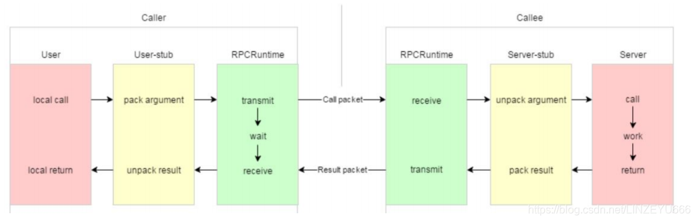
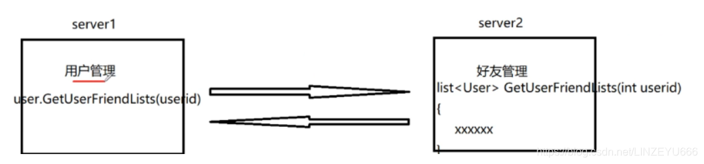
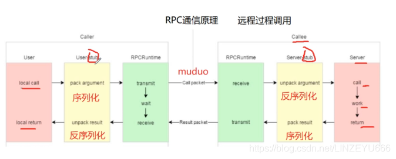
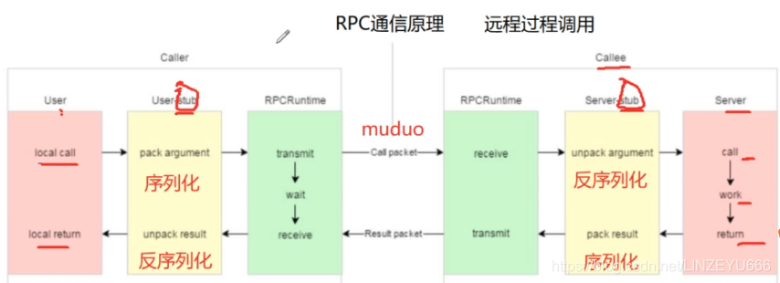
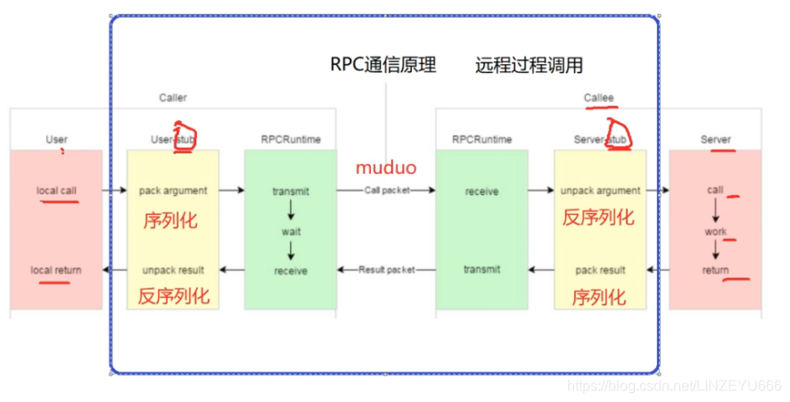
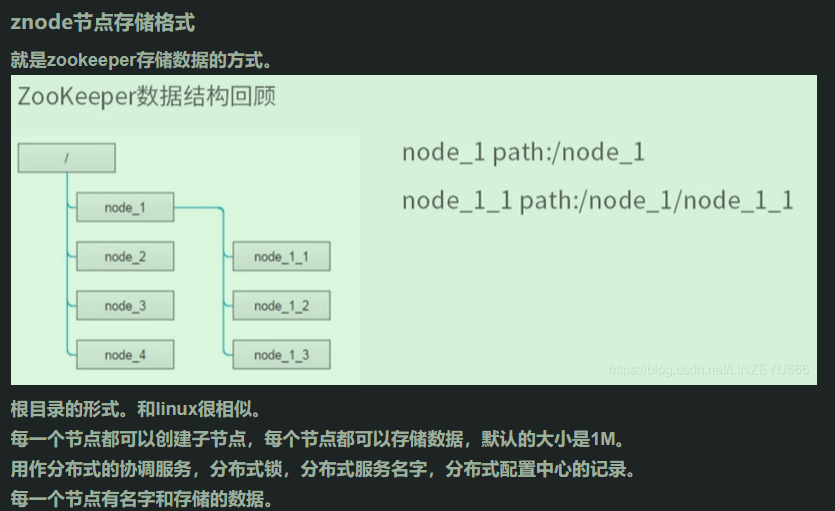
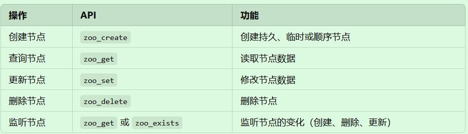
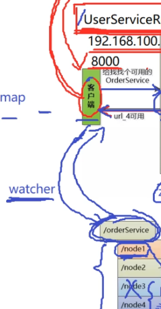
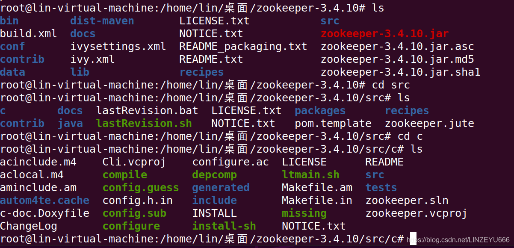
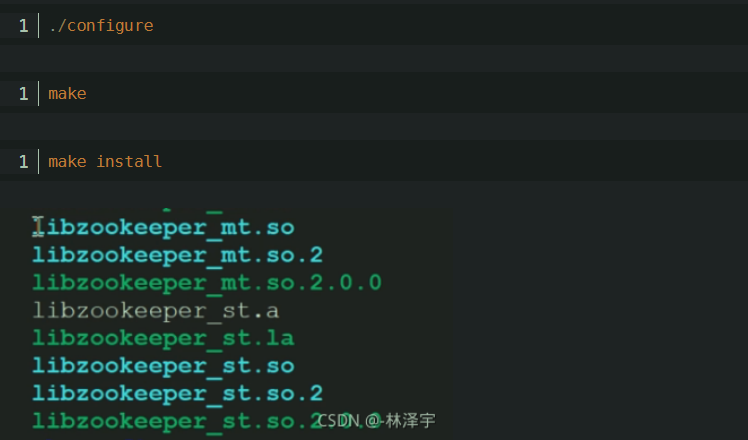

mprpc项目总结博客https://blog.csdn.net/linzeyu666/category_11234541.html

找到一个博主，里面很多篇，完整的mprpc项目前期知识、介绍，总结，环境配置文档，很值得推荐

客户端:发起rpc调用->需要框架的User_stub把我想调用的RPC的方法的方法名字，参数序列化，打包起来形成字节流，通过网络进行发送(使用muduo库）,发送到对端

服务端：对端receive，接收从网络得到的字节流，然后在Server-stub把字节流反序列化出来，然后根据解包的参数进行调用相应的函数。work调用执行，return登录执行的结果true或者false，有可能在执行的时候函数执行出现问题，我们可以在返回的东西中还可以加一些响应，响应码是0，表示这个方法在远端执行是正常的，如果执行错误，就返回一些信息（响应码，错误码，错误信息，具体的返回值）。然后经过打包（pack result）成字节流通过网络发送（muduo库）到对端。然后端端receive，在User-stub解包，反序列化，上报到应用程序，就知道了，根据返回的信息进行相应的操作。

项目总结https://blog.csdn.net/mengxinbaoxiao/article/details/132320480?spm=1001.2101.3001.6650.3&utm_medium=distribute.pc_relevant.none-task-blog-2%7Edefault%7EBlogCommendFromBaidu%7ERate-3-132320480-blog-119205495.235%5Ev43%5Epc_blog_bottom_relevance_base9&depth_1-utm_source=distribute.pc_relevant.none-task-blog-2%7Edefault%7EBlogCommendFromBaidu%7ERate-3-132320480-blog-119205495.235%5Ev43%5Epc_blog_bottom_relevance_base9&utm_relevant_index=6

https://devpress.csdn.net/v1/article/detail/130923561?spm=1001.2101.3001.6650.4&utm_medium=distribute.pc_relevant.none-task-blog-2%7Edefault%7EBlogCommendFromBaidu%7Eactivity-4-130923561-blog-119205495.235%5Ev43%5Epc_blog_bottom_relevance_base9&depth_1-utm_source=distribute.pc_relevant.none-task-blog-2%7Edefault%7EBlogCommendFromBaidu%7Eactivity-4-130923561-blog-119205495.235%5Ev43%5Epc_blog_bottom_relevance_base9&utm_relevant_index=9

------------------------------------------------

​                  

# mprpc前期知识

1.muduo数据库安装及使用–见《网络库》

2.Protobuf安装及使用 ：数据传输格式，序列化和反序列化,学习proto3语法来编写.proto文件(定义消息结构)，.proto文件编译生成.pb.cc源文件和.pb.h头文件，头文件\#include "example.pb.h"在C++代码中使用，学习如何与 RPC 框架结合使用,然后背背他的概念、优缺点、和xml,json的区别

3.Zookeeper分布式一致性协调服务：**Zookeeper 的核心作用**是为分布式系统提供协调功能，如注册服务，服务发现、配置管理、分布式锁等。客户端通过 Zookeeper 查询可用的服务地址，并发起 RPC 调用。还可以实现分布式锁， 解决节点之间的协调问题，确保系统一致性和可靠性。ZAB一致性协议

**客户端**不需要安装完整的 ZooKeeper，只需要使用 **ZooKeeper 的客户端库** 来与服务端进行通信。服务端需要安装完整的 ZooKeeper 软件包。

Zookeeper是通过Java开发的，所以要有JDK环境安装了 **Java 环境** 和 **ZooKeeper** 之后，需要启动 ZooKeeper 服务才能进行正常使用ZooKeeper 本质上是一个 **分布式协调服务**，它的功能依赖于一个 **运行中的服务器进程**（ZooKeeper Server）。

4.分布式概念，基础理论，CAP,BASE,

5.rpc概念，实现分布式通信

# 项目概要

原文链接：https://blog.csdn.net/LINZEYU666/article/details/119174297



mprpc框架主要包含以下两个部分的内容：

**黄色部分：**设计rpc方法参数的打包和解析，也就是数据的序列化和反序列化，使用Protobuf。

**绿色部分：**网络部分，包括寻找rpc服务主机，发起rpc调用请求和响应rpc调用结果，使用muduo网络库和zookeeper服务配置中心（专门做服务发现）。

解析上图（RPC通信图解）

左边的caller，就是调用者。相当于下图的server1这个角色，用户管理，用户发起的一个远程的方法调用，获取当前指定用户id的好友列表。上图的local call对应的状态就是server1用户管理的这个进程调用GetUserFriendList函数，这是一个远程的RPC方法，不是一个当前进程内的方法，首先得去服务配置中心查找，知道这个服务在server2里面，现在就是要把这个函数调用的请求通过网络发布到server2中，server2还得知道你要调用哪个函数！因为server2有很多模块，很多RPC方法。所以我们在传输的时候要把 函数的标识，方法在远端调用涉及到的参数进行打包。这就是对应上图的pack argument，打包参数，我们称作序列化。序列化好之后，我就可以把这个请求通过网络transmit传送过去到server2中，网络是用C++实现的开源的muduo库。
远端接收到从网络接收到RPC调用请求（对应上图的receive)，从网络底层上报上来，上报上来的是打包完成后的参数，这时要把从网络接收的打包的参数解包，对应上图的unpack argument，我们称作反序列化，就是把从网络的接收的字节流反序列化成具体的RPC调用的细节信息，方法，标识，参数，然后就到server2上了，对应上图的call。
此时，RPC的请求已经到达server2的好友管理的获取好友列表的函数上了，就是在机器的这个进程里执行这个list< User>GetUserFriendList函数，对应上图的work（工作，执行），然后return 返回值，不管是正常运行还是出错了，return 返回相应的东西，这时进行pack result，打包参数，即序列化成字节流，通过网络muduo库发到caller端。caller端收到后，即对应上图的receive，这个网络就会把字节流上报到User-stub上，把字节流反序列化，即对应上图的unpack result，反序列化后，就可以得到具体的应用程序可以认得的一个描述RPC调用方法请求的结果的数据，相当于上图的local return。


在分布式通信框架中，都有桩，stub就是“桩“，我们可以认为就是一个”代理“，因为RPC调用的发起方只需要关心业务，不用关心底层的网络上的RPC方法，通信的细节，细节都包装在stub，做数据的序列化和反序列化，网络数据的收发。执行RPC请求的这一端也是如此。

------------------------------------------------

**再举个例子**

RPC方法：bool login(string name,string pwd)；
调用这个方法，是远程调用另一个进程。

首先，我们在Caller的User，local call，发起login()；
需要框架的User_stub把我想调用的RPC的方法的方法名字，参数序列化，打包起来形成字节流，通过网络进行发送(使用muduo库）,发送到对端以后，对端receive，接收从网络得到的字节流，然后在Server-stub把字节流反序列化出来，然后根据解包的参数进行调用相应的函数。work调用执行，return登录执行的结果true或者false，有可能在执行的时候函数执行出现问题，我们可以在返回的东西中还可以加一些响应，响应码是0，表示这个方法在远端执行是正常的，如果执行错误，就返回一些信息（响应码，错误码，错误信息，具体的返回值）。然后经过打包（pack result）成字节流通过网络发送（muduo库)到对端。然后端端receive，在User-stub解包，反序列化，上报到应用程序，就知道了，根据返回的信息进行相应的操作

**我要完成的 基于RPC的分布式网络通信框架 项目就是完成下图的所圈起来的部分**


黄色部分，我将用protobuf完成，json也可以完成，但是protobuf相当于json的好处：
1、protobuf是二进制存储，xml和json都是文本存储！！！
二进制省空间！
protobuf在携带数据的时候，带宽的资源的利用率是高的。protobuf携带同样的数据，占用的字节少！
2、protubuf不需要存储额外的信息，
json的存储是：key-value
name ：“zhangsan" pwd:“123456”
而protobuf的存储是：“zhangsan" “123456”，它只存储有效数据！！！

绿色部分我将用muduo网络库和zookeeper服务配置中心（专门做服务发现）完成

**zk的watcher机制（监听）**

当我们客户端想要调用去rpc服务的时候，会拿RPC服务的名字和方法名字组成一个znode的节点路径，在服务配置中心上去查找一下，这个节点是否存在，如果存在，ip地址和端口号获取了，发起RPC方法的请求，如果找不到，就不用发起RPC请求了。

而watcher机制相当于通知，回调机制，客户端API可以添加一个watcher，观察器，监听事件类型，这个节点的变化，维护一个map表，键就是节点的名字，值就是节点的内容。
我们的客户端可以向zk的一个父节点添加一个watcher，如果这个父节点的字节点有任何的变化，比如说子节点有增加或者挂掉，会由zk主动地告诉客户端这个节点发生了什么变化。

原生ZkClient API存在的问题
Zookeeper原生提供了C和Java的客户端编程接口，但是使用起来相对复杂，几个弱点：
1.不会自动发送心跳消息 <==== 错误，源码上会在1/3的Timeout时间发送ping心跳消息
2.设置监听watcher只能是一次性的
每次触发后需要重复设置
客户端在节点注册watcher的时候，数据的改动都通知给客户端，但是只通知1次。要它通知第2次得重新再去注册。
3.znode节点只存储简单的byte字节数组
如果存储对象，需要自己转换对象生成字节数组(自己用json或者protobuf）

------

### RPC 远程调用的核心流程：

1. **Caller端**（调用者）：

   - User（用户层）

     ：

     - 用户通过本地方法调用（`local call`）开始RPC过程。

   - User-stub（用户存根层）

     ：

     - 将方法的参数**打包（pack argument）**为可传输的数据格式（通常为Protobuf序列化后的二进制数据）。
     - 收到远程调用的结果后，解包（`unpack result`）还原为调用者需要的结果数据。

   - RPCRuntime（运行时层）

     ：

     - 负责数据的传输（`transmit`）、等待响应（`wait`）和接收结果（`receive`）。
     - 通过底层网络模块（Muduo）与服务端进行通信。

2. **Callee端**（被调用者）：

   - RPCRuntime

     ：

     - 接收（`receive`）来自客户端的请求，并将结果打包后传输回去。

   - Server-stub（服务存根层）

     ：

     - 解包（`unpack argument`）调用请求的参数。
     - 将结果打包（`pack result`）为返回的响应数据。

   - Server（服务层）

     ：

     - 执行实际的服务逻辑，包括调用处理（`call`）、执行具体任务（`work`），并返回结果。

------

### MPRPC框架核心内容：

1. **黄色部分（数据打包和解析）**：

   - 利用 

     Protobuf

      进行参数序列化与反序列化：

     - 在客户端将方法参数序列化成二进制流，通过网络传输到服务端。
     - 服务端接收到数据后，将其反序列化为可用的对象或结构，进行实际调用。

2. **绿色部分（网络部分）**：

   - Muduo网络库

     ：

     - 用于处理高效的网络通信，包括TCP连接的建立、数据收发等。

   - Zookeeper服务配置中心

     ：

     - 用于服务发现和管理：
       - 确保客户端能够找到可用的服务端地址。
       - 管理服务的注册与注销，提供分布式协调能力。

------

### 你需要掌握的基础知识：

- Protobuf

  ：

  - 学会定义`.proto`文件，生成序列化和反序列化代码。
  - 掌握序列化与反序列化的使用方法。

- Muduo网络库

  ：

  - 理解Reactor模式和多线程网络编程。
  - 掌握基本的事件处理与数据通信方法。

- Zookeeper

  ：

  - 学习分布式协调服务的基本概念与命令（如`create`、`ls`、`delete`）。
  - 理解Zookeeper节点的组织结构和数据存储格式。

# 那我该怎么去做这个mprpc呢？你有什么建议吗？我现在有这个项目的代码和视频

要做好 **MPRPC（分布式RPC框架）** 项目，以下是我给您的详细建议，包括学习路径、项目实现步骤以及对代码和视频的使用方式：

------

## **第一步：明确学习目标**

1. **掌握 RPC 的核心概念和实现流程**：
   - RPC 的本质是将本地函数调用扩展为远程函数调用，同时隐藏网络通信的细节。
   - 理解参数序列化（Protobuf）和网络通信（Muduo）在 RPC 中的作用。
2. **熟悉项目的主要技术栈**：
   - **Muduo 网络库**：负责高性能网络通信。
   - **Protobuf**：负责序列化和反序列化数据。
   - **Zookeeper**：实现服务注册与发现、主节点选举等分布式协调功能。
3. **掌握代码的运行和调试**：
   - 通过阅读代码和调试，深入理解每个模块的作用。
4. **将理论转化为实践**：
   - 通过复现项目并尝试扩展功能，深入理解分布式系统的开发流程。

------

## **第二步：项目实现的详细步骤**

### **1. 环境搭建**

#### （1）安装必要的工具和库

- Muduo 网络库

  ：

  - 下载 Muduo 源码并编译。
  - 配置环境变量，确保项目可以正常调用 Muduo。

- Protobuf

  ：

  - 下载并安装 Protobuf。
  - 使用 `protoc` 工具生成序列化和反序列化代码。

- Zookeeper

  ：

  - 安装 Zookeeper 并启动服务，用于服务注册与发现。

- C++ 开发环境

  ：

  - 使用 GCC 或 Clang 编译器。
  - 使用 CMake 管理项目构建。

#### （2）确保基础开发环境正常

- 安装 Linux 或 WSL（如果您使用 Windows）。
- 测试 Muduo 和 Protobuf 是否正常运行。
- 运行一个简单的 Zookeeper 示例，验证服务是否可以正常注册和查询。

------

### **2. 学习项目的代码结构**

通过阅读代码和视频，明确每个模块的功能和作用。以下是典型的 MPRPC 项目代码结构：

- `src/`: 项目的核心代码，包括客户端、服务端和网络通信模块。
- `proto/`: 存放 `.proto` 文件，定义 RPC 接口。
- `test/`: 测试用例，用于验证各模块功能。
- `build/`: 编译生成的二进制文件和中间文件。
- `CMakeLists.txt`: 项目的构建脚本。

#### **模块分解**

- RPC 框架核心逻辑

  ：

  - 包括客户端代理（Stub）、服务端代理和 RPC 调度器。

- 网络模块（Muduo）

  ：

  - 处理 TCP 连接、请求接收与响应发送。

- 序列化模块（Protobuf）

  ：

  - 定义 RPC 的接口和消息结构。

- 服务注册与发现模块（Zookeeper）

  ：

  - 管理服务的动态注册和查询。

------

### **3. 实现项目的关键功能**

#### （1）**序列化和反序列化（Protobuf）**

1. 定义 

   ```
   .proto
   ```

    文件，例如：

   ```proto
   syntax = "proto3";
   
   message RpcRequest {
       string method_name = 1;
       string params = 2;
   }
   
   message RpcResponse {
       int32 code = 1;
       string result = 2;
   }
   
   service RpcService {
       rpc Call(RpcRequest) returns (RpcResponse);
   }
   ```

2. 使用 

   ```
   protoc
   ```

    编译生成 C++ 代码：

   ```bash
   protoc --cpp_out=. rpc.proto
   ```

3. 在客户端和服务端调用序列化与反序列化接口。

#### （2）**网络通信（Muduo）**

- 在服务端：
  - 使用 `TcpServer` 监听客户端请求。
  - 解析请求并调用对应的服务方法。
- 在客户端：
  - 使用 `TcpClient` 连接服务端。
  - 发送序列化的 RPC 请求，并接收响应。

#### （3）**服务注册与发现（Zookeeper）**

- 服务端在启动时，注册服务到 Zookeeper，例如：

  ```cpp
  ZkClient zkClient;
  zkClient.start("127.0.0.1:2181");
  zkClient.create("/rpc/service_name", "192.168.1.1:8888", ZkClient::EPHEMERAL);
  ```

- 客户端从 Zookeeper 查询服务地址：

  ```cpp
  std::string serviceAddr = zkClient.get("/rpc/service_name");
  ```

#### （4）**客户端与服务端的交互流程**

1. 客户端通过 Stub 发送 RPC 调用：
   - 通过 Protobuf 序列化方法名和参数。
   - 使用 Muduo 发送数据到服务端。
2. 服务端接收请求：
   - 使用 Muduo 的 `onMessage` 回调解析请求。
   - 通过 Protobuf 反序列化参数并调用对应方法。
   - 返回结果并发送响应。

------

### **4. 项目运行和测试**

#### （1）构建项目

- 使用 CMake 构建项目：

  ```bash
  mkdir build
  cd build
  cmake ..
  make
  ```

#### （2）运行测试用例

- 编写测试用例验证每个模块的功能：
  - 测试 Protobuf 的序列化和反序列化。
  - 测试 Muduo 的网络通信。
  - 测试 Zookeeper 的服务注册与发现。

#### （3）启动完整流程

1. 启动 Zookeeper 服务。
2. 启动 RPC 服务端，注册服务到 Zookeeper。
3. 启动 RPC 客户端，发送请求并获取结果。

------

### **5. 深化理解**

#### （1）研究项目扩展功能

- 添加更多服务方法，完善 `.proto` 文件。
- 实现负载均衡，支持多实例调用。
- 增加日志和监控功能，记录 RPC 调用情况。

#### （2）模拟故障场景

- 测试服务端故障时，Zookeeper 是否能正确移除节点。
- 测试客户端能否感知服务端的动态变化。

#### （3）优化性能

- 使用 Muduo 的线程池优化并发请求。
- 调整 Protobuf 的序列化策略，减少数据传输量。

------

### **6. 视频学习的建议**

1. **学习顺序**：
   - 视频一般会分为理论讲解和代码实现部分。先观看理论讲解，理解每个模块的作用，再结合代码实现细节。
2. **重点关注**：
   - 服务端和客户端之间的交互流程。
   - 如何利用 Muduo、Protobuf 和 Zookeeper 实现高效的 RPC 调用。
   - 常见问题的解决方案（如节点故障处理、负载均衡）。
3. **记录笔记**：
   - 在观看视频时，将每个模块的核心逻辑记录下来，方便后续实现和调试。

------

### **7. 提高的建议**

- **调试与扩展**：
  - 运行现有代码并调试，弄清每一行代码的作用。
  - 尝试增加新功能，比如实现客户端的超时机制。
- **学习分布式基础知识**：
  - 例如 CAP 理论、负载均衡策略、分布式锁等。
- **借鉴开源项目**：
  - 对比类似的开源 RPC 框架（如 gRPC），了解其实现方式和优化点。

------


# 1.集群和分布式

阅读博客：https://blog.csdn.net/LINZEYU666/article/details/119169427

### 什么是分布式？

**分布式系统**是指将一个系统的功能拆分到多个计算机节点上，这些节点通过网络协同工作，共同完成任务。换句话说，分布式系统就是一个**多台计算机组成的系统**，通过协调和通信，为用户提供一个整体的服务。

------

### 分布式系统的核心特点

1. **多个节点协同工作**
   - 系统由多台计算机（物理或虚拟）组成，每个计算机节点独立运行，但共同承担一个任务。
2. **透明性**
   - 用户感觉不到系统是由多个节点组成的，表现为一个整体。透明性包括：
     - **访问透明性**：用户不需要知道服务来自哪个节点。
     - **位置透明性**：不需要了解节点的实际物理位置。
     - **故障透明性**：部分节点出错时，系统能继续运行。
3. **可扩展性**
   - 通过增加更多节点，可以提升系统的处理能力或容错能力。
4. **高可靠性**
   - 即使某些节点出现故障，系统仍然可以正常运行（通过冗余设计或数据副本）。

------

### 分布式与单机系统的对比

| 特性       | 单机系统             | 分布式系统                     |
| ---------- | -------------------- | ------------------------------ |
| **硬件**   | 依赖单台服务器       | 多台服务器协作                 |
| **性能**   | 有限，受单机性能限制 | 可通过增加节点提升性能         |
| **容错性** | 单机故障，系统不可用 | 单点故障不会影响整体服务       |
| **复杂性** | 相对简单             | 涉及网络通信、协调、数据一致性 |

------

### 分布式系统的典型应用

1. **搜索引擎**
   - 搜索请求被分发到多个服务器处理，每个服务器负责不同部分的搜索任务。
2. **电商平台**
   - 用户的浏览、购物车、支付等功能分布在不同的模块上，由多个服务器协作完成。
3. **云计算**
   - AWS、阿里云等云服务提供商利用分布式架构来提供存储、计算和网络服务。
4. **分布式数据库**
   - 数据分布存储在不同节点上，比如MySQL集群、MongoDB。

------

### 分布式的核心挑战

1. **一致性**（Consistency）
   - 数据在多个节点间的同步问题。例如，用户同时更新同一条数据，如何保证最终一致。
2. **网络通信**
   - 分布式节点需要通过网络通信，可能面临延迟或丢包。
3. **容错性**
   - 节点可能宕机，需要设计系统的容错能力。
4. **分布式锁**
   - 多个节点并发访问共享资源时，需要用分布式锁来控制访问顺序。
5. **扩展性与负载均衡**
   - 如何平衡不同节点的负载，以及扩展系统时避免性能瓶颈。

------

### 分布式系统的设计原则

1. **CAP理论**

   - 在分布式系统中，只能在

     一致性（Consistency）、可用性（Availability）、**分区容错性（Partition Tolerance）**三者中选择两者。

     - 一致性：所有节点看到的数据是相同的。
     - 可用性：每个请求都能及时获得响应。
     - 分区容错性：系统能容忍部分网络故障。

2. **BASE理论**

   - 分布式系统的一种实践方法：
     - **基本可用**（Basic Availability）
     - **软状态**（Soft State）
     - **最终一致性**（Eventual Consistency）

------

### 分布式的简单例子

假设一个在线购物系统：

1. **订单服务**：处理用户订单。
2. **库存服务**：检查库存是否充足。
3. **支付服务**：处理用户付款。

每个服务可以单独部署在不同的服务器上，彼此通过网络通信协作完成一个完整的购物流程。

# 2.rpc

先阅读博客：https://blog.csdn.net/LINZEYU666/article/details/119174297


### 什么是RPC？

**RPC（Remote Procedure Call）**，即远程过程调用，是一种通过网络调用远程服务的方法，表现得像调用本地函数一样。它隐藏了底层的网络通信细节，让开发者无需关心数据的传输和协议，只需像调用本地方法一样调用远程服务。分布式通信，不在同一服务器之间的通信

------

### 核心概念：

1. **远程调用**：
   - 调用者（客户端）可以像调用本地函数一样调用位于远程服务器上的函数。
   - 底层的网络通信细节（如数据传输、协议处理）对用户透明。
2. **序列化与反序列化**：
   - 调用参数和返回结果通过**序列化**转为网络可传输的数据格式（如Protobuf）。
   - 接收到的数据需要**反序列化**还原为原始参数或结果。
3. **通信机制**：
   - RPC底层依赖网络协议（通常是TCP/IP），通过客户端和服务端之间的请求-响应机制完成调用。
4. **服务发现**：
   - RPC框架需要一种机制找到远程服务的位置（如IP地址和端口），通常通过**服务注册与发现工具**（如Zookeeper）。

------

### RPC的工作流程：

1. **客户端发起调用**：
   - 客户端调用一个本地代理函数（Stub）。
   - 代理函数将调用参数序列化为二进制数据。
2. **传输数据**：
   - 数据通过网络发送到远程服务。
3. **服务端处理请求**：
   - 服务端接收到请求后，反序列化数据，调用实际的服务逻辑函数。
4. **返回结果**：
   - 服务端将调用结果序列化后，通过网络返回给客户端。
   - 客户端接收到结果并反序列化，最终完成调用。

------

### 举个例子：

#### 本地调用：

```cpp
int add(int a, int b) {
    return a + b;
}
int result = add(3, 5);  // 返回8
```

#### 远程调用（使用RPC）：

```cpp
// 客户端调用
int result = rpc_call("add", 3, 5);  // 调用远程服务，返回8
```

在这个过程中，RPC隐藏了底层的细节，包括参数打包（序列化）、网络传输和解包（反序列化）。

------

### RPC的核心优势：

1. **透明性**：开发者不需要关心底层网络通信逻辑。
2. **高效性**：通过序列化机制（如Protobuf），提高了数据传输效率。
3. **分布式支持**：允许在不同服务器之间分布式调用，扩展性强。


# 3.分布式和rpc的关系是什么？

### 分布式和RPC的关系

**分布式系统**和**RPC（Remote Procedure Call，远程过程调用）**是相互关联的概念，但它们关注的点不同：

------

### 1. 定义对比

- **分布式系统**
  - 是一个整体系统架构的理念。分布式系统通过将任务分解到多个节点上，使多个计算机协作完成工作。
  - 关注点：**系统如何分布在不同节点上，并实现协调、通信和高效运行**。
- **RPC**
  - 是分布式系统中的一种**通信方式**，它让开发者可以像调用本地函数一样调用远程服务，而不需要关心底层网络通信的复杂性。
  - 关注点：**让远程服务调用像本地函数调用一样简单**。

------

### 2. 二者的关系

**RPC是分布式系统实现的基础工具之一。**

- 分布式系统中，不同节点之间需要通过网络通信来协作完成任务。RPC就是一种常用的通信机制，用于实现分布式系统中的节点之间的**远程调用**。
- 简而言之，**RPC是实现分布式系统中通信的手段之一**。

------

### 3. 两者的功能配合

#### 1）RPC在分布式系统中的作用：

- **跨节点通信：**
   RPC隐藏了网络通信细节（如请求打包、序列化、解包、传输等），使得分布式系统的节点可以方便地相互通信。
- **透明性：**
   使用RPC后，开发者不需要关心远程服务的具体实现，只需要像调用本地方法一样，调用远程服务。

#### 2）分布式系统为RPC提供的场景：

- 分布式架构的需求：

  在分布式系统中，不同节点需要协作处理任务。比如在一个电商系统中：

  - 订单服务、库存服务和支付服务分别运行在不同的服务器上。
  - RPC可以使这些服务互相调用，从而实现功能协作。

------

### 4. 一个例子：分布式架构中的RPC使用

#### 电商系统（分布式场景）

- **订单服务（节点A）**： 用户提交订单时，需要检查库存是否充足。
- **库存服务（节点B）**： 提供库存信息。
- **支付服务（节点C）**： 完成用户付款。

这些服务运行在不同的服务器上，因此需要通信来完成整个流程。

#### 使用RPC的工作流程：

1. 订单服务（节点A）通过RPC调用库存服务（节点B）检查库存。
2. 库存服务处理完成后，通过RPC返回结果。
3. 如果库存充足，订单服务（节点A）通过RPC调用支付服务（节点C），完成支付。

通过RPC，这些服务之间的通信就像调用本地函数一样简单，无需开发者处理复杂的网络传输逻辑。

------

### 5. 分布式和RPC的区别

| **特性**         | **分布式系统**                       | **RPC**                            |
| ---------------- | ------------------------------------ | ---------------------------------- |
| **关注点**       | 系统整体架构、节点协作和任务分布     | 实现节点之间的通信                 |
| **功能**         | 提供一个完整的分布式解决方案         | 提供远程方法调用的能力             |
| **作用范围**     | 包括服务发现、负载均衡、一致性等问题 | 只解决节点间的调用和通信问题       |
| **是否独立存在** | 是一种系统架构理念                   | 是分布式系统的一部分，可被单独实现 |

------

### 6. 总结

- **RPC是实现分布式系统的重要技术之一**。
- **分布式系统的复杂性**：除了通信，还需要解决节点之间的协调、数据一致性、故障恢复等问题。
   而RPC专注于解决节点间的通信问题。
- **两者结合**：RPC是分布式系统中实现服务协作和调用的重要工具，但分布式系统的完整实现还需要其他机制（如Zookeeper用于服务发现，Protobuf用于序列化）。

# 4.这个项目是怎样使用muduo网络库和protobuf和Zookeeper的

在 MPRPC 项目中，**Muduo 网络库**、**Protobuf** 和 **Zookeeper** 各自发挥了重要作用，共同组成了高效的 RPC 框架。以下是项目中它们的具体使用方式及相互配合的逻辑：

------

## **1. Muduo 网络库的使用**

Muduo 是一个高性能的 C++ 网络库，MPRPC 使用它来处理 **TCP 网络通信**。

### **Muduo 在 MPRPC 中的作用**

1. **通信建立和维护**：
   - 使用 `TcpServer` 在服务端监听客户端请求，接收数据并返回响应。
   - 使用 `TcpClient` 在客户端发起请求，与服务端通信。
2. **事件驱动模型**：
   - 通过 Muduo 的 **Reactor 模型**，MPRPC 能够异步处理多路 I/O，支持高并发。
3. **多线程支持**：
   - Muduo 提供了 `one loop per thread` 的线程模型，服务端可以使用多个线程同时处理来自客户端的请求。

### **Muduo 的使用场景**

- 客户端

  ：

  - 建立 TCP 连接并发送序列化后的 RPC 请求数据。

- 服务端

  ：

  - 接收 TCP 请求，解析数据，调用对应的 RPC 方法处理后，将结果返回。

### **实现逻辑（伪代码）**

#### 服务端

```cpp
#include <muduo/net/TcpServer.h>
#include <muduo/net/EventLoop.h>
#include <muduo/net/InetAddress.h>

void onMessage(const muduo::net::TcpConnectionPtr& conn, muduo::net::Buffer* buffer, muduo::Timestamp time) {
    std::string request = buffer->retrieveAllAsString();
    std::string response = processRpcRequest(request);  // 解析请求并调用对应服务
    conn->send(response);  // 返回序列化的结果
}

int main() {
    muduo::net::EventLoop loop;
    muduo::net::InetAddress listenAddr(8888);
    muduo::net::TcpServer server(&loop, listenAddr, "MPRPCServer");

    server.setMessageCallback(onMessage);  // 设置消息回调函数
    server.start();  // 启动服务端
    loop.loop();     // 开启事件循环
    return 0;
}
```

#### 客户端

```cpp
#include <muduo/net/TcpClient.h>
#include <muduo/net/EventLoop.h>
#include <muduo/net/InetAddress.h>

void onConnection(const muduo::net::TcpConnectionPtr& conn) {
    if (conn->connected()) {
        std::string request = serializeRpcRequest("method_name", "params");
        conn->send(request);  // 发送请求
    }
}

int main() {
    muduo::net::EventLoop loop;
    muduo::net::InetAddress serverAddr("127.0.0.1", 8888);
    muduo::net::TcpClient client(&loop, serverAddr, "MPRPCClient");

    client.setConnectionCallback(onConnection);
    client.connect();  // 发起连接
    loop.loop();       // 开启事件循环
    return 0;
}
```

------

## **2. Protobuf 的使用**

Protobuf 是 Google 开发的高效数据序列化工具，MPRPC 使用它来实现**参数的序列化与反序列化**。

### **Protobuf 在 MPRPC 中的作用**

1. **请求和响应数据的序列化与反序列化**：
   - 客户端将方法名、参数等序列化为二进制格式，通过 Muduo 网络库发送到服务端。
   - 服务端接收后反序列化为具体参数，调用对应的业务逻辑。
2. **定义 RPC 接口**：
   - 使用 Protobuf 的 `.proto` 文件定义 RPC 服务接口，包括方法名、参数类型和返回值类型。

### **Protobuf 的使用场景**

- 客户端

  ：

  - 将 RPC 方法名和参数打包成 Protobuf 消息。

- 服务端

  ：

  - 将 Protobuf 消息解包，还原为具体方法调用所需的参数。

### **实现逻辑（伪代码）**

#### 定义 `.proto` 文件

```proto
syntax = "proto3";

message RpcRequest {
    string method_name = 1;
    string params = 2;
}

message RpcResponse {
    int32 code = 1;
    string message = 2;
}

service RpcService {
    rpc Call(RpcRequest) returns (RpcResponse);
}
```

#### 序列化和反序列化

```cpp
// 客户端序列化请求
RpcRequest request;
request.set_method_name("add");
request.set_params("3,5");

std::string serializedRequest;
request.SerializeToString(&serializedRequest);

// 服务端反序列化请求
RpcRequest receivedRequest;
receivedRequest.ParseFromString(serializedRequest);
std::cout << "Method: " << receivedRequest.method_name() << std::endl;
```

------

## **3. Zookeeper 的使用**

Zookeeper 是分布式系统中的协调服务，在 MPRPC 中用于**服务注册与发现**。

### **Zookeeper 在 MPRPC 中的作用**

1. **服务注册**：
   - 服务端启动时，将自己的服务信息（如 IP 和端口）注册到 Zookeeper。
   - 这样，客户端可以通过 Zookeeper 查询到可用服务。
2. **服务发现**：
   - 客户端通过查询 Zookeeper，获取需要调用的服务地址。
3. **故障检测**：
   - 使用 Zookeeper 的临时节点机制，服务端宕机时，其注册的服务信息会自动删除，避免客户端调用不可用服务。

### **Zookeeper 的使用场景**

- 服务端

  ：

  - 在 Zookeeper 中创建临时节点，注册服务信息。

- 客户端

  ：

  - 从 Zookeeper 中读取服务节点，获取服务地址。

### **实现逻辑（伪代码）**

#### 服务端注册服务

```cpp
#include <zookeeper/zookeeper.h>

void registerService(const std::string& serviceName, const std::string& serviceAddr) {
    zhandle_t* zkHandle = zookeeper_init("127.0.0.1:2181", nullptr, 30000, 0, nullptr, 0);
    zoo_create(zkHandle, ("/" + serviceName).c_str(), serviceAddr.c_str(), serviceAddr.size(),
               &ZOO_OPEN_ACL_UNSAFE, ZOO_EPHEMERAL, nullptr, 0);
    zookeeper_close(zkHandle);
}
```

#### 客户端发现服务

```cpp
std::string discoverService(const std::string& serviceName) {
    zhandle_t* zkHandle = zookeeper_init("127.0.0.1:2181", nullptr, 30000, 0, nullptr, 0);
    char buffer[128];
    int bufferLen = sizeof(buffer);
    zoo_get(zkHandle, ("/" + serviceName).c_str(), 0, buffer, &bufferLen, nullptr);
    zookeeper_close(zkHandle);
    return std::string(buffer, bufferLen);
}
```

------

## **4. 三者的协同工作**

在 MPRPC 中，Muduo、Protobuf 和 Zookeeper 共同完成了以下任务：

1. **Muduo**：提供高性能的网络通信，负责客户端与服务端之间的请求和响应。
2. **Protobuf**：提供高效的数据序列化，负责打包和解析 RPC 请求和响应的数据。
3. **Zookeeper**：提供服务注册与发现机制，确保客户端能够找到服务端的地址。

### **完整工作流程**

1. **服务端**：
   - 服务端启动时，将自身服务（方法名、IP、端口）注册到 Zookeeper。
   - 使用 Muduo 启动 TCPServer，监听客户端的 RPC 请求。
2. **客户端**：
   - 客户端向 Zookeeper 查询目标服务的地址。
   - 使用 Muduo 连接到服务端，并发送序列化后的 RPC 请求。
3. **请求处理**：
   - 服务端接收请求，通过 Protobuf 解包，调用对应的业务逻辑。
   - 返回结果时，使用 Protobuf 序列化后通过 Muduo 返回给客户端。

如果你需要更具体的实现代码或某部分的详细讲解，请告诉我！

# 5.Zookeeper分布式一致性协调服务

https://www.cnblogs.com/xinyonghu/p/11031729.html

https://blog.csdn.net/dream_ambition/article/details/136027023?ops_request_misc=%257B%2522request%255Fid%2522%253A%25223ff871291c0e0e8d09c0a90ff8a6a4e1%2522%252C%2522scm%2522%253A%252220140713.130102334..%2522%257D&request_id=3ff871291c0e0e8d09c0a90ff8a6a4e1&biz_id=0&utm_medium=distribute.pc_search_result.none-task-blog-2~all~top_positive~default-1-136027023-null-null.142^v100^control&utm_term=zookeeper&spm=1018.2226.3001.4187

https://blog.csdn.net/weixin_64105389/article/details/134180897?ops_request_misc=%257B%2522request%255Fid%2522%253A%25223ff871291c0e0e8d09c0a90ff8a6a4e1%2522%252C%2522scm%2522%253A%252220140713.130102334..%2522%257D&request_id=3ff871291c0e0e8d09c0a90ff8a6a4e1&biz_id=0&utm_medium=distribute.pc_search_result.none-task-blog-2~all~top_positive~default-2-134180897-null-null.142^v100^control&utm_term=zookeeper&spm=1018.2226.3001.4187

### 什么是 Zookeeper 分布式协调服务？

**Zookeeper** 是一种开源的分布式协调服务，提供了高效、可靠的工具，用于分布式系统中的服务注册、配置管理、分布式锁、分布式队列等功能。它被广泛应用于分布式系统中，用来解决节点之间的协调问题，确保系统一致性和可靠性。

------


### Zookeeper 的核心概念

1. **Znode 节点**：
   - Zookeeper 以层次化的文件系统结构存储数据，每个节点称为 **Znode**。
   - 节点分为：
     - **持久节点（Persistent Node）**：数据持久存在，即使客户端断开连接也不影响。
     - **临时节点（Ephemeral Node）**：数据与客户端连接绑定，客户端断开后节点自动删除。
     - **顺序节点（Sequential Node）**：节点名带有唯一编号，用于分布式队列等场景。
2. **Watcher 机制**：
   - Zookeeper 提供监听机制（Watcher），可以监控节点的创建、删除或数据变化。
   - 当被监控的节点发生变化时，Watcher 会通知客户端。
3. **服务注册与发现**：
   - 服务提供者将自身信息（如 IP 和端口）注册到 Zookeeper 中，消费者可以从 Zookeeper 中找到可用的服务。
4. **分布式锁**：
   - 使用 Zookeeper 的节点临时性和顺序性，可以实现分布式锁，确保多个客户端对资源的有序访问。
5. **数据一致性**：
   - Zookeeper 保证了分布式系统中数据的一致性（如强一致性和最终一致性）。

------

### Zookeeper 的核心功能

1. **服务注册和发现**：
   - 服务端将服务地址注册到 Zookeeper，客户端从 Zookeeper 查询可用服务列表。
   - 如分布式 RPC 框架中，Zookeeper 是服务发现的核心。
2. **配置管理**：
   - 将配置信息存储在 Zookeeper 节点中，多个客户端可实时获取配置更新。
3. **分布式锁**：
   - 通过临时顺序节点实现分布式锁机制：
     - 客户端尝试创建临时顺序节点。
     - 检查自己是否是最小的节点，如果是，则获取锁。
     - 当锁释放（即节点删除）后，其它客户端会自动重新竞争。
4. **集群管理**：
   - 监控集群中节点的状态（存活与否）。
   - 分布式系统中常用于主节点选举。
5. **队列管理**：
   - 利用顺序节点实现分布式队列，保证节点按照创建顺序处理。

------

### Zookeeper 的工作原理

1. **角色分工**：
   - Zookeeper 集群包含：
     - **Leader（领导者）**：处理写请求，负责集群间数据同步。
     - **Follower（跟随者）**：处理读请求，从 Leader 获取最新数据。
     - **Observer（观察者）**：只提供读服务，不参与选举或写操作（用于扩展读性能）。
2. **一致性协议（ZAB 协议）**：
   - Zookeeper 使用 ZAB（Zookeeper Atomic Broadcast）协议，确保分布式环境中数据的一致性。
   - 主要分为两种模式：
     - **消息广播**：确保集群内数据同步。
     - **崩溃恢复**：确保 Leader 崩溃时，其它节点选举出新 Leader 并恢复一致状态。
3. **数据模型**：
   - Zookeeper 的数据以树状目录形式存储，每个节点都是一个 **Znode**。
   - 每个 Znode 都可以存储少量数据，并有一个版本号，方便客户端检查数据是否更新。

------

### Zookeeper 在 MPRPC 项目中的作用

1. **服务注册与发现**：
   - 在分布式系统中，每个服务（如 RPC 服务）都需要注册到 Zookeeper。
   - 客户端通过 Zookeeper 查询可用的服务地址，并发起 RPC 调用。
2. **故障检测**：
   - 通过监听节点的变化，Zookeeper 可以检测服务端是否宕机，并及时通知客户端。
3. **配置管理**：
   - MPRPC 中的配置信息（如服务端地址、端口号）可以保存在 Zookeeper 中，客户端可以动态加载配置。
4. **分布式锁**：
   - 如果 MPRPC 框架中有多个节点需要协作完成某个任务，Zookeeper 可以通过分布式锁实现任务的顺序执行。

------

### 使用 Zookeeper 的步骤

#### 1. 安装与启动

- 下载 Zookeeper 源码包并解压。

- 配置文件修改：

  ```bash
  cp conf/zoo_sample.cfg conf/zoo.cfg
  ```

- 启动 Zookeeper：

  ```bash
  ./bin/zkServer.sh start
  ```

#### 2. 基本操作（客户端命令）

进入客户端：

```bash
./bin/zkCli.sh -server 127.0.0.1:2181
```

常用命令：

- 查看节点：

  ```bash
  ls /
  ```

- 创建节点：

  ```bash
  create /node_name data
  ```

- 获取节点数据：

  ```bash
  get /node_name
  ```

- 修改节点数据：

  ```bash
  set /node_name new_data
  ```

- 删除节点：

  ```bash
  delete /node_name
  ```

------

### Zookeeper 示例代码

#### 服务注册与发现（伪代码）

1. **服务端注册服务**

   ```cpp
   ZkClient zkClient;
   zkClient.start("127.0.0.1:2181");
   zkClient.create("/rpc/service_name", "192.168.1.1:8888", ZkClient::EPHEMERAL);
   ```

2. **客户端发现服务**

   ```cpp
   ZkClient zkClient;
   zkClient.start("127.0.0.1:2181");
   std::string serviceAddr = zkClient.get("/rpc/service_name");
   ```

------

### 总结

- **Zookeeper 的核心作用**是为分布式系统提供协调功能，如服务发现、配置管理、分布式锁等。
- 在 MPRPC 项目中，Zookeeper 主要用于：
  1. **服务注册与发现**：管理 RPC 服务端的地址信息。
  2. **节点监听**：实时监控服务端状态，保证客户端连接的是可用服务。
  3. **分布式锁与任务协调**：在分布式场景下确保任务的正确顺序执行。


# 6.Zookeeper主要功能概要


### **Zookeeper 在分布式协调中的核心机制**

Zookeeper 是一种分布式协调服务，主要用于管理和协调分布式系统中的节点、任务和资源。它通过强一致性和高可靠性的机制，为分布式系统提供服务注册、分布式锁、主节点选举、任务协调等功能。

以下是 Zookeeper 在分布式协调中的核心功能和实现机制：

------

### **1. 服务注册与发现**

#### **功能描述**

- **服务注册**：
  - 服务提供者（如一个微服务实例）在 Zookeeper 中注册自己的信息（如 IP 地址、端口号）。
  - 注册使用临时节点（Ephemeral Node），如果服务实例故障，节点会自动删除。
- **服务发现**：
  - 服务消费者（客户端）从 Zookeeper 查询已注册的服务信息。
  - 通过监听机制，客户端可以感知服务状态的变化。

#### **实现流程**

1. 服务端在启动时，将自身信息写入 Zookeeper 中的一个特定路径节点，例如：

   ```
   /services/orderService/instance1 -> "192.168.1.1:8080"
   ```

2. 客户端读取 `/services/orderService` 下的所有子节点，获取服务实例列表。

3. 如果某个实例的临时节点被删除（服务端故障），客户端会收到通知，更新服务列表。

------

### **2. 分布式锁**

#### **功能描述**

- Zookeeper 提供一种简单可靠的分布式锁机制，确保多个客户端对共享资源的互斥访问。

#### **实现原理**

1. **独占锁**：
   - 每个客户端尝试在某路径（如 `/lock`）下创建一个临时节点。
   - 创建成功的客户端获得锁，其它客户端需要等待该节点被删除后重新竞争。
2. **可重入锁**：
   - 客户端可以多次获取锁而不发生死锁。
3. **公平锁**：
   - 通过顺序节点（Sequential Node）实现锁的公平性：
     - 每个客户端创建一个顺序节点（如 `/lock/lock_0001`）。
     - 节点序号最小的客户端获得锁。
     - 其他客户端监听前一个节点的删除事件，当其被删除时继续竞争。

#### **实现流程**

- 假设三个客户端请求锁：

  ```
  /lock/lock_0001
  /lock/lock_0002
  /lock/lock_0003
  ```

- 节点序号最小的客户端（`lock_0001`）获得锁。

- 当锁释放时，删除节点 `lock_0001`，`lock_0002` 监听到事件并获得锁。

------

### **3. 主节点选举**

#### **功能描述**

- 在分布式系统中，需要一个主节点（Leader）来管理任务或资源。Zookeeper 的主节点选举机制可以确保在任意时间，只有一个节点成为主节点。

#### **实现原理**

1. 系统中的所有节点尝试在特定路径（如 `/leader`）下创建一个临时节点。
2. 成功创建节点的节点即为 Leader，其它节点进入候选状态。
3. 如果 Leader 节点故障，临时节点被删除，其它候选节点会重新竞争。

#### **实现流程**

- 假设有三个节点：

  ```
  /leader/node1
  /leader/node2
  /leader/node3
  ```

- 节点 `node1` 成功创建 `/leader` 节点，成为 Leader。

- 如果 `node1` 故障，`node2` 和 `node3` 会重新竞争，直到选出新的 Leader。

------

### **4. 分布式队列**

#### **功能描述**

- 使用 Zookeeper 的顺序节点，可以实现分布式队列。
- 适用于任务排队、消费者-生产者模型。

#### **实现原理**

1. 客户端在特定路径（如 

   ```
   /queue
   ```

   ）下创建顺序节点：

   ```
   /queue/task_0001
   /queue/task_0002
   /queue/task_0003
   ```

2. 按节点的序号顺序消费任务，最小序号的任务优先处理。

#### **实现流程**

- 生产者创建任务节点：

  ```
  /queue/task_0001
  /queue/task_0002
  ```

- 消费者获取最小序号节点（`task_0001`），处理完后删除该节点。

- 下一个消费者继续获取新的最小序号节点。

------

### **5. Watcher 监听机制**

#### **功能描述**

- Watcher 是 Zookeeper 的事件监听机制，允许客户端实时感知节点的变化（如创建、删除、数据修改）。
- 适用于服务发现、配置更新等场景。

#### **实现原理**

1. 客户端在读取节点数据时，设置监听器。
2. 如果节点发生变化（如被删除或数据更新），Watcher 会触发通知客户端。

#### **实现流程**

- 假设服务端注册了一个节点 

  ```
  /service1
  ```

  ，客户端设置监听：

  ```
  get /service1 watcher
  ```

- 如果 `/service1` 被修改或删除，Watcher 会触发事件，通知客户端更新。

------

### **6. 任务协调（Job 协调）**

#### **功能描述**

- 在分布式环境中，多个任务实例需要协调运行，确保同一时间只有一个实例执行（如 Master 节点）。
- 如果当前运行的任务失败，其它任务实例会自动接管。

#### **实现原理**

- 利用 Zookeeper 的临时节点和监听机制：
  - 每个任务实例尝试创建 `/master` 临时节点。
  - 创建成功的实例成为 Master，其它实例监听该节点。
  - 如果 Master 节点故障，临时节点被删除，其它实例重新竞争。

#### **实现流程**

- 假设有三个任务实例：

  ```
  /master/task1
  /master/task2
  /master/task3
  ```

- `task1` 成功创建 `/master` 节点，成为 Master。

- 如果 `task1` 故障，`task2` 和 `task3` 会监听到 `/master` 节点的删除事件，重新竞争。

------

### **7. 数据一致性保障**

#### **功能描述**

- Zookeeper 提供强一致性，确保节点的数据变更在所有副本中保持一致。
- 使用 **ZAB 协议**（Zookeeper Atomic Broadcast）实现分布式数据一致性。

#### **实现原理**

1. 写请求由 Leader 处理。
2. Leader 将变更请求广播给所有 Follower。
3. Follower 确认（Ack）变更后，Leader 提交事务。

------


# 7.详解一个Zookeeper–功能①服务注册与发现

注册中心（包含节点，树形结构）它保存了能提供的服务的名称，以及URL。首先这些服务会在注册中心进行注册，当客户端来查询的时候，只需要给出名称，注册中心就会给出一个URL。所有的客户端在访问服务前，都需要向这个注册中心进行询问，以获得最新的地址。


注册中心是什么，节点到底是什么，leader,follower,observer是什么


### **Zookeeper 注册中心是什么**

**Zookeeper 注册中心**是一个分布式系统中的**服务注册与发现工具**。它的主要功能是让服务提供者将服务注册到 Zookeeper，服务消费者通过 Zookeeper 查询可用的服务，从而实现分布式系统中节点间的通信与协调。

#### **Zookeeper 作为注册中心的功能**

1. **服务注册**：

   - 服务提供者（如某个微服务）在启动时，将自己的 IP、端口等信息注册到 Zookeeper。
   - 注册信息存储在 Zookeeper 的 **Znode 节点**中。

2. **服务发现**：

   - 消费者（如客户端）通过 Zookeeper 查询注册的服务信息，获取可用服务地址，并建立连接。

3. **动态更新**：

   - 如果服务提供者发生变化（如宕机或重启），Zookeeper 会自动更新服务列表，消费者可以及时感知到变化。

4. **健康检测**：

   - 服务提供者注册服务时通常使用 **临时节点**（Ephemeral Node），如果服务提供者宕机或断开连接，节点会被自动删除，从而让消费者无法再调用失效的服务。

5. #### **多实例负载均衡**

   - 如果某个服务有多个实例，客户端可以随机或按权重从多个地址中选择一个进行调用。

------

### **Zookeeper 节点（Znode）是什么**

在 Zookeeper 中，**节点（Znode）** 是其核心的数据存储单位，类似于文件系统中的目录。所有的服务注册信息、配置数据等都存储在 Znode 中。

每个服务（如 `OrderService`）在 Zookeeper 中会有一个父节点（`/orderService`），子节点（如 `/node1`, `/node2`）表示服务的不同实例。每个子节点存储服务实例的地址（如 `http://192.168.0.2:8080/orderService`）。

#### **Znode 的特点**

1. **树形结构**：

   - Zookeeper 的数据模型是树状的，每个 Znode 是这棵树的一个节点。

   - 例如，服务注册的结构可以是：

     ```
     /services
       ├── /serviceA
       │     ├── /instance1 (192.168.1.1:8080)
       │     └── /instance2 (192.168.1.2:8080)
       └── /serviceB
             ├── /instance1 (192.168.2.1:9090)
     ```

2. **节点类型**：

   - **持久节点（Persistent Node）**：节点永久存在，除非主动删除。
   - **临时节点（Ephemeral Node）**：与客户端会话绑定，客户端断开后节点自动删除。
   - **顺序节点（Sequential Node）**：节点名带有递增的序号，用于实现分布式锁或队列。

3. **节点数据存储**：

   - 每个 Znode 可以存储少量数据（默认最大 1MB）。
   - 数据通常用于服务地址、配置信息等。

#### **Znode 的常见操作**

- **创建节点**：存储数据或注册服务。
- **删除节点**：取消服务注册或清理无效数据。
- **读取节点**：获取服务或配置信息。
- **设置监听器**：监控节点的变化（如新增、删除、数据修改）。

------

### **Leader、Follower 和 Observer 的角色**

Zookeeper 是一个分布式系统，通常以集群的形式运行。集群中的每个节点可以是 **Leader**、**Follower** 或 **Observer**，这些角色通过协作来提供高可靠性和一致性。

#### **1. Leader**

- 职责

  ：

  - 管理集群，处理所有的写操作（如创建、修改、删除 Znode 数据）。
  - 确保写操作在所有 Follower 节点上同步。
  - 负责协调和管理事务的执行。

- 特点

  ：

  - 集群中最多只有一个 Leader。
  - Leader 是通过选举机制产生的（如 Leader 崩溃时会进行重新选举）。

#### **2. Follower**

- 职责

  ：

  - 处理客户端的读操作。
  - 接受 Leader 的写操作指令并同步数据。
  - 参与 Leader 选举。

- 特点

  ：

  - 集群中通常有多个 Follower，用于分担读请求压力和确保高可用性。

#### **3. Observer**

- 职责

  ：

  - 提供读服务，但不参与写操作和事务提交。
  - 不参与 Leader 的选举。

- 特点

  ：

  - 主要用于扩展集群的读性能。
  - 适合读操作较多、写操作较少的场景。

------

### **Leader、Follower 和 Observer 的协作机制**

Zookeeper 集群通过 **ZAB 协议（Zookeeper Atomic Broadcast）** 来保证分布式数据的一致性。以下是它们的协作流程：

#### **1. 写操作（由 Leader 处理）**

1. 客户端的写请求被路由到 Leader。
2. Leader 将变更请求广播给所有 Follower。
3. Follower 确认（Ack）接收到变更后，Leader 将操作提交。
4. Leader 返回成功响应给客户端。

#### **2. 读操作（由 Follower 或 Observer 处理）**

1. 客户端的读请求可以直接路由到 Follower 或 Observer。
2. 如果需要强一致性，读请求会被路由到 Leader。

#### **3. Leader 选举**

- 当 Leader 宕机时，剩余的 Follower 会通过投票选举出新的 Leader。
- 新的 Leader 将重新接管写请求和集群管理。

------

### **Zookeeper 在注册中心中的作用**

结合上述概念，在注册中心场景中，Zookeeper 的工作可以分为以下步骤：

#### **1. 服务端注册服务**

- 服务端将服务信息（如 IP 和端口）作为 

  临时节点

   注册到 Zookeeper 中：

  ```
  /services
    ├── /serviceA
    │     ├── /instance1 (192.168.1.1:8080)
    │     └── /instance2 (192.168.1.2:8080)
  ```

#### **2. 客户端发现服务**

- 客户端从 Zookeeper 查询 `/serviceA` 节点下的实例信息，获取所有可用的服务地址。

#### **3. 动态感知**

- 如果某个服务端宕机，注册的临时节点会自动删除，客户端可以通过监听器感知到变化。

#### **4. 多实例负载均衡**

- 如果某个服务有多个实例，客户端可以随机或按权重从多个地址中选择一个进行调用。

------

# protobuff

### 什么是 **Protobuf (Protocol Buffers)**？

**Protocol Buffers**（简称 **Protobuf**）是由 Google 开发的一种高效、平台无关的**数据序列化协议**。它可以用于结构化数据的编码、存储和传输，常用于分布式系统中不同服务之间的数据通信。

------

## **1. 为什么需要 Protobuf？**

在分布式系统中，服务需要以高效、可靠的方式交换数据。传统的格式如 XML 和 JSON，虽然易于阅读和解析，但它们：

- **数据体积大**：包含冗余的标签或字段信息。
- **性能较低**：解析速度慢，占用更多资源。
- **类型支持有限**：无法直接处理复杂的二进制类型。

**Protobuf 的优势：**

- **高效**：序列化后的数据更小，占用更少的网络带宽。
- **跨语言支持**：支持多种编程语言（C++、Python、Java 等）。
- **版本兼容性强**：支持数据结构的向后和向前兼容。
- **支持多种数据类型**：支持基本类型、复杂嵌套和枚举。

------

## **2. Protobuf 的核心概念**

### **2.1 `.proto` 文件**

- Protobuf 的核心是 **`.proto` 文件**，它用于定义数据结构。

- 一个 

  ```
  .proto
  ```

   文件类似于数据模型的声明，包含：

  - **消息（Message）**：表示一个数据结构。
  - **字段（Field）**：每个消息中的数据字段。
  - **枚举（Enum）**：表示一组预定义的常量。

### **2.2 Protobuf 的数据结构**

#### 示例 `.proto` 文件：

```proto
syntax = "proto3";  // 指定使用 Protobuf 版本

message Person {     // 定义一个数据结构
  string name = 1;   // 字符串类型字段，序号为 1
  int32 id = 2;      // 整数类型字段，序号为 2
  string email = 3;  // 字符串类型字段，序号为 3
}
```

**字段解释：**

- **数据类型**：支持基本类型（如 `string`、`int32`）、复杂类型（如嵌套消息）。
- **字段编号（Field Number）**：每个字段有唯一的编号，字段编号用于在序列化/反序列化时匹配字段。

------

## **3. Protobuf 的工作流程**

### **3.1 定义数据结构**

在 `.proto` 文件中定义消息结构（如 `Person`）。

### **3.2 生成代码**

使用 Protobuf 编译器（`protoc`）将 `.proto` 文件转换为对应语言的代码：

```bash
protoc --cpp_out=. example.proto
```

生成的文件：

- `example.pb.h`：C++ 头文件。
- `example.pb.cc`：C++ 源文件。

### **3.3 在代码中使用**

在应用程序中引入生成的代码并使用：

```cpp
#include "example.pb.h"

int main() {
    // 创建并设置消息
    Person person;
    person.set_name("Alice");
    person.set_id(123);
    person.set_email("alice@example.com");

    // 序列化为二进制
    std::string serialized_data;
    person.SerializeToString(&serialized_data);

    // 反序列化
    Person deserialized_person;
    deserialized_person.ParseFromString(serialized_data);

    // 输出数据
    std::cout << "Name: " << deserialized_person.name() << std::endl;
    return 0;
}
```

------

## **4. Protobuf 的主要功能**

### **4.1 序列化与反序列化**

- **序列化**：将数据转换为紧凑的二进制格式，适合网络传输或存储。
- **反序列化**：从二进制格式恢复原始数据结构。

### **4.2 数据类型支持**

Protobuf 支持多种数据类型：

- 基本类型

  ：

  - `int32`, `int64`：整型。
  - `float`, `double`：浮点数。
  - `bool`：布尔型。
  - `string`：字符串。

- 复合类型

  ：

  - 嵌套消息（Message）。
  - 数组（`repeated` 关键字）。

- 枚举类型

  ： 定义一组预定义的常量。

  ```proto
  enum Status {
    ACTIVE = 0;
    INACTIVE = 1;
    SUSPENDED = 2;
  }
  ```

------

## **5. Protobuf 的版本兼容性**

Protobuf 支持向后和向前兼容性：

- 新增字段

  ：

  - 在已有结构中新增字段不会影响老版本客户端。

- 移除字段

  ：

  - 删除字段时，字段编号不能被重复使用。

------

## **6. Protobuf 的优缺点**

### **优点**

1. **高效紧凑**：比 XML 和 JSON 更小。
2. **跨平台**：支持多种语言和平台。
3. **自动代码生成**：减少手动编写解析代码的工作量。
4. **版本管理**：支持向前和向后兼容。

### **缺点**

1. **可读性差**：二进制数据格式不易调试。
2. **学习成本**：需要熟悉 `.proto` 文件和编译器的用法。
3. **对小型项目过重**：对于简单数据传输，JSON 或 XML 可能更直观。

------

## **7. Protobuf 与 JSON/XML 的对比**

| **特点**       | **Protobuf**           | **JSON**           | **XML**                    |
| -------------- | ---------------------- | ------------------ | -------------------------- |
| **数据大小**   | 小（紧凑的二进制格式） | 较大（包含键值对） | 更大（包含标签和结构信息） |
| **解析速度**   | 快                     | 中等               | 慢                         |
| **可读性**     | 差（二进制）           | 好                 | 好                         |
| **类型支持**   | 强（支持类型安全）     | 弱（仅基本类型）   | 中（支持结构化数据）       |
| **兼容性管理** | 强（支持版本管理）     | 中（通过键名管理） | 中                         |

------

## **8. Protobuf 的常见应用场景**

1. 分布式系统

   ：

   - 服务之间的数据交换，如 RPC 框架（gRPC）。

2. 网络传输

   ：

   - 在带宽受限的场景下高效传输数据。

3. 数据存储

   ：

   - 存储结构化数据，如配置文件、日志。

4. 嵌入式设备

   ：

   - 数据序列化时减少存储和传输成本。

------

## **9. Protobuf 的使用语言支持**

Protobuf 支持多种语言，包括但不限于：

- C++
- Python
- Java
- Go
- JavaScript
- Ruby

每种语言都提供了官方或第三方插件，方便与 `protoc` 一起使用。

------

# **学习 `proto3` 语法和编写 `.proto` 文件**

https://blog.csdn.net/t5y22/article/details/142169446?ops_request_misc=%257B%2522request%255Fid%2522%253A%2522a7bd4bbb22c369a06fb528476bdaabb2%2522%252C%2522scm%2522%253A%252220140713.130102334..%2522%257D&request_id=a7bd4bbb22c369a06fb528476bdaabb2&biz_id=0&utm_medium=distribute.pc_search_result.none-task-blog-2~all~sobaiduend~default-1-142169446-null-null.142^v100^control&utm_term=protobuff&spm=1018.2226.3001.4187

学习 **proto3** 语法的核心是掌握如何使用 `.proto` 文件定义数据结构、消息和服务接口等内容。以下是详细的讲解和示例：

------

## **1. Proto3 语法核心结构**

一个 `.proto` 文件通常包括以下部分：

1. **语法版本声明**：指定 Protobuf 使用的版本。
2. **消息定义**：描述数据结构。
3. **枚举定义**（可选）：定义一组常量值。
4. **服务定义**（可选）：用于 RPC 框架。

------

### **1.1 语法版本声明**

在文件开头声明使用的 Protobuf 语法版本（推荐使用 `proto3`）：

```proto
syntax = "proto3";
```

------

### **1.2 定义消息结构**

**`message` 是 Protobuf 的核心，用于定义数据结构**。每个字段有唯一的编号，定义其顺序和标识。

#### **消息定义示例**

```proto
message Person {
  string name = 1;   // 字符串类型，编号为 1
  int32 id = 2;      // 整数类型，编号为 2
  string email = 3;  // 字符串类型，编号为 3
}
```

#### **字段格式**

```proto
<类型> <字段名称> = <编号>;
```

- **类型**：Protobuf 支持多种基本类型和复合类型（见下表）。
- **字段名称**：开发者定义的变量名。
- **编号**：字段的唯一标识，用于序列化/反序列化。编号必须为正整数，且不能重复。

#### **字段类型**

| 类型     | 描述              |
| -------- | ----------------- |
| `int32`  | 32 位整数         |
| `int64`  | 64 位整数         |
| `uint32` | 无符号 32 位整数  |
| `float`  | 32 位浮点数       |
| `double` | 64 位双精度浮点数 |
| `bool`   | 布尔值            |
| `string` | UTF-8 字符串      |
| `bytes`  | 二进制数据        |

------

### **1.3 枚举类型**

枚举用于定义一组预定义的常量值。

#### **枚举定义示例**

```proto
enum Status {
  ACTIVE = 0;       // 活跃状态
  INACTIVE = 1;     // 不活跃状态
  SUSPENDED = 2;    // 暂停状态
}
```

**注意**：

- 枚举的第一个值通常是 `0`，这是 Protobuf 的默认值。
- 枚举值必须唯一。

------

### **1.4 嵌套消息**

消息可以嵌套定义，以描述更复杂的结构。

#### **嵌套消息示例**

```proto
message AddressBook {
  message Person {
    string name = 1;
    int32 id = 2;
    string email = 3;
  }
  repeated Person people = 1;  // 多个 Person 数据
}
```

- **`repeated`**：表示该字段是一个数组，包含 0 个或多个指定类型的值。

------

### **1.5 服务定义（用于 RPC）**

服务用于定义远程过程调用（RPC）接口，通常结合 gRPC 使用。

#### **服务定义示例**

```proto
service UserService {
  rpc GetUser (GetUserRequest) returns (UserResponse);
}

message GetUserRequest {
  int32 user_id = 1;
}

message UserResponse {
  string name = 1;
  string email = 2;
}
```

- **`rpc`**：定义一个 RPC 方法。
- **请求消息**：方法的输入。
- **响应消息**：方法的输出。

------

## **2. 完整的 Proto3 示例**

#### **示例：定义一个用户管理系统**

```proto
syntax = "proto3";

package user_management;  // 定义命名空间（可选）

// 定义枚举
enum UserStatus {
  ACTIVE = 0;
  INACTIVE = 1;
  SUSPENDED = 2;
}

// 定义用户数据结构
message User {
  int32 id = 1;         // 用户 ID
  string name = 2;      // 用户名
  string email = 3;     // 用户邮箱
  UserStatus status = 4;  // 用户状态
}

// 定义服务接口
service UserService {
  rpc CreateUser (User) returns (UserResponse);
  rpc GetUser (GetUserRequest) returns (User);
}

message GetUserRequest {
  int32 id = 1;  // 查询用户的 ID
}

message UserResponse {
  string message = 1;  // 创建用户的反馈信息
}
```

------

## **3. 编译 Proto3 文件**

### **3.1 安装 Protobuf 编译器**

确保已安装 Protobuf 编译器（`protoc`）。如果未安装，请参考[Protobuf 安装指南](#protobuf安装)。

### **3.2 编译命令**

使用 `protoc` 命令编译 `.proto` 文件为目标语言的代码。

#### **C++ 示例**

```bash
protoc --cpp_out=. user_management.proto
```

#### **Python 示例**

```bash
protoc --python_out=. user_management.proto
```

编译后，生成对应语言的文件，可以直接在项目中引用。

------

## **4. Proto3 的版本兼容性**

### **4.1 新增字段**

可以安全地向现有消息结构中新增字段。例如：

```proto
message Person {
  string name = 1;
  int32 id = 2;
  string email = 3;
  string phone = 4;  // 新增字段
}
```

- 老版本客户端不会影响现有功能，但不会处理新增字段。
- 新版本客户端可以处理新增字段，同时保持向后兼容。

### **4.2 删除字段的注意事项**

虽然可以删除字段，但**字段编号不能被重复使用**，否则会导致解析错误。

------

## **5. 学习建议**

1. 基础语法练习

   ：

   - 定义简单的 `.proto` 文件，练习消息结构和字段类型。

2. 多语言使用

   ：

   - 编译 `.proto` 文件为多种语言代码（如 C++、Python）。

3. 与 gRPC 结合

   ：

   - 学习如何使用 Protobuf 定义服务，并通过 gRPC 实现远程调用。

4. 复杂结构

   ：

   - 练习嵌套消息、枚举、多字段数据等高级用法。

------

如果你有具体的场景需求或者遇到问题，可以告诉我，我会进一步帮助你！ 😊

------

如果你对某一部分感兴趣，比如如何在具体语言中实现，或者 Protobuf 的高级用法（如嵌套消息、多语言支持等），可以告诉我，我会详细解答！

# 安装protobuff

实验室.6服务器已经安装了，可以看看这篇来安装

https://blog.csdn.net/qq_51652382/article/details/135040160?ops_request_misc=%257B%2522request%255Fid%2522%253A%2522194af76c1e20e925086381c7f6251602%2522%252C%2522scm%2522%253A%252220140713.130102334.pc%255Fall.%2522%257D&request_id=194af76c1e20e925086381c7f6251602&biz_id=0&utm_medium=distribute.pc_search_result.none-task-blog-2~all~first_rank_ecpm_v1~rank_v31_ecpm-3-135040160-null-null.142^v100^control&utm_term=ubuntu%20protobuf%E7%8E%AF%E5%A2%83%E6%90%AD%E5%BB%BA&spm=1018.2226.3001.4187

没必要验证，都能用

就是先创建一个.proto文件，然后编辑他，编译生成.pb.cc源文件和.pb.h头文件，头文件\#include "example.pb.h"在C++代码中使用

# 安装ZooKeeper

https://blog.csdn.net/LINZEYU666/article/details/119342395

Zookeeper是通过Java开发的，所以要有JDK环境，Ubuntu：sudo apt-get install openjdk

安装了 **Java 环境** 和 **ZooKeeper** 之后，需要启动 ZooKeeper 服务才能进行正常使用

ZooKeeper 本质上是一个 **分布式协调服务**，它的功能依赖于一个 **运行中的服务器进程**（ZooKeeper Server）。

安装 ZooKeeper 只是将其文件和运行脚本部署到系统中，但服务并没有自动启动。

只有在服务启动后，客户端才能与 ZooKeeper Server 进行交互。

安装完成，修改配置保存Zookeeper数据路径，启动，查看Zookeeper是否启动



# 如何排查 Zookeeper 的运行状态

运行 `netstat -tanp` 命令可以显示当前系统的网络连接情况，包括所有 TCP 连接的详细信息。以下是命令输出的含义以及如何分析：

------

### **1. 命令说明**

- `netstat`：显示网络连接、路由表、接口统计等。
- 选项：
  - `-t`：仅显示 TCP 连接。
  - `-a`：显示所有连接，包括监听的（LISTEN）和未连接的（CLOSE_WAIT）端口。
  - `-n`：以数字形式显示地址和端口（不进行 DNS 和服务名称解析）。
  - `-p`：显示进程 ID（PID）和进程名称。

------

### **2. 输出示例**

运行 `netstat -tanp` 命令后可能输出如下内容：

```plaintext
Proto Recv-Q Send-Q Local Address           Foreign Address         State       PID/Program name
tcp        0      0 127.0.0.1:2181          0.0.0.0:*               LISTEN      1234/java
tcp        0      0 192.168.1.10:22         203.0.113.5:54321       ESTABLISHED 987/sshd
tcp        0      0 0.0.0.0:80              0.0.0.0:*               LISTEN      567/nginx
tcp        0      0 127.0.0.1:3306          0.0.0.0:*               LISTEN      2345/mysqld
tcp6       0      0 :::8080                 :::*                    LISTEN      6789/java
```

------

### **3. 输出字段说明**

| 字段                 | 含义                                                         |
| -------------------- | ------------------------------------------------------------ |
| **Proto**            | 协议类型（`tcp` 或 `tcp6` 表示 IPv4 或 IPv6 的 TCP 连接）。  |
| **Recv-Q**           | 接收队列中等待处理的数据字节数（通常为 0）。                 |
| **Send-Q**           | 发送队列中等待传输的数据字节数（通常为 0）。                 |
| **Local Address**    | 本地地址及端口号，`127.0.0.1:2181` 表示绑定到本地环回地址的 2181 端口（Zookeeper 默认端口）。 |
| **Foreign Address**  | 远程地址及端口号，`203.0.113.5:54321` 表示与远程 IP 和端口的连接。 |
| **State**            | TCP 连接的状态，如 `LISTEN`、`ESTABLISHED`、`CLOSE_WAIT`。   |
| **PID/Program name** | 与连接对应的进程 ID 和名称，例如 `1234/java`。               |

------

### **4. 常见状态解释**

| **状态**        | **含义**                                                     |
| --------------- | ------------------------------------------------------------ |
| **LISTEN**      | 服务器正在监听端口，等待客户端连接。                         |
| **ESTABLISHED** | 表示当前连接已经建立，双方可以通信。                         |
| **CLOSE_WAIT**  | 表示远程主机已关闭连接，正在等待本地应用关闭连接。           |
| **TIME_WAIT**   | 表示本地端已主动关闭连接，TCP 正在等待时间窗口结束以确保连接完全关闭。 |
| **SYN_SENT**    | 表示客户端已发送连接请求（SYN），等待服务器响应。            |
| **SYN_RECV**    | 表示服务器已收到 SYN 请求并发送 ACK，等待客户端确认。        |
| **FIN_WAIT1**   | 表示本地端已主动关闭连接，等待对方确认。                     |
| **FIN_WAIT2**   | 表示对方已确认 FIN，但本地端还在等待对方关闭连接。           |

------

### **5. 如何排查 Zookeeper 的运行状态**

1. **检查 Zookeeper 默认端口（2181）是否 LISTEN 中**：

   - 找到以下类似行：

     ```plaintext
     tcp        0      0 127.0.0.1:2181          0.0.0.0:*               LISTEN      1234/java
     ```

   - 确认 `127.0.0.1:2181` 的状态为 `LISTEN`，并且程序是 Java。

2. **确认 Zookeeper 是否有客户端连接**：

   - 如果有客户端连接，`Foreign Address` 将显示客户端 IP 和端口，`State` 为 `ESTABLISHED`。

3. **如果端口未监听**：

   - 检查 Zookeeper 是否正确启动：

     ```bash
     zkServer.sh status
     ```

   - 如果未启动，手动启动：

     ```bash
     zkServer.sh start
     ```

4. **如果端口被占用**：

   - 检查当前端口是否被其它程序占用：

     ```bash
     netstat -tanp | grep 2181
     ```

   - 如果被其他程序占用，停止相关进程或更改 Zookeeper 的配置端口。

------

### **6. 常见问题排查**

- Zookeeper 未启动

  ：

  - 确保配置文件 `zoo.cfg` 设置正确，特别是 `dataDir` 和 `clientPort`。

- 端口被占用

  ：

  - 修改 `zoo.cfg` 中的 `clientPort` 为未占用的端口（如 2182）。

- 连接超时

  ：

  - 检查防火墙是否允许 2181 端口通信：

    ```bash
    sudo ufw allow 2181
    ```

如果需要进一步协助，请告诉我具体的运行输出或问题！

# 客户端和服务端都要安装ZooKeeper吗？

通常情况下，**客户端**不需要安装完整的 ZooKeeper，只需要使用 **ZooKeeper 的客户端库** 来与服务端进行通信。以下是详细的解释：

------

### **1. 客户端和服务端的关系**

- 服务端（ZooKeeper Server）

  ：

  - 服务端需要安装完整的 ZooKeeper 软件包。
  - 它运行作为一个服务进程，负责管理分布式协调功能，如节点存储、事件通知、分布式锁等。
  - 服务端需要配置和启动，并保持运行状态。

- 客户端（ZooKeeper Client）

  ：

  - 客户端通过网络与 ZooKeeper 服务端交互。
  - 客户端只需要 ZooKeeper 提供的 **客户端库（API）**，不需要安装完整的 ZooKeeper 服务。
  - 客户端的主要任务是发送请求、接收响应，以及监听事件。

------

### **2. 客户端如何与服务端交互？**

客户端通过 ZooKeeper 提供的 API（通常是 Java、C、Python 或其他语言的库）连接到 ZooKeeper 服务端。交互流程如下：

1. 客户端程序引入 ZooKeeper 客户端库（如 `zookeeper.jar`）。
2. 在代码中指定 ZooKeeper 服务端的地址和端口（如 `127.0.0.1:2181`）。
3. 通过客户端 API 发起操作，如创建节点、获取节点数据、设置监听器等。

**示例：Java 客户端**

```java
import org.apache.zookeeper.ZooKeeper;

public class ZooKeeperClientDemo {
    public static void main(String[] args) throws Exception {
        // 连接到 ZooKeeper 服务端（默认端口 2181）
        ZooKeeper zooKeeper = new ZooKeeper("127.0.0.1:2181", 3000, event -> {
            System.out.println("事件触发: " + event);
        });

        // 创建一个节点
        String path = zooKeeper.create("/my_node", "Hello ZooKeeper".getBytes(),
                ZooDefs.Ids.OPEN_ACL_UNSAFE, CreateMode.PERSISTENT);
        System.out.println("节点创建成功: " + path);

        // 关闭连接
        zooKeeper.close();
    }
}
```

------

### **3. 什么情况下客户端需要安装 ZooKeeper？**

客户端**通常不需要安装 ZooKeeper 服务端**，但以下情况可能需要：

1. 测试或开发环境

   ：

   - 如果你是开发人员，并希望使用 ZooKeeper 提供的命令行工具（如 `zkCli.sh`）直接与服务端交互，则需要安装完整的 ZooKeeper。

2. 调试目的

   ：

   - 在调试过程中，你可能需要启动 ZooKeeper 服务端和客户端在同一台机器上。

------

### **4. 客户端与服务端的部署模式**

- **分布式环境**：
  - ZooKeeper 服务端运行在几台服务器上，组成一个集群（通常是 3 台或 5 台）。
  - 客户端程序运行在其他服务器或机器上，通过网络连接 ZooKeeper 服务端。
- **本地开发环境**：
  - 服务端和客户端可以运行在同一台机器上，用于测试和调试。

------

### **5. 总结**

- **服务端**：必须安装 ZooKeeper，并启动服务。
- **客户端**：不需要安装 ZooKeeper，只需要引入客户端库（API）。
- 如果你只是开发客户端程序，直接使用语言对应的客户端库即可；如果需要使用 ZooKeeper 的命令行工具进行调试，则可以在客户端机器上安装 ZooKeeper。

如果还有其他疑问，可以随时问我！ 😊

# Zookeeper 的节点操作（如创建、查询、删除）



Zookeeper 提供了一套完整的节点操作 API，包括创建、查询、更新和删除节点。以下是这些操作的详细说明及示例代码。

------

### **Zookeeper 的节点操作**

Zookeeper 的节点称为 **Znode**，以类似文件系统的树状结构存储数据。每个 Znode 可以存储少量数据，并有一个唯一路径。

#### **节点类型**

1. 持久节点（Persistent Node）

   ：

   - 节点创建后会永久存在，除非显式删除。

2. 临时节点（Ephemeral Node）

   ：

   - 节点与客户端会话绑定，客户端断开后节点会自动删除。

3. 顺序节点（Sequential Node）

   ：

   - 节点名称带有递增的序号，常用于任务排队或分布式锁。

------

### **1. 创建节点**

#### **功能描述**

- 在 Zookeeper 的指定路径下创建节点。
- 节点可以存储数据，同时设置其类型（持久节点、临时节点、顺序节点）。

#### **API**

- ```
  zoo_create
  ```

  ```c
  int zoo_create(zhandle_t *zh,
                 const char *path,
                 const char *data,
                 int datalen,
                 const struct ACL_vector *acl,
                 int flags,
                 char *realpath_buffer,
                 int buffer_len);
  ```

#### **代码示例**

创建一个持久节点 `/example` 并存储数据 `hello`：

```cpp
#include <zookeeper/zookeeper.h>
#include <iostream>

int main() {
    zhandle_t *zkHandle = zookeeper_init("127.0.0.1:2181", nullptr, 30000, nullptr, nullptr, 0);
    if (zkHandle == nullptr) {
        std::cerr << "Failed to connect to Zookeeper!" << std::endl;
        return -1;
    }

    const char *path = "/example";
    const char *data = "hello";
    int rc = zoo_create(zkHandle, path, data, strlen(data), &ZOO_OPEN_ACL_UNSAFE, 0, nullptr, 0);

    if (rc == ZOK) {
        std::cout << "Node created: " << path << std::endl;
    } else {
        std::cerr << "Failed to create node: " << rc << std::endl;
    }

    zookeeper_close(zkHandle);
    return 0;
}
```

------

### **2. 查询节点**

#### **功能描述**

- 读取节点数据和状态信息。

#### **API**

- ```
  zoo_get
  ```

  ```c
  int zoo_get(zhandle_t *zh,
              const char *path,
              int watch,
              char *buffer,
              int *buffer_len,
              struct Stat *stat);
  ```

#### **代码示例**

读取节点 `/example` 的数据：

```cpp
#include <zookeeper/zookeeper.h>
#include <iostream>

int main() {
    zhandle_t *zkHandle = zookeeper_init("127.0.0.1:2181", nullptr, 30000, nullptr, nullptr, 0);
    if (zkHandle == nullptr) {
        std::cerr << "Failed to connect to Zookeeper!" << std::endl;
        return -1;
    }

    const char *path = "/example";
    char buffer[1024];
    int buffer_len = sizeof(buffer);
    struct Stat stat;

    int rc = zoo_get(zkHandle, path, 0, buffer, &buffer_len, &stat);
    if (rc == ZOK) {
        std::cout << "Data: " << std::string(buffer, buffer_len) << std::endl;
    } else {
        std::cerr << "Failed to get node data: " << rc << std::endl;
    }

    zookeeper_close(zkHandle);
    return 0;
}
```

------

### **3. 更新节点**

#### **功能描述**

- 修改节点的数据，同时可以指定版本号来保证数据的一致性。

#### **API**

- ```
  zoo_set
  ```

  ```c
  int zoo_set(zhandle_t *zh,
              const char *path,
              const char *buffer,
              int buflen,
              int version);
  ```

#### **代码示例**

更新节点 `/example` 的数据为 `world`：

```cpp
#include <zookeeper/zookeeper.h>
#include <iostream>

int main() {
    zhandle_t *zkHandle = zookeeper_init("127.0.0.1:2181", nullptr, 30000, nullptr, nullptr, 0);
    if (zkHandle == nullptr) {
        std::cerr << "Failed to connect to Zookeeper!" << std::endl;
        return -1;
    }

    const char *path = "/example";
    const char *new_data = "world";

    int rc = zoo_set(zkHandle, path, new_data, strlen(new_data), -1);  // -1 表示忽略版本号
    if (rc == ZOK) {
        std::cout << "Node updated: " << path << std::endl;
    } else {
        std::cerr << "Failed to update node: " << rc << std::endl;
    }

    zookeeper_close(zkHandle);
    return 0;
}
```

------

### **4. 删除节点**

#### **功能描述**

- 删除指定路径的节点，可以指定版本号来确保安全删除。

#### **API**

- ```
  zoo_delete
  ```

  ```c
  int zoo_delete(zhandle_t *zh,
                 const char *path,
                 int version);
  ```

#### **代码示例**

删除节点 `/example`：

```cpp
#include <zookeeper/zookeeper.h>
#include <iostream>

int main() {
    zhandle_t *zkHandle = zookeeper_init("127.0.0.1:2181", nullptr, 30000, nullptr, nullptr, 0);
    if (zkHandle == nullptr) {
        std::cerr << "Failed to connect to Zookeeper!" << std::endl;
        return -1;
    }

    const char *path = "/example";

    int rc = zoo_delete(zkHandle, path, -1);  // -1 表示忽略版本号
    if (rc == ZOK) {
        std::cout << "Node deleted: " << path << std::endl;
    } else {
        std::cerr << "Failed to delete node: " << rc << std::endl;
    }

    zookeeper_close(zkHandle);
    return 0;
}
```

------

### **5. 监听节点变化**

#### **功能描述**

- 设置 Watcher，监听节点的创建、删除或数据变化事件。

#### **API**

- `zoo_get` 或 `zoo_exists` 可设置 Watcher。
- 当节点发生变化时，Watcher 会触发回调函数。

#### **代码示例**

监听节点 `/example` 的变化：

```cpp
#include <zookeeper/zookeeper.h>
#include <iostream>

void watcher(zhandle_t *zh, int type, int state, const char *path, void *watcherCtx) {
    std::cout << "Watcher triggered: " << path << std::endl;
}

int main() {
    zhandle_t *zkHandle = zookeeper_init("127.0.0.1:2181", watcher, 30000, nullptr, nullptr, 0);
    if (zkHandle == nullptr) {
        std::cerr << "Failed to connect to Zookeeper!" << std::endl;
        return -1;
    }

    const char *path = "/example";
    char buffer[1024];
    int buffer_len = sizeof(buffer);
    struct Stat stat;

    // 设置 Watcher
    int rc = zoo_get(zkHandle, path, 1, buffer, &buffer_len, &stat);
    if (rc == ZOK) {
        std::cout << "Node data: " << std::string(buffer, buffer_len) << std::endl;
    } else {
        std::cerr << "Failed to set watcher: " << rc << std::endl;
    }

    // 保持连接，等待 Watcher 触发
    getchar();

    zookeeper_close(zkHandle);
    return 0;
}
```

------

# 熟悉 Zookeeper 的 Watcher 机制，用于监听服务状态变化。

### **Zookeeper 的 Watcher 机制**

Zookeeper 的 **Watcher** 是一种事件监听机制，允许客户端实时感知节点的变化（如节点创建、删除或数据更新）。它是 Zookeeper 实现动态服务发现、配置管理等功能的重要基础。

zk的watcher机制（监听）

当我们客户端想要调用去rpc服务的时候，会拿RPC服务的名字和方法名字组成一个znode的节点路径，在服务配置中心上去查找一下，这个节点是否存在，如果存在，ip地址和端口号获取了，发起RPC方法的请求，如果找不到，就不用发起RPC请求了。

而watcher机制相当于通知，回调机制，客户端API可以添加一个watcher，观察器，监听事件类型，这个节点的变化，维护一个map表，键就是节点的名字，值就是节点的内容。
我们的客户端可以向zk的一个父节点添加一个watcher，如果这个父节点的字节点有任何的变化，比如说子节点有增加或者挂掉，会由zk主动地告诉客户端这个节点发生了什么变化。

zk的原生开发API（c/c++接口)

进入上面解压目录src/c下面，zookeeper已经提供了原生的C/C++和Java API开发接口，需要通过源码编译生成，过程如下：

我们依次执行


mt是多线程版本
st是单线程版本

原生ZkClient API存在的问题
Zookeeper原生提供了C和Java的客户端编程接口，但是使用起来相对复杂，几个弱点：
1.不会自动发送心跳消息 <==== 错误，源码上会在1/3的Timeout时间发送ping心跳消息
2.设置监听watcher只能是一次性的
每次触发后需要重复设置
客户端在节点注册watcher的时候，数据的改动都通知给客户端，但是只通知1次。要它通知第2次得重新再去注册。
3.znode节点只存储简单的byte字节数组
如果存储对象，需要自己转换对象生成字节数组(自己用json或者protobuf）

------

### **1. Watcher 机制的基本概念**

- **什么是 Watcher**：
  - Watcher 是客户端向 Zookeeper 注册的一种一次性监听器，用于监控 Znode 节点的变化。
  - 当节点发生指定的事件（如创建、删除、数据修改）时，Zookeeper 会触发 Watcher 并通知客户端。
- **一次性触发**：
  - Watcher 触发后自动失效，需要手动重新设置。如果需要持续监听，需要在回调中重新注册 Watcher。
- **触发条件**：
  - Watcher 可以监听以下事件：
    1. **节点创建事件**：监听节点是否被创建。
    2. **节点删除事件**：监听节点是否被删除。
    3. **节点数据更新事件**：监听节点数据是否被修改。
    4. **子节点变化事件**：监听目录下的子节点增删。

------

### **2. Watcher 的工作原理**

1. **客户端注册 Watcher**：
   - 客户端在读取节点数据或检查节点状态时，向 Zookeeper 注册一个 Watcher。
   - 常见方法：`zoo_get`、`zoo_exists`、`zoo_get_children`。
2. **事件触发**：
   - 当节点发生变化时，Zookeeper 会将事件通知注册的客户端。
3. **回调处理**：
   - 客户端的 Watcher 回调函数会被触发，执行相应的逻辑。
4. **重新注册**：
   - Watcher 触发后自动失效，需要重新注册以继续监听。

------

### **3. 使用 Watcher 的场景**

1. **服务注册与发现**：
   - 客户端监听服务节点，当服务实例上线或下线时，客户端能及时感知并更新服务列表。
2. **分布式锁**：
   - 监听锁节点的删除事件，当锁释放时，其它客户端可以重新竞争。
3. **配置更新**：
   - 监听配置节点，当配置数据发生变化时，客户端可以自动加载新的配置。

------

### **4. Watcher 相关 API**

#### **zoo_get**（读取数据并监听）

- 读取指定节点的数据，同时注册监听器。
- 如果节点数据发生修改或节点被删除，触发 Watcher。

#### **zoo_exists**（监听节点状态）

- 检查节点是否存在，同时注册监听器。
- 如果节点被创建或删除，触发 Watcher。

#### **zoo_get_children**（监听子节点变化）

- 获取节点的子节点列表，同时注册监听器。
- 如果子节点增加或删除，触发 Watcher。

------

### **5. Watcher 的回调函数**

#### **Watcher 回调函数格式**

回调函数是由 Zookeeper 客户端在事件触发时调用的用户定义函数，格式如下：

```c
void watcher(zhandle_t *zh, int type, int state, const char *path, void *watcherCtx);
```

参数解释：

- **zh**：Zookeeper 客户端句柄。
- **type**：事件类型（如节点创建、删除、更新）。
- **state**：客户端状态（如连接成功、断开连接）。
- **path**：事件触发的节点路径。
- **watcherCtx**：用户传入的上下文数据。

------

### **6. Watcher 的代码实现**

#### **场景 1：监听节点数据变化**

```cpp
#include <zookeeper/zookeeper.h>
#include <iostream>

// Watcher 回调函数
void watcher(zhandle_t *zh, int type, int state, const char *path, void *watcherCtx) {
    std::cout << "Watcher triggered. Path: " << path << ", Event Type: " << type << std::endl;
}

int main() {
    // 初始化 Zookeeper 连接
    zhandle_t *zkHandle = zookeeper_init("127.0.0.1:2181", watcher, 30000, nullptr, nullptr, 0);
    if (zkHandle == nullptr) {
        std::cerr << "Failed to connect to Zookeeper!" << std::endl;
        return -1;
    }

    // 节点路径
    const char *path = "/example";
    char buffer[1024];
    int buffer_len = sizeof(buffer);
    struct Stat stat;

    // 读取节点数据并设置 Watcher
    int rc = zoo_get(zkHandle, path, 1, buffer, &buffer_len, &stat);  // 第三个参数为 1 表示启用 Watcher
    if (rc == ZOK) {
        std::cout << "Node data: " << std::string(buffer, buffer_len) << std::endl;
    } else {
        std::cerr << "Failed to set watcher: " << rc << std::endl;
    }

    // 保持程序运行，等待事件触发
    getchar();

    zookeeper_close(zkHandle);
    return 0;
}
```

------

#### **场景 2：监听节点的创建与删除**

```cpp
#include <zookeeper/zookeeper.h>
#include <iostream>

// Watcher 回调函数
void watcher(zhandle_t *zh, int type, int state, const char *path, void *watcherCtx) {
    std::cout << "Watcher triggered. Path: " << path << ", Event Type: " << type << std::endl;

    // 重新注册 Watcher
    zoo_exists(zh, path, 1, nullptr);
}

int main() {
    // 初始化 Zookeeper 连接
    zhandle_t *zkHandle = zookeeper_init("127.0.0.1:2181", watcher, 30000, nullptr, nullptr, 0);
    if (zkHandle == nullptr) {
        std::cerr << "Failed to connect to Zookeeper!" << std::endl;
        return -1;
    }

    // 节点路径
    const char *path = "/example";

    // 检查节点是否存在并设置 Watcher
    int rc = zoo_exists(zkHandle, path, 1, nullptr);  // 第三个参数为 1 表示启用 Watcher
    if (rc == ZOK) {
        std::cout << "Node exists: " << path << std::endl;
    } else if (rc == ZNONODE) {
        std::cout << "Node does not exist: " << path << std::endl;
    } else {
        std::cerr << "Failed to set watcher: " << rc << std::endl;
    }

    // 保持程序运行，等待事件触发
    getchar();

    zookeeper_close(zkHandle);
    return 0;
}
```

------

#### **场景 3：监听子节点的变化**

```cpp
#include <zookeeper/zookeeper.h>
#include <iostream>

// Watcher 回调函数
void watcher(zhandle_t *zh, int type, int state, const char *path, void *watcherCtx) {
    std::cout << "Watcher triggered. Path: " << path << ", Event Type: " << type << std::endl;

    // 重新获取子节点列表并注册 Watcher
    struct String_vector children;
    zoo_get_children(zh, path, 1, &children);
    for (int i = 0; i < children.count; ++i) {
        std::cout << "Child: " << children.data[i] << std::endl;
    }
}

int main() {
    // 初始化 Zookeeper 连接
    zhandle_t *zkHandle = zookeeper_init("127.0.0.1:2181", watcher, 30000, nullptr, nullptr, 0);
    if (zkHandle == nullptr) {
        std::cerr << "Failed to connect to Zookeeper!" << std::endl;
        return -1;
    }

    // 监听父节点下的子节点变化
    const char *path = "/example";
    struct String_vector children;

    int rc = zoo_get_children(zkHandle, path, 1, &children);  // 第三个参数为 1 表示启用 Watcher
    if (rc == ZOK) {
        for (int i = 0; i < children.count; ++i) {
            std::cout << "Child: " << children.data[i] << std::endl;
        }
    } else {
        std::cerr << "Failed to set watcher: " << rc << std::endl;
    }

    // 保持程序运行，等待事件触发
    getchar();

    zookeeper_close(zkHandle);
    return 0;
}
```

------

### **7. 总结**

- **Watcher 的核心特点**：
  - 事件触发后失效，需要手动重新注册。
  - 能实时感知节点变化，如创建、删除、数据更新。
  - 是 Zookeeper 实现动态服务发现、配置更新等功能的基础。
- **常见应用场景**：
  1. 动态服务注册与发现。
  2. 配置管理与动态更新。
  3. 分布式锁与主节点选举。

如果有更多具体的需求或问题，可以进一步探讨！


# CMakeLists.txt的配置编写

在分布式系统项目（例如使用 Zookeeper 和 Muduo 的 mprpc 项目）中，CMake 是常用的构建工具。以下是编写 `CMakeLists.txt` 文件的完整指南，适用于 mprpc 项目的场景。

------

## **CMakeLists.txt 基础结构**

```cmake
# 指定 CMake 最低版本
cmake_minimum_required(VERSION 3.10)

# 项目信息
project(mprpc_project)

# 设置 C++ 标准
set(CMAKE_CXX_STANDARD 17)
set(CMAKE_CXX_STANDARD_REQUIRED True)

# 添加 include 和 lib 的路径
include_directories(${PROJECT_SOURCE_DIR}/include)
link_directories(${PROJECT_SOURCE_DIR}/lib)

# 编译选项（例如启用调试信息和警告）
set(CMAKE_CXX_FLAGS "${CMAKE_CXX_FLAGS} -Wall -g")

# 设置可执行文件和源文件路径
set(SOURCE_FILES
    src/main.cpp
    src/rpc_server.cpp
    src/rpc_client.cpp
    src/zookeeper_util.cpp
    src/muduo_adapter.cpp
)

# 指定生成的可执行文件
add_executable(mprpc ${SOURCE_FILES})

# 链接所需的库
target_link_libraries(mprpc
    muduo_base
    muduo_net
    protobuf
    zookeeper_mt
    pthread
)
```

------

## **根据需求逐步编写 CMakeLists.txt**

### **1. 指定项目基础信息**

- 设置 CMake 的最低版本：

  ```cmake
  cmake_minimum_required(VERSION 3.10)
  ```

- 设置项目名称：

  ```cmake
  project(mprpc_project)
  ```

- 设置 C++ 编译标准：

  ```cmake
  set(CMAKE_CXX_STANDARD 17)
  set(CMAKE_CXX_STANDARD_REQUIRED True)
  ```

------

### **2. 添加头文件路径和库路径**

如果项目有头文件和库文件，添加以下两行：

- 包含头文件目录：

  ```cmake
  include_directories(${PROJECT_SOURCE_DIR}/include)
  ```

  假设项目的头文件存放在 `include` 文件夹中。

- 链接库文件目录：

  ```cmake
  link_directories(${PROJECT_SOURCE_DIR}/lib)
  ```

  假设项目的库文件存放在 `lib` 文件夹中。

------

### **3. 添加源文件**

通过 `set` 指令指定所有需要编译的源文件：

```cmake
set(SOURCE_FILES
    src/main.cpp
    src/rpc_server.cpp
    src/rpc_client.cpp
    src/zookeeper_util.cpp
    src/muduo_adapter.cpp
)
```

------

### **4. 定义可执行文件**

使用 `add_executable` 定义生成的可执行文件：

```cmake
add_executable(mprpc ${SOURCE_FILES})
```

------

### **5. 链接依赖的库**

- 使用 `target_link_libraries` 链接项目所需的外部库，例如：

  ```cmake
  target_link_libraries(mprpc
      muduo_base
      muduo_net
      protobuf
      zookeeper_mt
      pthread
  )
  ```

- **依赖库说明**：

  - `muduo_base` 和 `muduo_net`：Muduo 网络库。
  - `protobuf`：用于序列化和反序列化。
  - `zookeeper_mt`：Zookeeper 的多线程库。
  - `pthread`：多线程支持。

------

### **6. 完整示例**

假设项目结构如下：

```
mprpc_project/
├── CMakeLists.txt
├── include/
│   ├── rpc_server.h
│   ├── rpc_client.h
│   ├── zookeeper_util.h
│   └── muduo_adapter.h
├── lib/
│   ├── libmuduo_base.a
│   ├── libmuduo_net.a
│   ├── libprotobuf.a
│   └── libzookeeper_mt.a
├── src/
│   ├── main.cpp
│   ├── rpc_server.cpp
│   ├── rpc_client.cpp
│   ├── zookeeper_util.cpp
│   └── muduo_adapter.cpp
```

`CMakeLists.txt` 内容：

```cmake
cmake_minimum_required(VERSION 3.10)
project(mprpc_project)

# 设置 C++ 标准
set(CMAKE_CXX_STANDARD 17)
set(CMAKE_CXX_STANDARD_REQUIRED True)

# 包含头文件目录
include_directories(${PROJECT_SOURCE_DIR}/include)

# 链接库文件目录
link_directories(${PROJECT_SOURCE_DIR}/lib)

# 源文件列表
set(SOURCE_FILES
    src/main.cpp
    src/rpc_server.cpp
    src/rpc_client.cpp
    src/zookeeper_util.cpp
    src/muduo_adapter.cpp
)

# 定义可执行文件
add_executable(mprpc ${SOURCE_FILES})

# 链接所需的库
target_link_libraries(mprpc
    muduo_base
    muduo_net
    protobuf
    zookeeper_mt
    pthread
)
```

------

### **7. 额外功能**

#### **支持 Debug 和 Release 构建**

```cmake
set(CMAKE_BUILD_TYPE Debug)  # 默认 Debug，可切换为 Release
```

#### **安装输出路径**

指定生成的可执行文件和库的输出路径：

```cmake
set(CMAKE_RUNTIME_OUTPUT_DIRECTORY ${PROJECT_SOURCE_DIR}/bin)
set(CMAKE_LIBRARY_OUTPUT_DIRECTORY ${PROJECT_SOURCE_DIR}/lib)
```

------

### **8. 构建与运行**

#### **（1）生成构建文件**

进入项目根目录并创建 `build` 文件夹：

```bash
mkdir build
cd build
cmake ..
```

#### **（2）编译项目**

在 `build` 目录中运行：

```bash
make
```

#### **（3）运行生成的可执行文件**

生成的可执行文件通常位于 `build` 文件夹下：

```bash
./mprpc
```

------

### **总结**

通过 `CMakeLists.txt`，您可以高效地管理项目的依赖库和构建过程。如果项目中依赖更多库或需要生成多个目标文件，可以进一步扩展 `CMakeLists.txt` 文件。如果您需要具体的功能扩展或遇到问题，请告诉我！