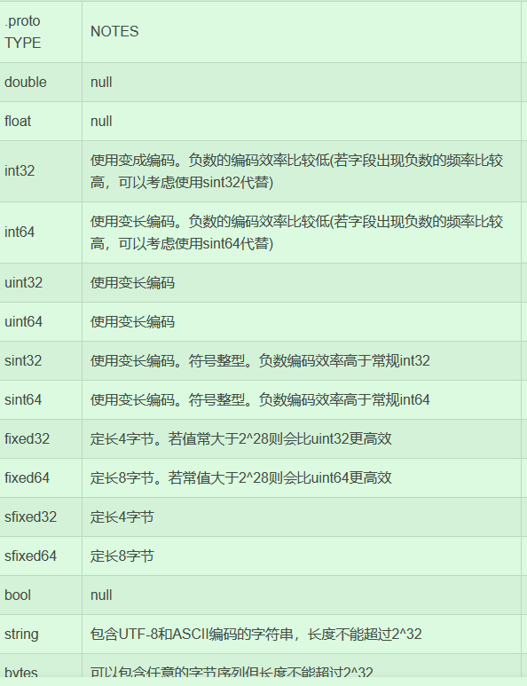

mprpc项目正式学习

 Git 只跟踪文件，不跟踪空文件夹,你创建空文件夹的时候并不会上传，在空文件夹里放一个.gitkeep文件即可，文件名就叫这个也行


流程：**1.客户端发起rpc调用请求，2.客户端通过zookeeper的watcher机制寻找发现服务端，3.客户端发起 RPC 请求到服务端，4.然后服务端响应请求并返回**，**5.客户端处理服务端响应**

**RPC调用的底层工作**：在你调用 `stub->Login(...)` 这样的 RPC 方法时，底层做了很多工作，包括消息序列化、网络传输、反序列化、错误处理、连接管理等。

**代理类（Stub）**：就是负责封装这些底层操作的类。它提供了一个简洁的 API，让你只需要关注方法的输入和输出，不用关心底层的实现细节。

**开发者的视角**：作为开发者，你只需要在客户端调用远程方法，而 mpRPC 会负责所有复杂的网络和序列化操作，**让远程调用变得像本地调用一样简单。**


# 学习项目的顺序–也是视频讲解的顺序

1.项目介绍 

2.集群分布式理论

3.RPC通信原理

4.环境搭建

5.protobuff实践

6.本地服务发布成rpc服务

7.Mprpc框架基础类设计

8.Mprpc框架项目动态库编译

9.Mprpc框架的配置文件加载

10.开发RpcProvider的网络服务 

11.RpcProvider发布服务方法

12.RpcProvider分发rpc服务

13.RpcProvider的rpc响应回调实现 

14.RpcChannel的调用过程

15.实现RPC方法的调用过程

16.点对点RPC通信功能测试

17. Mprpc框架的应用示例
18. RpcControler控制模块实现
19.  logger日志系统设计实现
20. 异步日志缓冲队列实现 
21. 学习Zookeeper，zk服务配置中心和znode节点
22. zk的watcher机制和原生API安装
23. 封装Zookeeper的客户类
24. zk在项目上的应用实践
25. 项目总结以及编辑脚本

# 1~3在网络库和前期知识.md

# 4.项目代码工程部署(mprpc)

https://blog.csdn.net/LINZEYU666/article/details/119205495

文件夹和文件

## 1.怎么编写该项目的CMakeLists.txt

先创建文件夹，然后每个文件夹里创建CMakeLists.txt文件

5个CMakeLists.txt，对应五个文件夹下面

项目根目录+example+src+example下的两个文件夹callee,caller

```cmake
1.根的
# 设置cmake的最低版本和项目名称
cmake_minimum_required(VERSION 3.0)
project(mprpc)

# 生成debug版本，可以进行gdb调试
set(CMAKE_BUILD_TYPE "Debug")

# 设置项目可执行文件输出的路径
set(EXECUTABLE_OUTPUT_PATH ${PROJECT_SOURCE_DIR}/bin)
# 设置项目库文件输出的路径
set(LIBRARY_OUTPUT_PATH ${PROJECT_SOURCE_DIR}/lib)

# 设置项目编译头文件搜索路径 -I
include_directories(${PROJECT_SOURCE_DIR}/src/include)
include_directories(${PROJECT_SOURCE_DIR}/example)
# 设置项目库文件搜索路径 -L
link_directories(${PROJECT_SOURCE_DIR}/lib)

# src包含了mprpc框架所有的相关代码
add_subdirectory(src)
# example包含了mprpc框架使用的示例代码
add_subdirectory(example)


2.src的
#aux_source_directory(. SRC_LIST)
set(SRC_LIST 
    mprpcapplication.cc 
    mprpcconfig.cc 
    rpcheader.pb.cc 
    rpcprovider.cc 
    mprpcchannel.cc
    mprpccontroller.cc
    logger.cc
    zookeeperutil.cc)
add_library(mprpc ${SRC_LIST})
target_link_libraries(mprpc muduo_net muduo_base pthread zookeeper_mt)

3.example的
add_subdirectory(callee)
add_subdirectory(caller)


4.example下callee的
# set(SRC_LIST userservice.cc ../user.pb.cc)
set(SRC_LIST friendservice.cc ../friend.pb.cc)

add_executable(provider ${SRC_LIST})
target_link_libraries(provider mprpc protobuf)


5.example下caller的
# set(SRC_LIST calluserservice.cc ../user.pb.cc)
set(SRC_LIST callfriendservice.cc ../friend.pb.cc)
add_executable(consumer ${SRC_LIST})
target_link_libraries(consumer mprpc protobuf)
```


# 5.protobuff实践

xml,json也学习一下，很简单

安装一个插件


流程：

编写.proto文件，用命令行protoc test.proto -cpp_out=./  编译，生成.pb.cc和.pb.h代码

在正式的.cpp代码里包含这个生成的.pb.h头文件即可，g++编译运行

## ①编写.proto文件

定义类，掌握数据类型有哪些，=1，=2是放在第一个和第二个的意思

```protobuf
syntax = "proto3"; // 声明了protobuf的版本

package fixbug; // 声明了代码所在的包（对于C++来说是namespace）

message ResultCode//可以封装一下失败类，减少代码重复量
{
    int32 errcode = 1;//表示第1字段
    bytes errmsg = 2;//表示第2字段
}

// 定义登录请求消息类型  name   pwd
message LoginRequest
{
    bytes name = 1;//表示第1字段
    bytes pwd = 2;//表示第2字段
}

// 定义登录响应消息类型
message LoginResponse
{
    ResultCode result = 1;//表示第1字段
    bool success = 2;//表示第2字段
}

```




## ②用命令行protoc test.proto -cpp_out=./  编译，生成.pb.cc和.pb.h代码

可以看到我们之前定义的LoginRequest是一个class类！
 我们定义的name，pwd相当于就是LoginRequest类的成员变量，也有相应的成员方法


## ③正式的.cc代码里包含这个生成的.pb.h头文件编写

什么是.cc，表示C++源代码的意思：


用刚才的类去定义对象，设置成员变量，然后调用方法（类的成员函数）来初始化set_变量名

和 相应的序列化和反序列化。类名.成员变量名


```cpp
#include "test.pb.h"
#include <iostream>
#include <string>
using namespace fixbug;

int main()
{
    // 封装了login请求对象的数据
    LoginRequest req;
    req.set_name("linzeyu");//用户名：林泽宇
    req.set_pwd("123456");//密码：123456

    // 对象数据序列化 =》 char*
    std::string send_str;
    if (req.SerializeToString(&send_str))
    {
        std::cout << send_str.c_str() << std::endl;
    }

    // 从send_str反序列化一个login请求对象
    LoginRequest reqB;
    if (reqB.ParseFromString(send_str))
    {
        std::cout << reqB.name() << std::endl;
        std::cout << reqB.pwd() << std::endl;
    }

    return 0;
}

```

char* 是C语言风格字符串


## ④类型

在存储数据的时候，有3种形式：**数据 列表(类似数组) 映射表(不怎么用)**


一般用bytes 来存储字符串 ， uint32来存储数字 ， 消息类用Message来定义 ，

### 可以封装Message嵌套，来减少重复代码出现—比如错误码ResultCode

```protobuf
message ResultCode//封装一下失败类
{
    int32 errcode = 1;//表示第1字段
    bytes errmsg = 2;//表示第2字段
}

// 定义登录响应消息类型
message LoginResponse
{
    ResultCode result = 1;//表示第1字段
    bool success = 2;//表示第2字段
}
```

### 可以里面使用枚举类型—枚举是从0开始的

```protobuf
//返回用户的信息
message User
{
    bytes name = 1;
    uint32 age = 2;
    enum Sex//枚举
    {
        MAN = 0;//枚举是从0开始的
        WOMAN = 1;
    }
    Sex sex = 3;//在3号字段
}
```

### 然后**列表**用repeated关键字来做

```protobuf
//获取好友列表请求的响应
message GetFriendListsResponse
{
    ResultCode result = 1;
    repeated User friend_list = 2; // 定义了一个列表类型,在上面User类的基础上
}
```

### 使用列表消息类

```protobuf
    GetFriendListsResponse rsp;
    ResultCode *rc = rsp.mutable_result();
    rc->set_errcode(0);

    User *user1 = rsp.add_friend_list();
    user1->set_name("zhang san");
    user1->set_age(20);
    user1->set_sex(User::MAN);

    User *user2 = rsp.add_friend_list();
    user2->set_name("li si");
    user2->set_age(22);
    user2->set_sex(User::MAN);
```

Q:mutable_result()和add_friend_list() 方法，是GetFriendListsResponse 自带的吗？

A:`mutable_result()` 和 `add_friend_list()` 是 **`GetFriendListsResponse`** 类自带的成员方法，它们并不是人为编写的，而是通过 **Protocol Buffers (protobuf)** 自动生成的代码中的方法。当你使用 `protoc` 编译器编译这个 `.proto` 文件时，`protoc` 会根据 `.proto` 文件的定义生成对应的 

### **为什么需要 `mutable_result()` 和 `add_friend_list()`**

- **`mutable_result()`**：在 `protobuf` 中，消息字段有两种类型：简单类型和复合类型。复合类型字段（如 `ResultCode` 和 `User`）在 protobuf 的 C++ 类中会自动生成访问方法。`mutable_` 前缀表示这个字段是可以修改的。如果字段是不可修改的（例如 `const`），会生成 `result()` 方法。
- **`add_friend_list()`**：因为 `friend_list` 是一个 **重复字段（repeated）**，它类似于一个动态数组（如 `std::vector`）。`add_friend_list()` 方法用于向 `friend_list` 数组中添加新的元素，并返回指向该元素的指针。这使得可以方便地构造和操作一个包含多个元素的列表。

`GetFriendListsResponse` 类中的自动生成方法：

```C++
class GetFriendListsResponse {
public:
    // 访问 result 字段的方法（返回指向 ResultCode 的指针）
    ResultCode* mutable_result() {
        return &result_;
    }

    // 访问 friend_list 字段的方法
    User* add_friend_list() {
        friend_list_.emplace_back();  // 添加一个新的 User 对象
        return &friend_list_.back();  // 返回指向最后一个 User 对象的指针
    }

private:
    ResultCode result_;               // 存储 ResultCode 对象
    std::vector<User> friend_list_;   // 存储多个 User 对象
};
```

### 找方法在这个文件里OUTLINE


## ⑤**在 protobuf 中定义 RPC 方法**

虽然 protobuf 本身并不直接提供 RPC 通信功能，但它确实提供了 **服务（Service）** 的定义，允许你描述 **RPC 方法** 的输入、输出和方法名称。通过使用 protobuf 描述 RPC 接口，可以让你在客户端和服务器之间传输方法名称、参数和返回值。

通过 `service` 关键字，你可以在 `.proto` 文件中定义一个 **RPC 服务**。这相当于定义了一个接口，其中包含了一组可以被调用的 RPC 方法。每个方法都有请求和响应消息类型。

### **`cc_generic_services = true` 选项**

这个选项告诉 `protobuf` 编译器在生成 C++ 代码时，不仅生成消息类，还生成一个 **服务类** 和 **RPC 方法的接口描述**。如果不设置该选项，protobuf 默认不生成与服务相关的代码。这个选项主要用于生成 C++ 的 RPC 服务代码，它会在服务端和客户端之间提供方法调用接口。

在 protobuf 中，定义 RPC 方法的类型通过 `service` 来完成。每个 `rpc` 方法指定了请求消息类型和响应消息类型。

`cc_generic_services = true` 选项用于告诉 `protoc` 生成服务类和 RPC 方法接口，使得可以方便地实现服务端和客户端的代码。


```protobuf
//定义下面的选项，表示生成service服务类和rpc方法描述，默认不生成
option cc_generic_services = true;
//在protobuf里面怎么定义描述rpc方法的类型 - service
service UserServiceRpc
{
    rpc Login(LoginRequest) returns(LoginResponse);
    rpc GetFriendLists(GetFriendListsRequest) returns(GetFriendListsResponse);
}//服务类及服务的方法
```


### 桩stub

**我们进入生成的test.pb.h看到，服务service生成了UserServiceRpc类和UserServiceRpc_stub类（桩，代理类**

**相当于是说，本地调用一个RPC方法的时候，底层要做很多事情，这些事情都是由代理类来做的。**

**RPC调用的底层工作**：在你调用 `stub->Login(...)` 这样的 RPC 方法时，底层做了很多工作，包括消息序列化、网络传输、反序列化、错误处理、连接管理等。

**代理类（Stub）**：就是负责封装这些底层操作的类。它提供了一个简洁的 API，让你只需要关注方法的输入和输出，不用关心底层的实现细节。

**开发者的视角**：作为开发者，你只需要在客户端调用远程方法，而 mpRPC 会负责所有复杂的网络和序列化操作，让远程调用变得像本地调用一样简单。

是的，生成的 `test.pb.h` 文件中会包含 `UserServiceRpc` 类及其相关的 `UserServiceRpcStub` 类。这些类是 gRPC 框架生成的，用于服务端和客户端进行 RPC 通信。

### 1. **`UserServiceRpc` 类 (服务端类)**

在 `test.pb.h` 中，`UserServiceRpc` 类它继承自 `PROTOBUF_NAMESPACE_ID::Service`，是由 **gRPC** 自动生成的服务端接口类。这个类是一个抽象类，包含了所有 RPC 方法的定义。它的作用是给服务端实现这些方法提供一个接口。需要在服务端实现这个类中的方法来处理客户端的请求。

**作用**：该类为你的服务提供了一个接口，用于处理客户端发来的请求。实际的处理逻辑需要你在服务端实现。


### 2. **`UserServiceRpcStub` 类 (客户端桩类)**

`UserServiceRpcStub` 是由 **gRPC** 自动生成的 **客户端代理类**（也叫桩类）。它提供了一个方法来调用远程的 RPC 方法。客户端通过这个类来发起 RPC 请求，**gRPC 框架会自动处理消息的序列化、网络传输和反序列化**，然后将响应返回给客户端。


### 3. **服务端的实现**

在服务端，你需要实现 `UserServiceRpc` 类中的抽象方法，提供业务逻辑。通常，你会创建一个类，继承 `UserServiceRpc`，并实现其中的 RPC 方法。

### 4. **客户端调用**

客户端通过 `UserServiceRpc::Stub` 类的实例来调用服务器端的方法。在客户端代码中，`Stub` 类会被用来发起远程调用，向服务端发送请求并等待响应。

### 5. **完整的 gRPC 流程总结**

1. **定义服务**：在 `.proto` 文件中定义 RPC 服务（包括方法和消息类型）。
2. **生成代码**：使用 `protoc` 编译器生成 C++ 的服务端和客户端代码。
3. **服务端实现**：继承 gRPC 自动生成的服务类，重写 RPC 方法，实现具体的业务逻辑。
4. **客户端调用**：通过 gRPC 自动生成的 `Stub` 类，发起远程调用，并处理响应。


## **总结**

1.在Protobuf里通过 **`Message`** 类型来定义RPC 方法的参数和返回值。这些 `Message` 类会自动生成，提供了很多成员方法，用于实现请求数据和响应数据的序列化与反序列化。

Protobuf 会为每个 `Message` 类型生成一组成员方法，用于序列化和反序列化操作。这些方法大致包括：

- **`SerializeToString`**: 将消息对象序列化为一个字符串（字节流）。
- **`ParseFromString`**: 从字节流中反序列化恢复原消息。
- **`DebugString`**: 以字符串形式打印消息内容，通常用于调试。

2.在Protobuf里通过 **`service`** 类型来定义 RPC 服务方法。`service` 是一个逻辑上的服务集合，它包含多个 RPC 方法的声明。每个 RPC 方法都对应一个输入消息（Request）和一个输出消息（Response）。

```protobuf
//在protobuf里面怎么定义描述rpc方法的类型 - service
service UserServiceRpc
{
    rpc Login(LoginRequest) returns(LoginResponse);
    rpc GetFriendLists(GetFriendListsRequest) returns(GetFriendListsResponse);
}
```

**会生成两个类**

**①UserServiceRpc服务端的抽象类，定义了服务方法的接口。**

服务端不直接创建该类的实例

服务端需要继承这个类并实现其中的虚函数来处理实际的 RPC 方法。

**②UserService_Stub 客户端代理类，允许客户端调用远程服务的方法。**

UserService_Stub构造函数用于初始化与服务端的连接，它接收一个 `Channel` 对象，通过该 `Channel` 发送请求

**看他们的继承方式，构造函数，方法成员函数**


**①UserServiceRpc**

1.继承于protobuf的**Service类**

2.有默认的构造函数，构造的时候不用传参数，

3.Login和GetFriendLists，参数都一样


 **②UserService_Stub**

1.继承于**UserServiceRpc类**

2.没有默认的构造函数，要传Rpcchannel指针，而且有一个成员变量：Rpcchannel指针，接收了构造函数的实参


**而Rpcchanne**l是一个抽象类，有一个CallMethod方法


我们必须自己写一个派生类继承他，重写他的**CallMethod方法。**


**stub构造函数就是传自己实现的MyRpcChannel给Rpcchannel指针给stub构造，派生类是可以用基类指针的。**

 **到时候，调用Stub的login方法或者GetFriendList方法都是基类指针指向了派生类同名的方法。**

**用Stub桩类不管调用哪个方法，最终都调用到我们的MyRpcChannel的CallMethod方法，我们在这里就可以进行rpc方法的序列化和反序列化，然后发起远程的rpc调用请求。**


# 6.本地服务发布成rpc服务

# 7.Mprpc框架基础类设计

# 8.Mprpc框架项目动态库编译

# 9.Mprpc框架的配置文件加载

# 10.开发RpcProvider的网络服务 

# 11.RpcProvider发布服务方法

# 12.RpcProvider分发rpc服务

# 13.RpcProvider的rpc响应回调实现 

14.RpcChannel的调用过程

15.实现RPC方法的调用过程

16.点对点RPC通信功能测试

17. Mprpc框架的应用示例
18. RpcControler控制模块实现
19.  logger日志系统设计实现
20. 异步日志缓冲队列实现 
21. 学习Zookeeper，zk服务配置中心和znode节点
22. zk的watcher机制和原生API安装
23. 封装Zookeeper的客户类
24. zk在项目上的应用实践
25. 项目总结以及编辑脚本

