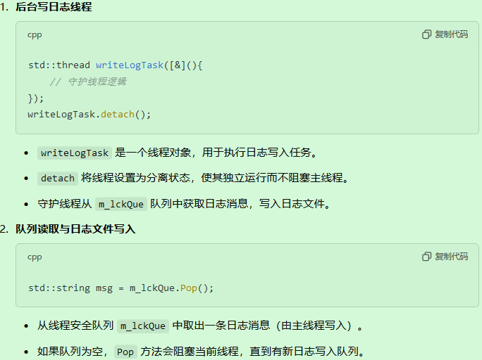
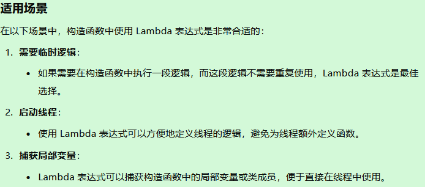

# 开头

mprpc项目正式学习

**1.  .h，每写一个全局模块的头文件就加到框架头文件里 mprpcapplication里面**，如果不用全局，就加到具体的里面去，

** 2.cc，每写一个就要添加在src的CMakeLists.txt更新一下**


服务端callee（rpc服务提供方）使用：

1.在protobuf里定义服务对象和服务方法类 

2.在服务对象.cc文件里比如 ：Userservice.cc 继承protobuf的服务对象类，里面写本地Login方法，还有重写protobuf的Login服务方法虚函数，在这个里面获取函数参数，传入本地方法，将本地方法的结果写回响应，执行回调（序列化和网络发送，框架要做的事）

3.主函数，初始化框架，定义provider对象，发布上面的服务，启动provider，等待远程rpc请求

客户端caller（rpc服务请求方）使用：


```C++
class UserServiceRpc : public ::google::protobuf::Service {
 protected:
  // This class should be treated as an abstract interface.
  inline UserServiceRpc() {};
 public:
  virtual ~UserServiceRpc();

  typedef UserServiceRpc_Stub Stub;

  static const ::google::protobuf::ServiceDescriptor* descriptor();

  virtual void Login(::google::protobuf::RpcController* controller,
                       const ::fixbug::LoginRequest* request,
                       ::fixbug::LoginResponse* response,
                       ::google::protobuf::Closure* done);

  // implements Service ----------------------------------------------

  const ::google::protobuf::ServiceDescriptor* GetDescriptor();
  void CallMethod(const ::google::protobuf::MethodDescriptor* method,
                  ::google::protobuf::RpcController* controller,
                  const ::google::protobuf::Message* request,
                  ::google::protobuf::Message* response,
                  ::google::protobuf::Closure* done);
  const ::google::protobuf::Message& GetRequestPrototype(
    const ::google::protobuf::MethodDescriptor* method) const;
  const ::google::protobuf::Message& GetResponsePrototype(
    const ::google::protobuf::MethodDescriptor* method) const;

 private:
  GOOGLE_DISALLOW_EVIL_CONSTRUCTORS(UserServiceRpc);
};

class UserServiceRpc_Stub : public UserServiceRpc {
 public:
  UserServiceRpc_Stub(::google::protobuf::RpcChannel* channel);
  UserServiceRpc_Stub(::google::protobuf::RpcChannel* channel,
                   ::google::protobuf::Service::ChannelOwnership ownership);
  ~UserServiceRpc_Stub();

  inline ::google::protobuf::RpcChannel* channel() { return channel_; }

  // implements UserServiceRpc ------------------------------------------

  void Login(::google::protobuf::RpcController* controller,
                       const ::fixbug::LoginRequest* request,
                       ::fixbug::LoginResponse* response,
                       ::google::protobuf::Closure* done);
 private:
  ::google::protobuf::RpcChannel* channel_;
  bool owns_channel_;
  GOOGLE_DISALLOW_EVIL_CONSTRUCTORS(UserServiceRpc_Stub);
};

```

这个项目主要就是：

1.框架初始化

2.provider提供注册服务，发布服务功能，接收rpc请求反序列化，并把rpc响应结果序列化发送出去

**提供服务的节点先启动**，和ZK创建会话（session），然后在里面维护了一个RPC方法的map表，想发布服务会调用notifyservice函数，把发布服务的对象和RPC方法写到map表，然后通过ZKclient把这些服务和方法都注册在ZK上，放在相应的znode节点上，可以看一下图右边的根目录形式的写法。
然后RPC服务的提供者就会去启动网络服务，采用的是muduo库，设置了4个线程，自动分配1个I/O线程和3个work线程，muduo绑定回调，（绑定了OnConnection和OnMessage），调用了start和loop方法，RPC服务节点就开始启动了。

**服务方(也就是执行业务方)的RPC方法做4步操作。**（通过OnMessage函数）①将muduo网络通信收到的网络数据反序列化成参数，包括  ，其中LoginRequest已经反序列化数据  b. rpc服务方名字service name和rpc方法的名字method name③根据这两个名字找到service对象和method对象，④根据获取到的服务对象和方法对象，生成rpc方法调用的请求request和响应response参数（LoginRequest和LoginResponse），绑定发送回调

④调用service.callMethod,


3.channel给客户端使用，**RPC调用方和服务方建立连接后**，RPC服务的调用方就发起调用，首先通过stub代理对象调用RPC方法，最终都是调用channel的CallMethod方法，统一进行参数的打包，数据的序列化，获取ZK的服务的IP地址和端口号，发起RPC调用。
在ZK查到调用服务的IP地址和端口号以后，用header组装数据。header_size表示rpcheader的长度。
rpcheader包括servicename,methodname,和args的长度（防止粘包）。

原文链接：https://blog.csdn.net/LINZEYU666/article/details/119357149

GPT：https://chatgpt.com/c/674bff5b-6770-800a-96a7-815496f174b2（挂）

https://chatgpt.com/c/676380f9-dccc-800a-b76e-3dd928cf0e29

这个框架就是负责

**1.网络通信**

**2.请求和响应的序列化和反序列化**

**3.服务发现、负载均衡、高可用等分布式系统的关键功能**


 Git 只跟踪文件，不跟踪空文件夹,你创建空文件夹的时候并不会上传，在空文件夹里放一个.gitkeep文件即可，文件名就叫这个也行


流程：**1.客户端发起rpc调用请求，2.客户端通过zookeeper的watcher机制寻找发现服务端，3.客户端发起 RPC 请求到服务端，4.然后服务端响应请求并返回**，**5.客户端处理服务端响应**

**RPC调用的底层工作**：在你调用 `stub->Login(...)` 这样的 RPC 方法时，底层做了很多工作，包括消息序列化、网络传输、反序列化、错误处理、连接管理等。

**代理类（Stub）**：就是负责封装这些底层操作的类。它提供了一个简洁的 API，让你只需要关注方法的输入和输出，不用关心底层的实现细节。

**开发者的视角**：作为开发者，你只需要在客户端调用远程方法，而 mpRPC 会负责所有复杂的网络和序列化操作，**让远程调用变得像本地调用一样简单。**


底层框架如何处理 RPC 请求：

- 客户端通过 RPC 调用发送请求到服务端。
- 服务端接收到请求后，会根据请求的类型找到对应的服务方法（如 `Login`）。
- 框架将请求数据反序列化为 `LoginRequest` 对象，服务端的业务逻辑方法（如 `Login`）会通过这个对象获取用户名和密码并处理业务。
- 服务端处理完业务后，将结果填入 `LoginResponse` 中，框架会将该响应对象序列化并发送回客户端。
- `done->Run()`：通知框架回调，执行响应的序列化和传输操作。

# 详细流程


在引入 **Zookeeper** 后的 **RPC框架** 详细流程可以分为 **服务注册、服务发现、请求处理和响应** 四大部分。下面是每个部分的详细流程总结：

------

### 1. **服务端：服务注册（注册到 Zookeeper）**

服务端提供了 RPC 服务，首先需要将自己的服务注册到 **Zookeeper**，使得客户端能够发现并调用该服务。

#### 步骤：

1. **启动服务端**：
   - 服务端启动时，首先会调用框架的注册功能，向 **Zookeeper** 注册自己所提供的 RPC 服务。服务提供者通常会创建一个独立的 Zookeeper 节点路径，例如 `/rpc/services/UserService`。
2. **注册服务实例**：
   - 服务实例将自己的信息（例如：服务地址、端口等元数据）存储在 Zookeeper 中。例如，每个服务实例会在 `/rpc/services/UserService/instance_1`、`/rpc/services/UserService/instance_2` 等节点下存储自己的地址（如 `127.0.0.1:8080`）。
3. **维护服务实例状态**：
   - 服务端将注册的服务信息**持久化**到 Zookeeper。如果服务端挂掉或者下线，Zookeeper 会自动删除该服务节点（**临时节点**），并更新注册表。
4. **提供服务接口**：
   - 服务端继承框架的 `UserServiceRpc` 类，并实现其具体方法（如 `Login` 和 `GetFriendLists` 等）。这些方法被框架自动暴露并等待客户端请求。

------

### 2. **客户端：服务发现（通过 Zookeeper 获取服务）**

客户端需要获取远程服务实例的地址，以便发起 RPC 请求。

#### 步骤：

1. 启动客户：
   - 客户端启动时，首先需要查询 Zookeeper，获取指定服务的实例列表。例如，查询 `/rpc/services/UserService` 节点下的所有实例。
2. 获取服务列表：
   - Zookeeper 会返回该服务下所有注册的实例节点，如 `instance_1`、`instance_2` 等。这些实例节点包含服务实例的地址（如 `127.0.0.1:8080`）。
3. 负载均衡：
   - 客户端会根据负载均衡策略（如轮询、随机、加权等）从多个服务实例中选择一个实例。这样可以确保请求均衡地分配给多个服务端，提高系统的可扩展性和性能。
4. 建立与服务端的连接：
   - 客户端选择服务实例后，通过框架与选定的服务端建立网络连接，准备发送 RPC 请求。

------

### 3. **客户端发起 RPC 请求**

客户端通过代理类（如 `UserService_Stub`）发起 RPC 请求，并将请求数据发送到服务端。

#### 步骤：

1. 调用代理类方法
   - 客户端通过代理类（`UserService_Stub`）发起远程方法调用，例如 `Login(name, pwd)`。这些方法会被框架拦截并转换为网络请求。
2. 请求序列化
   - 代理类将请求参数（如 `LoginRequest`）转换为字节流。框架使用 **Protobuf** 进行序列化，将数据转化为可以通过网络传输的格式。
3. 发送请求
   - 请求数据通过底层网络库（如 **Muduo**）发送到服务端。框架会确保请求经过网络层正确传输。

------

### 4. **服务端：处理请求**

服务端接收到请求后，框架会将请求反序列化为对应的消息对象，并调用服务提供者的本地方法来处理请求。

#### 步骤：

1. 接收请求
   - 服务端收到请求后，框架会将传输过来的字节流反序列化为 Protobuf 生成的请求对象（如 `LoginRequest`）。此时，服务端可以通过对象方法获取请求参数（如用户名、密码等）。
2. 调用本地服务方法
   - 框架将反序列化后的请求对象传递给服务端的本地方法（如 `Login(name, pwd)`）。本地服务方法处理业务逻辑后返回结果。
3. 封装响应
   - 服务端将处理结果封装到响应对象（如 `LoginResponse`）中。响应对象会包括业务处理结果（如登录成功或失败的状态）以及其他信息（如错误码、错误信息等）。
4. 响应序列化
   - 响应对象通过框架进行序列化，转化为字节流以便发送回客户端。
5. 发送响应
   - 底层网络库（如 **Muduo**）将响应数据通过网络发送回客户端。

------

### 5. **客户端：接收响应并处理**

客户端接收到服务端的响应后，框架会将响应数据反序列化为 Protobuf 生成的响应对象，并返回给客户端应用。

#### 步骤：

1. 接收响应
   - 客户端通过框架接收到来自服务端的响应字节流。
2. 反序列化响应
   - 框架使用 Protobuf 将响应字节流反序列化为响应对象（如 `LoginResponse`）。客户端可以通过对象方法获取响应数据。
3. 处理响应数据
   - 客户端应用根据响应数据进行处理，例如检查登录是否成功、获取错误信息等。

------

### 6. **服务端下线与健康检查（高可用性）**

在分布式环境中，服务端可能会宕机或发生故障，框架和 Zookeeper 会确保系统的高可用性。

#### 步骤：

1. **健康检查**：
   - 客户端会定期检查 Zookeeper 上的服务实例列表。通过 Zookeeper 提供的 **Watcher** 机制，客户端会在服务下线时收到通知。
2. **服务下线通知**：
   - 如果服务实例不可用，Zookeeper 会自动从服务实例列表中删除该服务。客户端会自动绕过不可用的实例，确保请求可以发往健康实例。
3. **服务重试机制**：
   - 如果某个服务实例不可用，客户端会根据负载均衡策略重新选择其他可用的实例，确保请求能够正确执行。


# 学习项目的顺序–也是视频讲解的顺序

1.项目介绍 

2.集群分布式理论

3.RPC通信原理

4.环境搭建

5.protobuff实践

6.本地服务发布成rpc服务

7.Mprpc框架基础类设计

8.Mprpc框架项目动态库编译

9.Mprpc框架的配置文件加载

10.开发RpcProvider的网络服务 

11.RpcProvider发布服务方法

12.RpcProvider分发rpc服务

13.RpcProvider的rpc响应回调实现 

14.RpcChannel的调用过程

15.实现RPC方法的调用过程

16.点对点RPC通信功能测试

17. Mprpc框架的应用示例
18. RpcControler控制模块实现
19.  logger日志系统设计实现
20. 异步日志缓冲队列实现 
21. 学习Zookeeper，zk服务配置中心和znode节点
22. zk的watcher机制和原生API安装
23. 封装Zookeeper的客户类
24. zk在项目上的应用实践
25. 项目总结以及编辑脚本

# 1~3在网络库和前期知识.md

# 4.项目代码工程部署(mprpc)

https://blog.csdn.net/LINZEYU666/article/details/119205495

文件夹和文件

## 1.怎么编写该项目的CMakeLists.txt

先创建文件夹，然后每个文件夹里创建CMakeLists.txt文件

5个CMakeLists.txt，对应五个文件夹下面

项目根目录+example+src+example下的两个文件夹callee,caller

```cmake
1.根的
# 设置cmake的最低版本和项目名称
cmake_minimum_required(VERSION 3.0)
project(mprpc)

# 生成debug版本，可以进行gdb调试
set(CMAKE_BUILD_TYPE "Debug")

# 设置项目可执行文件输出的路径
set(EXECUTABLE_OUTPUT_PATH ${PROJECT_SOURCE_DIR}/bin)
# 设置项目库文件输出的路径
set(LIBRARY_OUTPUT_PATH ${PROJECT_SOURCE_DIR}/lib)

# 设置项目编译头文件搜索路径 -I
include_directories(${PROJECT_SOURCE_DIR}/src/include)
include_directories(${PROJECT_SOURCE_DIR}/example)
# 设置项目库文件搜索路径 -L
link_directories(${PROJECT_SOURCE_DIR}/lib)

# src包含了mprpc框架所有的相关代码
add_subdirectory(src)
# example包含了mprpc框架使用的示例代码
add_subdirectory(example)


2.src的
#aux_source_directory(. SRC_LIST)
set(SRC_LIST 
    mprpcapplication.cc 
    mprpcconfig.cc 
    rpcheader.pb.cc 
    rpcprovider.cc 
    mprpcchannel.cc
    mprpccontroller.cc
    logger.cc
    zookeeperutil.cc)
add_library(mprpc ${SRC_LIST})
target_link_libraries(mprpc muduo_net muduo_base pthread zookeeper_mt)

3.example的
add_subdirectory(callee)
add_subdirectory(caller)


4.example下callee的
# set(SRC_LIST userservice.cc ../user.pb.cc)
set(SRC_LIST friendservice.cc ../friend.pb.cc)

add_executable(provider ${SRC_LIST})
target_link_libraries(provider mprpc protobuf)


5.example下caller的//后面再写，先不写
# set(SRC_LIST calluserservice.cc ../user.pb.cc)
set(SRC_LIST callfriendservice.cc ../friend.pb.cc)
add_executable(consumer ${SRC_LIST})
target_link_libraries(consumer mprpc protobuf)
```


# 5.protobuff实践

https://blog.csdn.net/LINZEYU666/article/details/119205758

xml,json也学习一下，很简单

安装一个插件


总结：在.pror文件里定义消息类型，Message和Service,生成的.pb.cc文件里游泳构造函数和方法成员函数，取查看他们并学会怎么调用

1.①结构体变量用一个指针来定义初始化，ResultCode*rc = resp.mutable_result();


   反序列化调用直接resp2.result().errmsg() 


   ②普通变量初始化/赋值用   ：set_变量名（初始值）


③数组成员repeated，初始化用指针：


反序列化：用成员函数方法，来进行下标操作


2.**对象** 序列化成 **string变量**，用    **对象名.SerializePartialToString(&字符串名)** ，取地址，因为要改变字符串，引用传递


3.**string变量** 反序列化成  **新对象**，用  **新对象名.SerializePartialToString(字符串名)** ，不用取地址 


4.有很多成员函数方法，

5.定义rpc服务:在.proto文件添加

```protobuf
/定义下面的选项，表示生成service服务类和rpc方法描述，默认不生成
option cc_generic_services = true;
//在protobuf里面怎么定义描述rpc方法的类型 - service
service UserServiceRpc
{
    rpc Login(LoginRequest) returns(LoginResponse);
    rpc GetFriendLists(GetFriendListsRequest) returns(GetFriendListsResponse);
}//服务类及服务的方法
```

**生成的pb.cc里可以看到生成了两个类UserServiceRpc和UserServiceRpc_Stub，仔细观察他们的构造函数和成员方法，如何使用**


流程：

编写.proto文件，用命令行protoc test.proto -cpp_out=./  编译，生成.pb.cc和.pb.h代码

在正式的.cpp代码里包含这个生成的.pb.h头文件即可，g++编译运行g++ main.cc test.pb.cc -lprotobuf

运行程序：                                   ./a.out

## ①编写.proto文件

定义类，掌握数据类型有哪些，=1，=2是放在第一个和第二个的意思

```protobuf
syntax = "proto3"; // 声明了protobuf的版本

package fixbug; // 声明了代码所在的包（对于C++来说是namespace）

message ResultCode//可以封装一下失败类，减少代码重复量
{
    int32 errcode = 1;//表示第1字段
    bytes errmsg = 2;//表示第2字段
}

// 定义登录请求消息类型  name   pwd
message LoginRequest
{
    bytes name = 1;//表示第1字段
    bytes pwd = 2;//表示第2字段
}

// 定义登录响应消息类型
message LoginResponse
{
    ResultCode result = 1;//表示第1字段
    bool success = 2;//表示第2字段
}

```


## ②用命令行protoc test.proto -cpp_out=./  编译，生成.pb.cc和.pb.h代码

可以看到我们之前定义的LoginRequest是一个class类！
 我们定义的name，pwd相当于就是LoginRequest类的成员变量，也有相应的成员方法


## ③正式的.cc代码里包含这个生成的.pb.h头文件编写

什么是.cc，表示C++源代码的意思：


用刚才的类去定义对象，设置成员变量，然后调用方法（类的成员函数）来初始化set_变量名

和 相应的序列化和反序列化。类名.成员变量名


```cpp
#include "test.pb.h"
#include <iostream>
#include <string>
using namespace fixbug;

int main()
{
    // 封装了login请求对象的数据
    LoginRequest req;
    req.set_name("linzeyu");//用户名：林泽宇
    req.set_pwd("123456");//密码：123456

    // 对象数据序列化 =》 char*
    std::string send_str;
    if (req.SerializeToString(&send_str))
    {
        std::cout << send_str.c_str() << std::endl;
    }

    // 从send_str反序列化一个login请求对象
    LoginRequest reqB;
    if (reqB.ParseFromString(send_str))
    {
        std::cout << reqB.name() << std::endl;
        std::cout << reqB.pwd() << std::endl;
    }

    return 0;
}

```

char* 是C语言风格字符串


修改了.proto文件后要重新编译：protoc test.proto --cpp_out=./

修改了main.cc文件后要重新编译：g++ main.cc test.pb.cc -lprotobuf

运行程序：                                   ./a.out

## ④类型

在存储数据的时候，有3种形式：**数据 列表(类似数组) 映射表(不怎么用)**


一般用bytes 来存储字符串 ， uint32来存储数字 ， 消息类用Message来定义 ，

### 可以封装Message嵌套，来减少重复代码出现—比如错误码ResultCode

```protobuf
message ResultCode//封装一下失败类
{
    int32 errcode = 1;//表示第1字段
    bytes errmsg = 2;//表示第2字段
}

// 定义登录响应消息类型
message LoginResponse
{
    ResultCode result = 1;//表示第1字段
    bool success = 2;//表示第2字段
}
```

### 可以里面使用枚举类型—枚举是从0开始的

```protobuf
//返回用户的信息
message User
{
    bytes name = 1;
    uint32 age = 2;
    enum Sex//枚举
    {
        MAN = 0;//枚举是从0开始的
        WOMAN = 1;
    }
    Sex sex = 3;//在3号字段
}
```

### 然后**列表**用repeated关键字来做

```protobuf
//获取好友列表请求的响应
message GetFriendListsResponse
{
    ResultCode result = 1;
    repeated User friend_list = 2; // 定义了一个列表类型,在上面User类的基础上
}
```

### 使用列表消息类

```protobuf
    GetFriendListsResponse rsp;
    ResultCode *rc = rsp.mutable_result();
    rc->set_errcode(0);

    User *user1 = rsp.add_friend_list();
    user1->set_name("zhang san");
    user1->set_age(20);
    user1->set_sex(User::MAN);

    User *user2 = rsp.add_friend_list();
    user2->set_name("li si");
    user2->set_age(22);
    user2->set_sex(User::MAN);
```

Q:mutable_result()和add_friend_list() 方法，是GetFriendListsResponse 自带的吗？

A:`mutable_result()` 和 `add_friend_list()` 是 **`GetFriendListsResponse`** 类自带的成员方法，它们并不是人为编写的，而是通过 **Protocol Buffers (protobuf)** 自动生成的代码中的方法。当你使用 `protoc` 编译器编译这个 `.proto` 文件时，`protoc` 会根据 `.proto` 文件的定义生成对应的 

### **为什么需要 `mutable_result()` 和 `add_friend_list()`**

- **`mutable_result()`**：在 `protobuf` 中，消息字段有两种类型：简单类型和复合类型。复合类型字段（如 `ResultCode` 和 `User`）在 protobuf 的 C++ 类中会自动生成访问方法。`mutable_` 前缀表示这个字段是可以修改的。如果字段是不可修改的（例如 `const`），会生成 `result()` 方法。
- **`add_friend_list()`**：因为 `friend_list` 是一个 **重复字段（repeated）**，它类似于一个动态数组（如 `std::vector`）。`add_friend_list()` 方法用于向 `friend_list` 数组中添加新的元素，并返回指向该元素的指针。这使得可以方便地构造和操作一个包含多个元素的列表。

`GetFriendListsResponse` 类中的自动生成方法：

```C++
class GetFriendListsResponse {
public:
    // 访问 result 字段的方法（返回指向 ResultCode 的指针）
    ResultCode* mutable_result() {
        return &result_;
    }

    // 访问 friend_list 字段的方法
    User* add_friend_list() {
        friend_list_.emplace_back();  // 添加一个新的 User 对象
        return &friend_list_.back();  // 返回指向最后一个 User 对象的指针
    }

private:
    ResultCode result_;               // 存储 ResultCode 对象
    std::vector<User> friend_list_;   // 存储多个 User 对象
};
```

### 找方法在这个文件里OUTLINE


## ⑤**在 protobuf 中定义 RPC 方法**

虽然 protobuf 本身并不直接提供 RPC 通信功能，但它确实提供了 **服务（Service）** 的定义，允许你描述 **RPC 方法** 的输入、输出和方法名称。通过使用 protobuf 描述 RPC 接口，可以让你在客户端和服务器之间传输方法名称、参数和返回值。

通过 `service` 关键字，你可以在 `.proto` 文件中定义一个 **RPC 服务**。这相当于定义了一个接口，其中包含了一组可以被调用的 RPC 方法。每个方法都有请求和响应消息类型。

### **`cc_generic_services = true` 选项**

这个选项告诉 `protobuf` 编译器在生成 C++ 代码时，不仅生成消息类，还生成一个 **服务类** 和 **RPC 方法的接口描述**。如果不设置该选项，protobuf 默认不生成与服务相关的代码。这个选项主要用于生成 C++ 的 RPC 服务代码，它会在服务端和客户端之间提供方法调用接口。

在 protobuf 中，定义 RPC 方法的类型通过 `service` 来完成。每个 `rpc` 方法指定了请求消息类型和响应消息类型。

`cc_generic_services = true` 选项用于告诉 `protoc` 生成服务类和 RPC 方法接口，使得可以方便地实现服务端和客户端的代码。


```protobuf
//定义下面的选项，表示生成service服务类和rpc方法描述，默认不生成
option cc_generic_services = true;
//在protobuf里面怎么定义描述rpc方法的类型 - service
service UserServiceRpc
{
    rpc Login(LoginRequest) returns(LoginResponse);
    rpc GetFriendLists(GetFriendListsRequest) returns(GetFriendListsResponse);
}//服务类及服务的方法
```


### 桩stub

**我们进入生成的test.pb.h看到，服务service生成了UserServiceRpc类和UserServiceRpc_stub类（桩，代理类**

**相当于是说，本地调用一个RPC方法的时候，底层要做很多事情，这些事情都是由代理类来做的。**

**RPC调用的底层工作**：在你调用 `stub->Login(...)` 这样的 RPC 方法时，底层做了很多工作，包括消息序列化、网络传输、反序列化、错误处理、连接管理等。

**代理类（Stub）**：就是负责封装这些底层操作的类。它提供了一个简洁的 API，让你只需要关注方法的输入和输出，不用关心底层的实现细节。

**开发者的视角**：作为开发者，你只需要在客户端调用远程方法，而 mpRPC 会负责所有复杂的网络和序列化操作，让远程调用变得像本地调用一样简单。

是的，生成的 `test.pb.h` 文件中会包含 `UserServiceRpc` 类及其相关的 `UserServiceRpcStub` 类。这些类是 gRPC 框架生成的，用于服务端和客户端进行 RPC 通信。

### 1. **`UserServiceRpc` 类 (服务端类)**

在 `test.pb.h` 中，`UserServiceRpc` 类它继承自 `PROTOBUF_NAMESPACE_ID::Service`，是由 **gRPC** 自动生成的服务端接口类。这个类是一个抽象类，包含了所有 RPC 方法的定义。它的作用是给服务端实现这些方法提供一个接口。需要在服务端实现这个类中的方法来处理客户端的请求。

**作用**：该类为你的服务提供了一个接口，用于处理客户端发来的请求。实际的处理逻辑需要你在服务端实现。


### 2. **`UserServiceRpcStub` 类 (客户端桩类)**

`UserServiceRpcStub` 是由 **gRPC** 自动生成的 **客户端代理类**（也叫桩类）。它提供了一个方法来调用远程的 RPC 方法。客户端通过这个类来发起 RPC 请求，**gRPC 框架会自动处理消息的序列化、网络传输和反序列化**，然后将响应返回给客户端。


### 3. **服务端的实现**

在服务端，你需要实现 `UserServiceRpc` 类中的抽象方法，提供业务逻辑。通常，你会创建一个类，继承 `UserServiceRpc`，并实现其中的 RPC 方法。

### 4. **客户端调用**

客户端通过 `UserServiceRpc::Stub` 类的实例来调用服务器端的方法。在客户端代码中，`Stub` 类会被用来发起远程调用，向服务端发送请求并等待响应。

### 5. **完整的 gRPC 流程总结**

1. **定义服务**：在 `.proto` 文件中定义 RPC 服务（包括方法和消息类型）。
2. **生成代码**：使用 `protoc` 编译器生成 C++ 的服务端和客户端代码。
3. **服务端实现**：继承 gRPC 自动生成的服务类，重写 RPC 方法，实现具体的业务逻辑。
4. **客户端调用**：通过 gRPC 自动生成的 `Stub` 类，发起远程调用，并处理响应。


## **总结**

1.在Protobuf里通过 **`Message`** 类型来定义RPC 方法的参数和返回值。这些 `Message` 类会自动生成，提供了很多成员方法，用于实现请求数据和响应数据的序列化与反序列化。

Protobuf 会为每个 `Message` 类型生成一组成员方法，用于序列化和反序列化操作。这些方法大致包括：

- **`SerializeToString`**: 将消息对象序列化为一个字符串（字节流）。
- **`ParseFromString`**: 从字节流中反序列化恢复原消息。
- **`DebugString`**: 以字符串形式打印消息内容，通常用于调试。

2.在Protobuf里通过 **`service`** 类型来定义 RPC 服务方法。`service` 是一个逻辑上的服务集合，它包含多个 RPC 方法的声明。每个 RPC 方法都对应一个输入消息（Request）和一个输出消息（Response）。

```protobuf
//在protobuf里面怎么定义描述rpc方法的类型 - service
service UserServiceRpc
{
    rpc Login(LoginRequest) returns(LoginResponse);
    rpc GetFriendLists(GetFriendListsRequest) returns(GetFriendListsResponse);
}
```

**会生成两个类**

**①UserServiceRpc服务端的抽象类，定义了服务方法的接口。**

服务端不直接创建该类的实例

服务端需要继承这个类并实现其中的虚函数来处理实际的 RPC 方法。

**②UserService_Stub 客户端代理类，允许客户端调用远程服务的方法。**

UserService_Stub构造函数用于初始化与服务端的连接，它接收一个 `Channel` 对象，通过该 `Channel` 发送请求

**看他们的继承方式，构造函数，方法成员函数**


**①UserServiceRpc**

1.继承于protobuf的**Service类**

2.有默认的构造函数，构造的时候不用传参数，

3.Login和GetFriendLists，参数都一样


 **②UserService_Stub**

1.继承于**UserServiceRpc类**

2.没有默认的构造函数，要传Rpcchannel指针，而且有一个成员变量：Rpcchannel指针，接收了构造函数的实参


**而Rpcchanne**l是一个抽象类，有一个CallMethod方法


我们必须自己写一个派生类继承他，重写他的**CallMethod方法。**


**stub构造函数就是传自己实现的MyRpcChannel给Rpcchannel指针给stub构造，派生类是可以用基类指针的。**

 **到时候，调用Stub的login方法或者GetFriendList方法都是基类指针指向了派生类同名的方法。**

**用Stub桩类不管调用哪个方法，最终都调用到我们的MyRpcChannel的CallMethod方法，我们在这里就可以进行rpc方法的序列化和反序列化，然后发起远程的rpc调用请求。**


# proto文件作用

### **`UserServiceRpc_Stub` 的作用**

在 Protobuf 和 RPC 框架中，`UserServiceRpc_Stub` 是 **客户端的代理类**，用于模拟客户端调用远程服务的方法。它是 Protobuf 根据 `.proto` 文件定义的 `service` 自动生成的代码，继承自 `UserServiceRpc`（或类似命名的接口类）。

------

### **生成的代码结构**

假设 `.proto` 文件定义如下：

```proto
syntax = "proto3";

service UserServiceRpc {
    rpc Login(LoginRequest) returns (LoginResponse);
    rpc Register(RegisterRequest) returns (RegisterResponse);
}
```

Protobuf 会生成两个重要的类：

1. **`UserServiceRpc`（接口类）**：

   - 这是服务端需要实现的基类，服务端会继承该类并实现具体的业务逻辑。

   - 示例：

     ```cpp
     class UserServiceRpc : public ::google::protobuf::Service {
     public:
         virtual void Login(::google::protobuf::RpcController* controller,
                            const LoginRequest* request,
                            LoginResponse* response,
                            ::google::protobuf::Closure* done) = 0;
         
         virtual void Register(::google::protobuf::RpcController* controller,
                               const RegisterRequest* request,
                               RegisterResponse* response,
                               ::google::protobuf::Closure* done) = 0;
     };
     ```

2. **`UserServiceRpc_Stub`（客户端代理类）**：

   - 这是用于客户端调用的方法代理类，它将调用远程方法所需的工作（如数据序列化、发送请求等）封装起来。

   - 示例：

     ```cpp
     class UserServiceRpc_Stub : public UserServiceRpc {
     public:
         UserServiceRpc_Stub(::google::protobuf::RpcChannel* channel);
         void Login(::google::protobuf::RpcController* controller,
                    const LoginRequest* request,
                    LoginResponse* response,
                    ::google::protobuf::Closure* done) override;
     
         void Register(::google::protobuf::RpcController* controller,
                       const RegisterRequest* request,
                       RegisterResponse* response,
                       ::google::protobuf::Closure* done) override;
     };
     ```

------


# 6.本地服务发布成rpc服务

"本地服务发布成 RPC 服务" 是指将本地运行的服务方法（通常是在单机环境下调用的）暴露出来，通过 **远程过程调用（RPC）** 协议让远程的客户端能够跨进程或跨机器调用这些方法。具体来说，它是通过一个框架或协议（如 gRPC 或自定义的 RPC 框架）将本地服务方法的功能暴露给网络上的其他机器或进程，使得这些方法可以在远程执行时像本地方法一样被调用。

### 1. **本地服务** 的定义：

本地服务通常是运行在单个机器或进程内的普通服务，包含了一些业务逻辑。例如，在你的例子中，`UserService` 类中有一个 `Login` 方法，它仅在当前机器或进程内运行。如果你在同一个进程内调用 `UserService::Login`，它会直接执行相关业务逻辑。

### 2. **RPC（远程过程调用）** 的定义：

远程过程调用（RPC）是一个协议或机制，它允许在分布式环境中，**一个进程调用另一个进程的函数或方法**，这些进程可能运行在不同的机器或网络环境中。RPC 将远程方法的调用封装成一种 **网络请求**，使得客户端像调用本地方法一样调用远程方法。

### 3. **本地服务发布成 RPC 服务**：

将本地服务发布成 RPC 服务，意味着将某个本地的方法或业务逻辑（如 `UserService::Login`）通过 RPC 框架暴露出去，**使得其他机器或进程能够通过网络来调用这个本地服务**。

这种过程通常包括以下几个步骤：

- **定义 RPC 服务**：首先通过 **proto 文件**（如 `user.proto`）定义服务方法和数据结构，描述这些方法的输入输出。
- **实现本地服务**：在本地实现服务类（如 `UserService`），提供实际的业务逻辑（如 `Login` 方法）。
- **发布服务**：通过 RPC 框架，将本地实现的服务发布成网络服务，让它能够接收来自远程客户端的请求。例如，`RpcProvider` 会将 `UserService` 注册为一个可以被远程调用的服务。
- **客户端调用**：远程客户端通过 RPC 框架调用这个暴露出去的方法，框架会自动处理数据的序列化、传输、反序列化等工作，客户端像调用本地方法一样调用远程方法。

https://blog.csdn.net/LINZEYU666/article/details/119237242

在 RPC **服务端**实现一个本地服务，并通过重写生成的 RPC 服务接口来处理**客户端**的请求。

通过 Protobuf 自动生成的 `LoginRequest` 和 `LoginResponse` 类，开发者可以方便地处理 RPC 调用中的数据传输与序列化。框架会自动处理网络通信和序列化，开发者只需要实现具体的业务逻辑即可。

### 总结

1. **定义服务**：在 Protobuf 文件中定义 `service` 和 `message`。来定义请求和响应的消息格式，并定义 RPC 服务接口。
2. **实现服务端**：在服务端（`callee`）实现具体的业务逻辑，并继承生成的服务接口，重写 RPC 方法。实现继承自 Protobuf 自动生成的服务类，处理实际的业务逻辑。
3. **配置网络**：使用 Muduo 来创建服务器和客户端，处理网络通信。
4. **客户端调用**：客户端通过生成的 `Stub` 类来调用服务端的远程方法。

1.在这个 `.proto` 文件中，我们定义了 一个rpc方法（比如`Login` ，客户端会发送一个 `LoginRequest` 消息，服务端会返回一个 `LoginResponse` 消息。）

2.使用 Protobuf 编译器（`protoc`）来生成 C++ 代码。这些代码包括消息类（如 `LoginRequest`、`LoginResponse`）和服务类（如 `UserServiceRpc`）。

3.实现服务端。服务端需要继承 Protobuf 生成的抽象服务类，重写其中的 RPC 方法。`Login` 方法接收远程请求并进行处理，它从 `LoginRequest` 中获取数据，调用本地的 `Login` 方法处理逻辑，然后将结果返回给 `LoginResponse`。


4.实现服务端。使用 Muduo 来监听服务端的网络请求

5.实现客户端，我们会使用 `UserServiceRpc::Stub` 来发送请求。`Stub` 是由 Protobuf 自动生成的类，用来在客户端和服务端之间做数据传输和方法调用。

```C++
#include <iostream>
#include <string>
#include "user.pb.h"

/*
UserService原来是一个本地服务，提供了两个进程内的本地方法，Login和GetFriendLists
*/
class UserService : public fixbug::UserServiceRpc//这个UserService是使用在rpc服务的发布端（rpc服务提供者）
{
public:
    bool Login(std::string name, std::string pwd)//本地方法，给rpc方法调用
    {
        std::cout << "doing local service: Login" << std::endl;
        std::cout << "name:" << name << " pwd:" << pwd << std::endl;  
        return false;
    }

    bool Register(uint32_t id, std::string name, std::string pwd)
    {
        std::cout << "doing local service: Register" << std::endl;
        std::cout << "id:" << id << "name:" << name << " pwd:" << pwd << std::endl;
        return true;
    }

	/*RPC 框架如何处理远程方法调用的流程：
	我的角色是服务的提供者，你作为远端想发起一个调用我这个机器上的UserService的Login方法
	首先你会发一个RPC请求，这个请求是先到RPC框架，RPC框架根据你发过来的请求，然后根据参数和标识
	匹配到我的Login方法，然后它就把这个网络上发的请求上报来，我接收到这个请求后，从请求中拿取数据，
	然后做本地业务，填写相应的响应，然后再执行一个回调，相当于把执行完的这个RPC方法的返回值再塞给框架
	，然后框架再进行序列化，通过网络传送回去，发送给你。体现在Login的四个参数。
	*/

	/*
    重写基类UserServiceRpc的虚函数 下面这些方法都是框架直接调用的
    1. caller RPC调用者   ===>   Login(LoginRequest)打包  => muduo库 =>   callee端
    2. callee RPC提供者   ===>   根据接收到的Login(LoginRequest)  => 交到下面重写的这个Login方法上了
    */
    void Login(::google::protobuf::RpcController* controller,
                       const ::fixbug::LoginRequest* request,
                       ::fixbug::LoginResponse* response,
                       ::google::protobuf::Closure* done)
    {
        //框架给业务上报了请求参数LoginRequest，应用程序获取相应数据做本地业务（登录的本地业务）
        std::string name = request->name();
        std::string pwd = request->pwd();
		/*这个就是使用protobuf的好处，protobuf直接把字节流反序列化成我们可以识别的LoginRequest对象，通过
		他生成的方法获取姓名和密码。
		*/

        //做本地业务
        bool login_result = Login(name, pwd);//等于当前的本地方法

        //框架只是创建一个LoginResponse，我们只需要把响应写入，包括错误码、错误消息、返回值
        fixbug::ResultCode *code = response->mutable_result();
        code->set_errcode(0);
        code->set_errmsg("");//没有错误
        response->set_sucess(login_result);

        //执行回调操作，执行响应对象数据的序列化和网络发送（都是由框架来完成的）
		//Closure是一个抽象类，重写Run,让它去做一些事情
        done->Run();
    }
};

```


这段代码展示了如何在 RPC 服务端实现一个本地服务，并通过重写生成的 RPC 服务接口来处理客户端的请求。通过 Protobuf 自动生成的 `LoginRequest` 和 `LoginResponse` 类，开发者可以方便地处理 RPC 调用中的数据传输与序列化。框架会自动处理网络通信和序列化，开发者只需要实现具体的业务逻辑即可。

### 1. `UserService` 类

`UserService` 是服务提供者（即服务器端），它继承自 `fixbug::UserServiceRpc`，这个类是从 Protobuf 定义的 `service` 自动生成的。`UserService` 类提供了本地服务方法 `Login` 和 `Register`。

- ```
  Login(std::string name, std::string pwd)
  ```

  ：这是一个本地方法，模拟用户登录的业务逻辑，接受用户名和密码，输出相关信息，并返回 `false` 表示登录失败。

- ```
  Register(uint32_t id, std::string name, std::string pwd)
  ```

  ：这是一个本地方法，模拟用户注册，接受用户 ID、用户名和密码，输出相关信息，并返回 `true` 表示注册成功。

### 2. `Login` RPC 方法实现

这是关键的部分，重写了基类 `UserServiceRpc` 中的 `Login` 方法，实现了如何处理来自客户端的 RPC 请求。

```cpp
void Login(::google::protobuf::RpcController* controller,
           const ::fixbug::LoginRequest* request,
           ::fixbug::LoginResponse* response,
           ::google::protobuf::Closure* done)
{
    // 从接收到的 LoginRequest 中获取用户的用户名和密码
    std::string name = request->name();
    std::string pwd = request->pwd();

    // 调用本地的 Login 方法进行业务逻辑处理
    bool login_result = Login(name, pwd);  // 调用本地的 Login 方法

    // 填写响应 LoginResponse
    fixbug::ResultCode *code = response->mutable_result();
    code->set_errcode(0);  // 设置错误码，0表示无错误
    code->set_errmsg("");  // 设置错误消息
    response->set_sucess(login_result);  // 设置登录成功与否

    // 执行回调，告知框架已完成响应的处理
    done->Run();
}
```

### 3. 参数和数据传输

- `RpcController* controller`：用于控制 RPC 调用的一些细节（如超时、取消等）。
- `const ::fixbug::LoginRequest* request`：RPC 调用的请求数据，包含客户端发送的参数（如用户名和密码）。这个 `LoginRequest` 对象由 Protobuf 序列化成字节流并反序列化为此对象。
- `::fixbug::LoginResponse* response`：RPC 调用的响应数据，框架会将此对象序列化并发送回客户端。你需要填充该响应对象，以便传递给客户端。
- `::google::protobuf::Closure* done`：一个回调对象，用于通知框架当业务处理完成时进行响应的序列化和发送。

### 4. 底层框架如何处理 RPC 请求

- 客户端通过 RPC 调用发送请求到服务端。
- 服务端接收到请求后，会根据请求的类型找到对应的服务方法（如 `Login`）。
- 框架将请求数据反序列化为 `LoginRequest` 对象，服务端的业务逻辑方法（如 `Login`）会通过这个对象获取用户名和密码并处理业务。
- 服务端处理完业务后，将结果填入 `LoginResponse` 中，框架会将该响应对象序列化并发送回客户端。
- `done->Run()`：通知框架回调，执行响应的序列化和传输操作。

### 5. 使用 Protobuf 的优势

- 使用 Protobuf 使得数据的序列化和反序列化非常简便。Protobuf 会自动为 `LoginRequest` 和 `LoginResponse` 生成方法，开发者只需要专注于业务逻辑。
- `LoginRequest` 对象通过 Protobuf 自动生成的接口将字节流反序列化为可以访问的结构体，简化了开发工作。

### 总结：

当一个客户端发起远程调用（RPC 请求）时，如何通过 RPC 框架将请求传递给服务端，服务端接收到请求后，执行本地逻辑，生成响应并通过框架回传给客户端的整个过程。核心是：RPC 框架作为中介，处理请求的路由、数据的序列化与反序列化、回调等细节，开发者只需要专注于实现服务端的业务逻辑。这段话的意思是在解释 RPC 框架如何处理远程方法调用的流程，特别是当你作为 **服务提供者** 时，如何接收来自 **远程调用者** 的请求并响应。具体解释如下：

1. **服务的提供者**：假设你是一个提供远程服务的机器上的 `UserService` 类的实现者，你定义了 `Login` 方法，其他机器或进程通过 RPC 来调用这个方法。
2. **远端调用**：远端（客户端）想要调用你机器上的 `UserService` 的 `Login` 方法。
3. **发起 RPC 请求**：远端会发送一个 **RPC 请求** 到网络上，RPC 请求包括了调用方法（`Login`）、方法参数（`LoginRequest`）等信息。
4. **RPC 框架处理请求**：
   - 请求到达 RPC 框架时，框架会解析请求，找出请求的目标方法和参数。
   - RPC 框架根据方法名和参数信息，找到正确的本地方法（即你在 `UserService` 类中的 `Login` 方法）。
   - 框架会将网络中的请求信息传递给服务端的方法。
5. **服务端接收请求**：你（服务提供者）接收到框架传来的请求，然后从中提取出请求参数（如用户名和密码）。
6. **执行本地业务逻辑**：你执行 `Login` 方法中的实际逻辑，例如验证用户名和密码。
7. **填写响应数据**：你在执行完本地业务后，需要创建一个响应对象（`LoginResponse`），并填写其中的结果，例如成功与否、错误代码、错误信息等。
8. **执行回调**：在响应数据准备好后，你通过回调（`Closure`）告诉框架已经完成处理。回调的作用是通知框架，你已经准备好了响应数据，框架可以继续下一步操作。
9. **框架序列化响应数据**：框架会对你的响应数据（`LoginResponse`）进行 **序列化**，将其转换成字节流。
10. **通过网络返回响应**：框架会通过网络将序列化后的响应数据发送回远程调用者，完成一次 RPC 调用。


# 7.Mprpc框架基础类/服务发布类设计–两个头文件定义两个类，两个.cc来实现他的具体方法


### **框架设计思路总结**

- **初始化（MprpcApplication）**：框架需要加载配置文件、日志、网络等设置，`MprpcApplication` 类通过 `Init` 方法来完成这一过程。
- **服务发布（RpcProvider）**：`RpcProvider` 类负责将本地服务（如 `UserService`）注册到 RPC 框架中，并启动服务器监听客户端请求。
- **客户端调用**：客户端创建 `Stub` 类对象来调用远程服务方法，框架将自动处理远程调用的序列化、网络通信等细节。
- **服务的执行**：服务端接收到远程请求后，框架将调用本地服务方法并将执行结果序列化返回给客户端。

### **关键点**

- **protobuf 服务**：你定义的 `proto` 文件提供了数据结构和 RPC 方法的定义，通过 `protoc` 生成服务类，客户端和服务端通过这些类进行通信。
- **高并发支持**：通过使用 `muduo` 库实现网络层的并发处理，确保服务能够同时处理多个客户端请求。
- **简化开发**：使用该框架，你只需要专注于服务的实现，框架处理了网络通信、数据序列化、请求路由等繁琐的工作。

要实现 `mprpc` 框架，并通过 `RpcProvider` 来发布服务，可以按照以下步骤来构建框架的基本结构。下面的设计基于你给出的代码框架，并逐步完善如何通过 `mprpc` 框架实现本地服务的远程调用。

步骤：

**1.我们实现框架的代码存放在src中我们在src下再创一个文件夹：include；用来存放头文件。**

**2.我们在include下创建2个头文件：mprpcapplication.h和mprpcprovider.h**

**3.接下来我们在src下（不是include）创建 mprpcprovider.cc和mprpcapplication.cc**

**4.把这2个头文件写到userservice.cc**

头文件定义类但不实现具体方法，具体类方法实现另外一个.cc文件

### 1. **MprpcApplication 类 (框架初始化)**


`MprpcApplication` 是框架的基础类，负责初始化框架的设置、配置、日志等操作。它采用单例模式，确保在整个程序生命周期中只有一个框架实例。

mprpcapplication.h头文件定义类

```cpp
// mprpcapplication.h
#pragma once

class MprpcApplication {
public:
    // 框架的初始化操作
    static void Init(int argc, char **argv);

    // 单例模式，获取框架实例
    static MprpcApplication& GetInstance();

private:
    MprpcApplication() {} // 私有构造函数，防止外部创建实例
    MprpcApplication(const MprpcApplication&) = delete; // 删除拷贝构造
    MprpcApplication(MprpcApplication&&) = delete; // 删除移动构造
};
```

mprpcapplicatio.cc初始化init代码


### 2. **RpcProvider 类 (发布 RPC 服务)**

mprpcprovider.h

`RpcProvider` 是负责发布 RPC 服务的核心类，具体完成将服务对象注册到框架中，并启动网络服务监听。

```cpp
// rpcprovider.h
#pragma once
#include "google/protobuf/service.h"

// 框架提供的专门发布rpc服务的网络对象类
class RpcProvider {
public:
    // 发布RPC服务的方法
    void NotifyService(google::protobuf::Service *service);

    // 启动RPC服务节点，开始提供RPC远程网络调用服务
    void Run();
};
```

### 3. **RpcProvider 的实现**

`RpcProvider` 需要依赖于网络库（如 `muduo`）来实现高并发的 RPC 服务。它的实现会涉及到如何接收远程请求并根据请求调用正确的服务方法。

```cpp
// rpcprovider.cpp
#include "mprpcprovider.h"
#include <muduo/net/TcpServer.h>

void RpcProvider::NotifyService(google::protobuf::Service *service) {
    // 注册服务对象，实际上会将该服务与RPC框架关联
    // 假设框架需要将服务和客户端的请求进行映射
}

void RpcProvider::Run() {
    // 启动一个 TCP 服务器监听远程请求
    muduo::net::TcpServer server;
    server.start();
    // 进入阻塞状态，等待远程调用请求
}
```

### 


# 8.Mprpc框架项目动态库编译

https://blog.csdn.net/LINZEYU666/article/details/119245310

编写**CMakeLists.txt**

1.**首先完善mprpc目录下的CMakeLists.txt**

用来管理静态库的编译。假设 `mprpc` 目录包含框架的核心代码，在 `CMakeLists.txt` 中你可以使用 `aux_source_directory` 命令来收集当前目录下的所有 `.cc` 源文件，并生成静态库。`aux_source_directory` 会将当前目录下所有的源代码文件收集到一个变量中。


2.**然后我们在src底下增加一个CMakeLists.txt**

包含该目录的源文件并链接到 `mprpc` 静态库。


3.**然后我们打开callee下的CMakeLists.txt**


4.进入build 目录下， 命令行输入命令   cmake  ..     make


# ★★★9.Mprpc框架的初始化方法函数编写配置文件加载和读取

## ★★1.MprpcApplication::Init  读取命令行，加载配置文件

**这个Init函数需要用户传一个命令行参数
 我们希望这么去写 provider -i config.conf**
 **读取相关的网络服务器以及相关的配置中心的IP地址和端口号。**

在mprpcapplication.cc

```cpp
#include "mprpcapplication.h"
#include <iostream>
#include <unistd.h>//getopt的头文件
#include <string>

void ShowArgsHelp()
{
    std::cout<<"format: command -i <configfile>" << std::endl;//格式必须是command -i <configfile>
}

void MprpcApplication::Init(int argc, char **argv)
{
    if (argc < 2)//说明程序RPC服务站点根本没有传入任何参数
    {
        ShowArgsHelp();
        exit(EXIT_FAILURE);//退出
    }

    int c = 0;  // 存储命令行选项的字符
    std::string config_file;  // 用于存储配置文件路径

    // 解析命令行参数
   while ((c = getopt(argc, argv, "i:")) != -1)  // 获取命令行中的每一个选项
  {
    switch (c)  // 根据返回的选项字符处理不同的情况
    {
    case 'i':  // 如果参数是 '-i'
        config_file = optarg;  // optarg 是全局变量，存储选项参数值
        break;

    case '?':  // 如果遇到无效的选项
        ShowArgsHelp();  // 调用帮助函数，显示正确的命令格式
        exit(EXIT_FAILURE);  // 退出程序

    case ':':  // 如果 '-i' 后没有跟参数
        ShowArgsHelp();  // 调用帮助函数，显示正确的命令格式
        exit(EXIT_FAILURE);  // 退出程序

    default:
        break;  // 其他情况，继续循环
    }
}


    //开始加载配置文件了 rpcserver_ip=  rpcserver_port=   zookeeper_ip=  zookepper_port=
    m_config.LoadConfigFile(config_file.c_str());

    //std::cout << "rpcserverip:" << m_config.Load("rpcserverip") << std::endl;
    //std::cout << "rpcserverport:" << m_config.Load("rpcserverport") << std::endl;
    //std::cout << "zookeeperip:" << m_config.Load("zookeeperip") << std::endl;
    //std::cout << "zookeeperport:" << m_config.Load("zookeeperport") << std::endl;
}

MprpcApplication& MprpcApplication::GetInstance()//单例模式
{
    static MprpcApplication app;
    return app;
}
```

**`ShowArgsHelp()`**：这是一个自定义的函数，用于显示如何正确使用命令行参数。当出现无效的参数或者缺少参数时，程序会调用此函数来提示用户

`getopt` 函数是用于解析命令行参数的标准库函数。它的返回值表示解析到的选项字符或者状态，具体的返回值说明如下：

**`optarg`**：这是 `getopt` 提供的全局变量，保存了选项的参数值。在这里，`config_file = optarg;` 将选项 `-i` 后的配置文件路径存入 `config_file`。

### `getopt` 函数返回值说明：

1. **有效选项字符**（如 `-i`、`-x` 等）：

   - `getopt` 返回命令行参数中有效的选项字符（单个字符）。例如，如果你使用 `getopt(argc, argv, "i:")` 来解析选项 `-i`，并且输入命令行是 `-i config.conf`，`getopt` 会返回 `'i'`。
   - 如果命令行包含多个选项，`getopt` 会返回每个选项的字符。例如，如果输入 `-i config.conf -x`, `getopt` 会先返回 `'i'`，然后返回 `'x'`。

   ```cpp
   while ((c = getopt(argc, argv, "i:")) != -1) {
       std::cout << "Option: " << (char)c << std::endl;
   }
   ```

2. **`-1`**：

   - 当所有选项解析完毕时，`getopt` 返回 `-1`，表示没有更多的选项需要解析，通常用于终止循环。

   ```cpp
   while ((c = getopt(argc, argv, "i:")) != -1) {
       // 继续处理
   }
   // 这里表示所有选项都被处理完了
   ```

3. **`?`**：

   - 如果解析到一个无效的选项字符，`getopt` 会返回 `'?'`。这通常是因为用户传入了不在 `optstring` 中定义的选项。例如，`getopt` 期望 `-i`，但用户传入了 `-x`，则返回 `?`。

   ```cpp
   case '?':
       // 无效的选项，调用帮助信息
       ShowArgsHelp();
       exit(EXIT_FAILURE);
   ```

4. **`:`**：

   - 当 `getopt` 解析到一个选项需要参数，但参数缺失时，它会返回 `':'`。例如，如果你定义了 `-i` 选项需要一个文件路径参数，但用户输入 `-i` 而没有提供参数，`getopt` 会返回 `':'`。

   ```cpp
   case ':':
       // 参数缺失，调用帮助信息
       ShowArgsHelp();
       exit(EXIT_FAILURE);
   ```

### 示例：

### 输入1：有效命令行

```bash
./program -i config.conf
```

- `argc = 3`，`argv = ["./program", "-i", "config.conf"]`
- `getopt` 解析后，返回 `'i'` 并将 `optarg` 设置为 `"config.conf"`。
- 最终输出：`Config file: config.conf`

### 输入2：无效选项

```bash
./program -x config.conf
```

- `argc = 3`，`argv = ["./program", "-x", "config.conf"]`
- `getopt` 返回 `'?'`，表示遇到了一个无效选项。
- 输出：`Usage: program -i <config_file>`

### 输入3：缺少参数

```bash
./program -i
```

- `argc = 2`，`argv = ["./program", "-i"]`
- `getopt` 返回 `':'`，表示缺少参数。
- 输出：`Usage: program -i <config_file>`

### 总结：

- **有效选项**：返回对应的选项字符（如 `'i'`）。
- **解析完成**：返回 `-1`，表示没有更多选项。
- **无效选项**：返回 `?`。
- **参数缺失**：返回 `:`，表示选项后没有参数。

## ★★★2.配置文件加载  MprpcConfig类的LoadConfigFile函数和`Load` 函数（以后给Provider用，直接访问哈希表查找端口号和ip）

**读取文件操作，按行读取，读到#号表示注释，跳过前后空格读到真正的内容（分两次，先从前往后第一个非空字符，然后从他开始到最后截取，对剩下部分再从后往前找到第一个非空字符，然后从开头截取到最后非空），用了很多字符串的操作，读取文件的操作 ，把读进来的<key,value>存到m_configMap里，用来以后查询配置项信息**

https://blog.csdn.net/LINZEYU666/article/details/119254795

1.**我们在src的include中创建头文件：mprpcconfig.h**

```C++
#pragma once//防止头文件被重复包含 

#include<unordered_map>//键值对，方便读取这个key值项 ，配置文件不会一直改变 
#include<string>

//用于存放rpcserverip  rpcserverport  zookeeperip zookeeperport
//框架读取配置文件类
class MprpcConfig
{
public:
    //负责解析加载配置文件
    void LoadConfigFile(const char *config_file);
    //查询配置项信息
    std::string Load(const std::string &key);//返回key所对应的值-字符串 
private:
    std::unordered_map<std::string, std::string> m_configMap;
    //去掉字符串前后的空格
    void Trim(std::string &src_buf);
};

```

**2.我们在src下创建文件mprpcconfig.cc**


int idx = src_buf.find_first_not_of(' '); // 找到第一个非空格字符的位置

src_buf = src_buf.substr(idx, src_buf.size() - idx); // 去掉前面的空格

idx = src_buf.find_last_not_of(' '); // 找到最后一个非空格字符的位置

src_buf = src_buf.substr(0, idx + 1); // 去掉后面的空格

```C++
#include "mprpcconfig.h"

#include <iostream>
#include <string>

// 负责解析加载配置文件
void MprpcConfig::LoadConfigFile(const char *config_file)
{
    FILE *pf = fopen(config_file, "r"); // 以读的方式打开文件
    if (nullptr == pf)                  // 该文件不存在
    {
        std::cout << config_file << " is note exist!" << std::endl;
        exit(EXIT_FAILURE);
    }

    // 1.注释  2.正确的配置项 =  3.去掉开头的多余的空格
    while (!feof(pf)) // 循环读取
    {
        char buf[512] = {0};
        fgets(buf, 512, pf); // 读取一行

        // 第一次去掉字符串前面多余的空格
        std::string read_buf(buf);
        Trim(read_buf);

        // 判断#的注释
        if (read_buf[0] == '#' || read_buf.empty())
        {
            continue;
        }

        // 解析配置项
        int idx = read_buf.find('='); // 找到=的下标
        if (idx == -1)
        {
            // 配置项不合法
            continue;
        }

        std::string key;
        std::string value;
        // = 号前后可能还有空格，还要继续去除
        //第二次
        key = read_buf.substr(0, idx); // 分割
        Trim(key);                     // 去掉字符串前后的空格
        // rpcserverip=127.0.0.1\n
        //第三次
        int endidx = read_buf.find('\n', idx);
        value = read_buf.substr(idx + 1, endidx - idx - 1);//这里-1是把末尾的换行排除在外
        Trim(value);
        m_configMap.insert({key, value});
    }

    fclose(pf); // 关闭文件
}

// 查询配置项信息
std::string MprpcConfig::Load(const std::string &key)
{
    auto it = m_configMap.find(key);
    if (it == m_configMap.end())
    {
        return "";
    }
    return it->second;
}

// 去掉字符串前后的空格
void MprpcConfig::Trim(std::string &src_buf)
{
    int idx = src_buf.find_first_not_of(' ');
    if (idx != -1)
    {
        // 说明字符串前面有空格
        src_buf = src_buf.substr(idx, src_buf.size() - idx);
    }
    // 去掉字符串后面多余的空格
    idx = src_buf.find_last_not_of(' ');
    if (idx != -1)
    {
        // 说明字符串后面有空格
        src_buf = src_buf.substr(0, idx + 1);
    }
}

```

三次去除空格：


3.**完善mprpcapplication.h**

**把配置的头文件加入，还有添加相应和配置有关的方法函数和成员变量**


4.**完善mprpcapplication.cc**

**把配置的头文件加入，还有添加相应和配置有关的方法函数和成员变量**


5.**我们在bin下创建一个配置文件：test.conf**

```.conf
# rpc节点的ip地址
rpcserverip=127.0.0.1     
# rpc节点的port端口号
rpcserverport=8000
# zk的ip地址
zookeeperip=127.0.0.1
# zk的port端口号
zookeeperport=2181
```

# 生成可执行程序provider过程

1.确保所有CmakeLists写对了，每个目录下，不要有空的CmakeLists

2.新增加/修改.cc文件，都要重新编译，cd build目录下，rm -r *清空build文件夹，cmake..  , make 

3.生成的可执行程序在bin 目录下 ， cd bin目录， ./provider -i test.conf   运行程序即可

4.这次只测试了服务端，example的userservice.cc 有int main主函数


## 4.调试provider（视频16/07:40开始）验证去除多余的空格是否正确

CmakeLists 里添加


红框是输入的命令

(gdb)开头就是打断点（在mprpcconfig.cc :17 第17行的意思打断点），执行程序run 


输入n就是下一步的意思，p监视变量


# 小结一


生成可执行程序：


# 服务端流程


# ★★★10.开发RpcProvider的网络服务 Run，OnConnection（muduo库）

provider要干的事：


先修改CMakeLists.txt


net 在 base前面

## 1.Run方法启动 RPC 服务

该方法是 **启动 RPC 服务** 的入口。它会读取配置文件中的 IP 和端口信息，创建 `TcpServer` 对象并启动监听。然后，它将注册的回调函数（连接回调和消息回调）绑定到服务器，最后调用 `m_eventLoop.loop()` 进入事件循环，等待客户端的连接。

#### 步骤：

-  通过 `MprpcApplication` 加载服务配置，获取服务的 IP 和端口信息。
- 创建 **`muduo::net::TcpServer`**:`TcpServer` 对象，创建服务端，绑定连接回调和消息回调。
- 启动服务器，并让 `EventLoop` 开始工作，等待连接和处理消息。**`muduo::net::EventLoop`**: 事件循环，处理所有的网络事件和回调。

给服务端用


完整代码和一些小细节都在注释里了

muduo库的好处是：分离了网络代码和业务代码

```C++
void RpcProvider::Run()
{
    // 读取配置文件rpcserver的信息
    std::string ip = MprpcApplication::GetInstance().GetConfig().Load("rpcserverip");                // ip
    uint16_t port = atoi(MprpcApplication::GetInstance().GetConfig().Load("rpcserverport").c_str()); // port，因为atoi返回char *，所以要c_str()
    muduo::net::InetAddress address(ip, port);

    // 创建TcpServer对象
    muduo::net::TcpServer server(&m_eventLoop, address, "RpcProvider");

    // 绑定连接回调和消息读写回调方法 ，muduo库的好处是：分离了网络代码和业务代码
    server.setConnectionCallback(std::bind(&RpcProvider::OnConnection, this, std::placeholders::_1)); // 预留1个参数std::placeholders::_1因为OnConnection一个参数
    server.setMessageCallback(std::bind(&RpcProvider::OnMessage, this, std::placeholders::_1,
                                        std::placeholders::_2, std::placeholders::_3)); // 预留3个参数std::placeholders::_1,2,3因为OnMessage一个参数

    // 设置muduo库的线程数量
    server.setThreadNum(4); // 1个是I/O线程，3个是工作线程

    // rpc服务端准备启动，打印信息
    std::cout << "RpcProvider start service at ip:" << ip << " port:" << port << std::endl;

    // 启动网络服务
    server.start();
    m_eventLoop.loop(); // 相当于启动了epoll_wait，阻塞，等待远程连接
}


//已建立连接用户的读写事件回调 ，如果远程有一个rpc服务的调用请求，那么OnMessage方法就会响应
void RpcProvider::OnMessage(const muduo::net::TcpConnectionPtr &conn, 
                            muduo::net::Buffer *buffer, 
                            muduo::Timestamp)
{
  
}
```

测试：1.发现muduo库没有安装到正确的位置，Muduo 库安装在 /home/hetao/muduo，而不是系统默认的 /usr/local/lib，我想把Muduo库安装在系统默认的 /usr/local/lib，怎么做

2.mprpcprovider.h 没有正确的头文件


## 2.OnConnection处理连接

**rpc的请求是短连接的，请求一次完了，服务端返回rpc的方法的响应，就主动关闭连接了**

该方法是 **TCP 连接的回调**，当客户端与服务器建立或断开连接时，会触发这个方法。在连接断开时，它会调用 `conn->shutdown()` 来关闭连接，保证资源的正确释放。

`OnConnection` 可以在连接建立时做一些初始化工作。当客户端与服务器建立或断开连接时，会触发这个方法。在连接断开时，它会调用 `conn->shutdown()` 来关闭连接，保证资源的正确释放。

如果连接断开（`!conn->connected()`），则关闭连接，释放资源。

```C++
//新的socket连接回调
void RpcProvider::OnConnection(const muduo::net::TcpConnectionPtr &conn)
{
    if (!conn->connected())
    {
        conn->shutdown();
    }
}

```

## ★★★3.OnMessage处理消息 见12.RpcProvider分发rpc服务

`OnMessage` 用于处理接收到的消息，即处理客户端的RPC请求。这里可以解析消息并执行相应的 RPC 调用。

**RPC 方法解析**: 目前的 `OnMessage` 方法是一个占位符，实际中你需要在这里解析收到的消息，识别所调用的 RPC 方法，并调用对应的服务。

这是 RPC 服务的核心方法，用于处理客户端发送的请求消息。它负责解析消息头，提取出请求的 `service_name` 和 `method_name`，然后根据这些信息找到对应的服务和方法。接着，它会根据方法的参数生成请求对象，并调用对应的方法。

从接收到的缓冲区 `buffer` 中提取出请求的头部信息（`header_size`），然后根据它解析出 `service_name`、`method_name` 和参数 `args_str`。

通过 `m_serviceMap` 查找对应的服务和方法。如果服务或方法不存在，输出错误信息并返回。

创建请求和响应消息对象，并使用 `protobuf` 的 `ParseFromString` 方法将参数解析为请求对象。

使用 `CallMethod` 执行RPC方法，并在执行完后通过 Closure 进行回调，调用 `SendRpcResponse` 来发送响应。

#### 步骤：

- 解析客户端发送的消息，首先提取消息头，获得 `service_name`、`method_name` 和参数大小等信息。
- 查找并获取相应的 `service` 和 `method` 描述符。
- 根据 `method` 描述符，生成对应的请求和响应对象。
- 使用 Closure 来异步处理方法调用，将响应结果发送回客户端。

```c++
//已建立连接用户的读写事件回调 ，如果远程有一个rpc服务的调用请求，那么OnMessage方法就会响应
void RpcProvider::OnMessage(const muduo::net::TcpConnectionPtr &conn, 
                            muduo::net::Buffer *buffer, 
                            muduo::Timestamp)
{
  
}
```


# ★★★11.RpcProvider发布服务方法NotifyService

## mprpcprovider.h头文件里，private：添加结构体和哈希表

 **Provider的NotifyService方法，给rpc服务提供方callee使用来发布服务，框架要做的事（也就是这个NotifyService方法）是维护一张哈希表，记录1.服务名和2.服务信息结构体  ， 这个服务信息结构体又是记录了1.服务对象指针和2.一张哈希表记录他对应的1.方法名和2.方法指针**
**服务名是string类型，因为rpc请求方只知道服务名字，而不是指针，具体底层的事框架在做**


**服务对象 和服务方法是什么？ 服务对象和服务方法在protobuf里就定义里，然后在框架里继承protobuf的服务对象类，**

**callee的某个服务对象.cc 比如 ：Userservice.cc 继承protobuf的服务对象类，里面写本地Login方法，还有重写protobuf的Login服务方法虚函数，在这个里面获取函数参数，传入本地方法，将本地方法的结果写回响应，执行回调（序列化和网络发送，框架要做的事）**


```C++
struct ServiceInfo
{
    google::protobuf::Service *m_service; //保存服务对象
    std::unordered_map<std::string, const google::protobuf::MethodDescriptor*> m_methodMap;//保存服务方法
};
//存储注册成功的服务对象和其服务方法的所有信息
std::unordered_map<std::string, ServiceInfo> m_serviceMap;
```
`service_info` 结构体用来存储服务对象和方法描述。

`m_serviceMap` 存储了服务名到服务信息的映射。每个服务信息包括服务对象和该服务的所有方法。

## **`NotifyService` 方法**

框架的RpcProvider从网络上接收一个RPC调用请求时，他怎么知道要调用应用程序的哪个服务对象的哪个RPC方法呢？

我们将要实现NotifyService的：
需要生成一张表，记录服务对象和发布的所有服务方法。
比如说：UserService 发布了Login , Register等方法
FriendService发布了AddFriend，DelFriend，GetFriendList等方法
使用protobuf的好处：这些Service都是继承了protobuf的Service类，方法都是继承protobuf的Method类。
而且，我们用户不知道什么时候调用Login，框架才知道，有人请求，框架才调用，因为我们是作为服务方。

当远端有RPC有请求过来时，RpcProvider就可以在这张表查调用的是哪个对象的哪个方法，它就去调用了。

该方法的作用是 **注册服务**。通过该方法，`RpcProvider` 可以接收外部服务对象并将其注册到框架中。外部服务对象是通过 **protobuf** 定义的 service 类（例如 `UserService`），它包含多个方法，`RpcProvider` 会将这些方法信息存储在内部的 `m_serviceMap` 中，方便后续处理请求时查找和调用。

#### 步骤：

- 获取外部传入服务的描述信息，包括服务名和所有方法的信息。

- 将服务名、方法名以及相应的描述存入 `m_serviceMap` 中。

  `service->GetDescriptor()` 获取服务的描述信息，包括服务名和方法描述。

**protobuf提供了获取了服务对象的描述信息函数**

```C++
/*
service_name =>对于 service描述   
                        =》对应 service* 记录服务对象
                        多个method_name  =>对应多个method方法对象
*/
//这里是框架提供给外部（callee）使用的，可以发布rpc方法的函数接口
void RpcProvider::NotifyService(google::protobuf::Service *service)
{
    ServiceInfo service_info;//结构体

    //获取了服务对象的描述信息
    const google::protobuf::ServiceDescriptor *pserviceDesc = service->GetDescriptor();
	//因为返回类型是指针。获取服务对象的描述信息。存储名字之类的。

    //获取服务的名字
    std::string service_name = pserviceDesc->name();
    //获取服务对象service的方法的数量
    int methodCnt = pserviceDesc->method_count();

    std::cout << "service_name:" << service_name << std::endl;

    for (int i=0; i < methodCnt; ++i)
    {
        //获取了服务对象指定下标的服务方法的描述（抽象的描述） UserService   Login
        const google::protobuf::MethodDescriptor* pmethodDesc = pserviceDesc->method(i);
        std::string method_name = pmethodDesc->name();
        service_info.m_methodMap.insert({method_name, pmethodDesc});//插入键值对到map中

        std::cout<<"method_name:"<<method_name<<std::endl;//打印
    }
    service_info.m_service = service;//记录服务对象
    m_serviceMap.insert({service_name, service_info});//存储一下服务及其具体的描述
}
```

**protobuf提供了serviceRPC方法的描述，service类，method类，从抽象的层面描述服务对象，服务方法，到时候，由底层就直接可以用上层的服务方法了。NotifyService就是发布rpc服务的站点**

# （重点）12.RpcProvider分发rpc服务–OnMessage

https://blog.csdn.net/LINZEYU666/article/details/119274479

`OnMessage` 用于处理接收到的消息，即处理客户端的RPC请求。这里可以解析消息并执行相应的 RPC 调用。

OnMessage要做的事

(1)接收网络请求
(2)解析消息头
(3)反序列化消息头
(4)提取参数数据
(5)查找服务和方法
(6)构造请求和响应对象
(7)反序列化参数
(8)调用服务方法
(9)返回响应


**RPC 方法解析**: 目前的 `OnMessage` 方法是一个占位符，实际中你需要在这里解析收到的消息，识别所调用的 RPC 方法，并调用对应的服务。


**这是 RPC 服务的核心方法，用于处理客户端发送的请求消息。它负责解析消息头，提取出请求的 `service_name` 和 `method_name`和参数 `args_str`，然后根据这些信息找到对应的服务和方法。接着，它会根据方法的参数生成请求对象，并调用对应的方法。**

**从接收到的缓冲区 `buffer` 中提取出请求的头部信息（`header_size`），然后根据它解析出 `service_name`、`method_name` 和参数 `args_str`。**


通过 `m_serviceMap` 查找对应的服务和方法。如果服务或方法不存在，输出错误信息并返回。

创建请求和响应消息对象，并使用 `protobuf` 的 `ParseFromString` 方法将参数解析为请求对象。

使用 `CallMethod` 执行RPC方法，并在执行完后通过 Closure 进行回调，调用 `SendRpcResponse` 来发送响应。

步骤：

- 解析客户端发送的消息，首先提取消息头，获得 `service_name`、`method_name` 和参数大小等信息。
- 查找并获取相应的 `service` 和 `method` 描述符。
- 根据 `method` 描述符，生成对应的请求和响应对象。
- 使用 Closure 来异步处理方法调用，将响应结果发送回客户端。


我们要用到std::string insert和copy方法
把header_size按照内存的方式二进制的形式直接存4个字节。
所以，我们从字符流解析是按：数据头(4字节大小，表示service_name method_name args_size的长度）+service_name method_name args_size(防止粘包的问题)+args(参数）
我们在src里面创建rpcheader.proto文件   

```C++
/*
在框架内部，RpcProvider和RpcConsumer协商好之间通信用的protobuf数据类型
怎么商量呢？ 
包含：service_name  method_name   args   
对应：16UserService   Login    zhang san123456   
我们在框架中定义proto的message类型，进行数据头的序列化和反序列化
service_name method_name args_size(防止粘包的问题) 

怎么去区分哪个是service_name, method_name, args
我们把消息头表示出来 
header_size(4个字节) + header_str + args_str
前面几个字节是服务名和方法名。 
为了防止粘包，我们还要记录参数的字符串的长度 
我们统一：一开始读4个字节，数据头的长度，也就是除了方法参数之外的所有数据：服务名字和方法名字 
10 "10"
10000 "1000000"
std::string   insert和copy方法 
*/

//已建立连接用户的读写事件回调,如果远程有一个rpc服务的调用请求，那么OnMessage方法就会响应
void RpcProvider::OnMessage(const muduo::net::TcpConnectionPtr &conn, 
                            muduo::net::Buffer *buffer, 
                            muduo::Timestamp)
{
    //网络上接收的远程rpc调用请求的字符流 包含了RPC方法的名字Login和参数args
    std::string recv_buf = buffer->retrieveAllAsString();

    //从字符流中读取前4个字节的内容
    uint32_t header_size = 0;
    recv_buf.copy((char*)&header_size, 4, 0);//从0下标位置拷贝4个字节的内容到header_size 

    std::string rpc_header_str = recv_buf.substr(4, header_size);
	//从第4个下标，前4个字节略过。读取包含了service_name method_name args_size 
	//根据header_size读取数据头的原始字符流，反序列化数据，得到rpc请求的详细信息
    mprpc::RpcHeader rpcHeader;
    std::string service_name;
    std::string method_name;
    uint32_t args_size;
    if (rpcHeader.ParseFromString(rpc_header_str))
    {
        //数据头反序列化成功
        service_name = rpcHeader.service_name();
        method_name = rpcHeader.method_name();
        args_size = rpcHeader.args_size();
    }
    else
    {
        //数据头反序列化失败
        std::cout << "rpc_header_str:" << rpc_header_str << " parse error!" << std::endl;
        return;//不用往后走了 
    }

    //获取rpc方法参数的字符流数据
    std::string args_str = recv_buf.substr(4 + header_size, args_size);
    //header_size(4个字节) + header_str + args_str

    //打印调试信息
    std::cout << "============================================" << std::endl;
    std::cout << "header_size: " << header_size << std::endl; 
    std::cout << "rpc_header_str: " << rpc_header_str << std::endl; 
    std::cout << "service_name: " << service_name << std::endl; 
    std::cout << "method_name: " << method_name << std::endl; 
    std::cout << "args_str: " << args_str << std::endl; 
    std::cout << "============================================" << std::endl;

}

```

续，接下来根据服务名和方法名取查map，先查服务名，存在，再查方法名，双重map

```C++
//获取service对象和method对象
    auto it = m_serviceMap.find(service_name);//用[]会有副作用 
    if (it == m_serviceMap.end())//根本没有的服务 
    {
        std::cout << service_name << " is not exist!" << std::endl;
        return;
    }

    auto mit = it->second.m_methodMap.find(method_name);
    if (mit == it->second.m_methodMap.end())//服务里没有这个方法 
    {
        std::cout << service_name << ":" << method_name << " is not exist!" << std::endl;
        return;
    }

    google::protobuf::Service *service = it->second.m_service;//获取service对象  对应的就是像new UserService这种 
    const google::protobuf::MethodDescriptor *method = mit->second;//获取method对象 对应的是像Login这种 

    //生成rpc方法调用的请求request和响应response参数
    google::protobuf::Message *request = service->GetRequestPrototype(method).New();
	//在框架以抽象的方式表示。new生成新对象，传给userservice 
	//将参数（args_str）反序列化到 request 对象中。
    if (!request->ParseFromString(args_str))//解析 
    {
        std::cout << "request parse error, content:" << args_str << std::endl;
        return;
    }
    google::protobuf::Message *response = service->GetResponsePrototype(method).New();//响应 

    //CallMethod需要closure参数
	//给下面的method方法的调用，绑定一个Closure的回调函数
    google::protobuf::Closure *done = google::protobuf::NewCallback<RpcProvider, 
                                                                  const muduo::net::TcpConnectionPtr&, 
                                                                    google::protobuf::Message*>
                                                                    (this, 
                                                                    &RpcProvider::SendRpcResponse, 
                                                                    conn, response);

    //在框架上根据远端rpc请求，调用当前rpc节点上发布的方法
    
    service->CallMethod(method, nullptr, request, response, done);//做完本地业务，根据结果写好reponse给框架，框架再给调用方 
    //相当于new UserService().Login(controller, request, response, done)
}

```


## Closure *done是干什么的？

在 Protobuf RPC 框架中，`Closure` 是一个回调机制，用于在 RPC 方法执行完成后触发某些操作。通常，`done` 参数会传递给 `CallMethod` 或具体的方法，方法执行完毕后会调用 `done` 的 `Run()` 方法，完成后续操作。

**`Closure` 的定义**

`Closure` 是 Protobuf 中定义的一个抽象类，用于实现回调操作。它的核心是 `Run()` 方法，`Run()` 是一个纯虚函数，子类需要实现这个方法以定义具体的回调逻辑。


### **`done` 的具体作用**

1. **方法执行后的回调**：

   - `done` 是一个回调对象，方法执行完成后，框架调用 `done->Run()` 来处理后续操作。
   - 典型的后续操作包括：
     - 序列化方法执行结果。
     - 将结果通过网络返回给客户端。

2. **解耦业务逻辑和框架**：

   - 通过 `done`，框架和业务逻辑实现了解耦。
   - 业务代码专注于方法逻辑的实现，而框架通过 `done` 来完成额外的工作（如结果处理和返回）。

3. **异步编程的支持**：

   - 在异步 RPC 框架中，`done` 是一种非常重要的机制。方法可以在处理完成后，延迟调用 `done->Run()`，从而实现异步处理。

   done的使用

   

   

   

   

# 13.RpcProvider的rpc响应回调实现 –Closure

`SendRpcResponse` 方法

将 `response` 对象序列化为字符串 `response_str`，然后通过 `conn->send()` 发送给客户端。

最后调用 `conn->shutdown()` 关闭连接

```C++
//Closure的回调操作，用于序列化rpc的响应和网络发送
void RpcProvider::SendRpcResponse(const muduo::net::TcpConnectionPtr& conn, google::protobuf::Message *response)
{
    std::string response_str;
    if (response->SerializeToString(&response_str))//对response进行序列化
    {
        //序列化成功后，通过网络把rpc方法执行的结果发送会rpc的调用方
        conn->send(response_str);
    }
    else//序列化失败
    {
        std::cout << "serialize response_str error!" << std::endl; 
    }
    conn->shutdown(); //模拟http的短链接服务，由rpcprovider主动断开连接，给更多的rpc调用方提供服务
}
```

# 为什么要CallMethod


调用 `CallMethod` 是 **RPC 框架的核心步骤之一**，因为它实现了客户端远程调用服务端方法的具体执行。以下是为什么需要 `CallMethod` 的详细解析。

------

### 1. **`CallMethod` 的作用**

`CallMethod` 是 `google::protobuf::Service` 提供的一个虚函数，其作用是：

- **在服务端执行客户端请求的方法**：
  - 根据客户端请求的服务名称和方法名称，定位具体的服务对象和方法。
  - 将请求参数传递给对应的方法进行处理。
  - 将处理结果写入响应对象。
- **提供统一的调用接口**：
  - 不同的服务和方法可以通过同一个接口进行调用，框架无需知道服务和方法的具体类型。

**示例接口（简化版）：**

```cpp
virtual void CallMethod(const MethodDescriptor* method,
                        RpcController* controller,
                        const Message* request,
                        Message* response,
                        Closure* done) = 0;
```

**参数解析：**

- `method`：方法描述符，用于标识要调用的具体方法。
- `controller`：控制器对象（可以为空），用于管理方法调用过程中的状态或异常。
- `request`：请求参数，包含客户端传递的序列化数据。
- `response`：响应参数，方法执行后填充的返回结果。
- `done`：回调函数，在方法执行完成后触发，通常用于向客户端返回结果。

------

### 2. **为什么需要使用 `CallMethod`？**

#### (1) **动态方法调用**

在 RPC 框架中，服务和方法都是动态的：

- 服务端在运行时根据客户端的请求动态决定调用哪个服务对象的哪个方法。
- 具体的服务和方法类型在编译时并不知道。

`CallMethod` 通过 `MethodDescriptor` 和 Protobuf 的反射机制，动态找到并调用正确的方法，而无需框架直接依赖具体的服务和方法。

#### (2) **抽象化的接口设计**

RPC 框架中，服务对象通常是通过继承 `google::protobuf::Service` 实现的。例如：

```cpp
class UserService : public google::protobuf::Service {
    void Login(...) override { ... }
    void Register(...) override { ... }
};
```

所有的服务对象都通过 `google::protobuf::Service` 的基类接口来调用。`CallMethod` 是基类中定义的接口，实现了服务方法的统一调用。

#### (3) **支持多种服务和方法**

通过 `CallMethod`，框架可以在服务端支持多种服务和方法。例如：

- `UserService::Login`
- `UserService::Register`
- `FriendService::AddFriend`

这些服务和方法可以通过相同的 `CallMethod` 接口被调用，而框架只需要根据 `service_name` 和 `method_name` 查找到对应的 `MethodDescriptor` 即可。

#### (4) **解耦框架和具体服务**

`CallMethod` 的存在使得 RPC 框架和用户定义的服务解耦：

- 框架只需调用 `CallMethod`，不需要了解具体的业务逻辑。
- 业务逻辑由服务对象的具体方法（如 `Login`, `Register`）实现。

------

### 3. **`CallMethod` 的实现流程**

#### 假设客户端调用了 `UserService::Login` 方法：

1. **客户端请求**：

   - 客户端通过网络发送一个 RPC 请求，包含：
     - 服务名（`UserService`）
     - 方法名（`Login`）
     - 参数数据

2. **服务端解析请求**：

   - 服务端通过 OnMessage

      方法解析出：

     - 服务名（`UserService`）
     - 方法名（`Login`）
     - 参数数据（反序列化为 `request` 对象）

3. **服务端调用 `CallMethod`**：

   - 服务端根据服务名找到 `UserService` 对象。
   - 根据方法名找到 `Login` 方法的 `MethodDescriptor`。
   - 调用 `CallMethod`，将 `Login` 方法的逻辑执行。

4. **返回结果**：

   - `CallMethod` 会将结果写入 `response` 对象。
   - 服务端将 `response` 序列化后返回给客户端。

------

### 4. **简化后的调用流程示例**

#### Protobuf 定义：

```proto
service UserService {
    rpc Login(LoginRequest) returns (LoginResponse);
}
```

#### 服务对象实现：

```cpp
class UserService : public google::protobuf::Service {
public:
    void CallMethod(const MethodDescriptor* method,
                    RpcController* controller,
                    const Message* request,
                    Message* response,
                    Closure* done) override {
        if (method->name() == "Login") {
            Login(static_cast<const LoginRequest*>(request),
                  static_cast<LoginResponse*>(response),
                  done);
        }
    }

    void Login(const LoginRequest* request,
               LoginResponse* response,
               Closure* done) {
        // 具体的业务逻辑
        if (request->username() == "admin" && request->password() == "123") {
            response->set_success(true);
        } else {
            response->set_success(false);
        }
        done->Run();
    }
};
```

#### 服务端调用：

```cpp
// 从映射表中查找服务对象和方法描述符
google::protobuf::Service* service = service_map["UserService"];
const google::protobuf::MethodDescriptor* method = method_map["Login"];

// 动态调用方法
service->CallMethod(method, nullptr, request, response, done);
```

------

### 5. **总结**

`CallMethod` 是 Protobuf 的服务类提供的一个通用接口，用于动态调用服务端的方法：

- **为什么要用 `CallMethod`？**
  - 动态方法调用：支持在运行时根据客户端请求动态调用服务。
  - 解耦框架和业务：框架无需知道服务和方法的具体实现。
  - 支持多种服务和方法：通过统一接口调用不同的服务和方法。
- **作用**
  - 框架通过 `CallMethod` 调用具体的方法执行业务逻辑，并通过响应对象返回结果。

这个设计极大地提高了 RPC 框架的灵活性和可扩展性，使得框架可以支持任意服务和方法，而不需要对服务对象的具体实现有任何假设。


# 为什么服务端和客户端都会调用 `CallMethod`？

因为RpcService_stub继承RpcService,而RpcService继承protobuf的Service,所以都有CallMethod

服务端RpcProvider的OnMessage里


客户端mprpcChannel的重写


但是因为 **客户端和服务端的 `CallMethod` 是两个完全不同的概念和实现**，尽管它们共享同样的名称。它们分别承担了 **不同的职责**：

1. **客户端调用 `CallMethod`**

   - 客户端的 `CallMethod` 是由 `RpcChannel` 实现的（如 `MprpcChannel`）。
   - 它的职责是：**将客户端发起的服务方法调用转化为远程请求**，通过网络发送给服务端。
   - 客户端的 `CallMethod` 是一个 **请求构造和发送的逻辑封装**，它的目的是通过网络向服务端发起 RPC 请求。
   - 

2. **服务端调用 `CallMethod`**

   - 服务端的 `CallMethod` 是由 Protobuf 生成的 `Service` 类的子类实现的。
   - 它的职责是：**接收远程请求，找到对应的服务方法，并执行该方法**。
   - 服务端的 `CallMethod` 是一个 **方法分发器**，根据方法描述符调用本地具体的业务逻辑。
   - 
   - 
   - 
   - 

   

   #### **各参数说明：**

   - **`method`**：
     - 描述了方法的名称和签名（通过 Protobuf 的反射机制生成）。
     - 由服务的描述符对象获取，表示当前调用的是服务的哪个方法。
     - 例如：`FindMethodByName("Foo")` 返回对应的方法描述符。
   - **`controller`**：
     - 用于管理 RPC 调用的上下文信息（如错误状态、取消等）。
     - 在本地调用时可以为空；在框架实现中，可用于扩展调用控制。
   - **`request`**：
     - 表示请求参数的 Protobuf 对象。
     - 必须是服务端定义的特定类型（由方法描述符决定）。
   - **`response`**：
     - 表示响应结果的 Protobuf 对象。
     - 由服务端填充内容，最终返回给调用方。
   - **`done`**：
     - 用于在方法执行完成后触发回调。
     - 常见用法是将结果序列化后通过网络发送给客户端。

   

   

   

   

   

   

   

   

   

   

   

# 请求方代码，怎么使用rpc框架


1.框架初始化 2.定义stub，传入一个new出来的MprpcChannel对象（是框架的，不是请求方自己写的，和提供方不同）3.定义rpc请求和响应对象并初始化（request,response等）4.调用stub的rpc请求方法


**caller就是按照提供rpc服务的那一方(callee)提供的proto协议，发起调用**

### **客户端调用流程**

#### 1. **创建 `RpcChannel`**

- `RpcChannel` 是客户端和服务端通信的通道。
- 在自定义实现中，会创建一个继承自 `google::protobuf::RpcChannel` 的类，例如 `MprpcChannel`，并重写其 `CallMethod`。

#### 2. **实例化 `UserServiceRpc_Stub`**

通过将 `RpcChannel` 对象传递给 `UserServiceRpc_Stub` 构造函数，客户端即可通过 `Stub` 调用远程方法。

```cpp
MprpcChannel channel;
UserServiceRpc_Stub stub(&channel);
```

#### 3. **调用远程方法**

调用远程方法时，`Stub` 会将请求数据传递给 `channel` 的 `CallMethod` 方法。

```cpp
LoginRequest request;
request.set_username("admin");
request.set_password("123456");

LoginResponse response;
stub.Login(nullptr, &request, &response, nullptr);
```

在调用 `stub.Login` 时，内部会：

1. 将方法信息（服务名、方法名）和参数（`request`）序列化。
2. 通过 `RpcChannel` 将序列化后的数据发送到服务端。
3. 等待服务端响应，解析返回数据到 `response`。


### **客户端调用总结**

1. **核心类**：
   - `UserServiceRpc_Stub`: 提供方法代理，封装客户端对服务端方法的调用。
   - `MprpcChannel`: 负责序列化请求和网络通信。
2. **调用步骤**：
   - 创建 `RpcChannel` 实例。
   - 将 `RpcChannel` 传递给 `UserServiceRpc_Stub`。
   - 调用 `Stub` 提供的方法即可完成远程调用。
3. **底层逻辑**：
   - `Stub` 内部通过 `CallMethod` 将请求数据发送到服务端。
   - 服务端处理完成后，将结果返回给客户端。
   - 框架对序列化和通信的细节进行了隐藏，用户只需要关注方法调用和参数。

通过 `UserServiceRpc_Stub`，客户端实现了对远程方法的透明调用，极大地简化了 RPC 的使用。

# 14.RpcChannel封装客户端发起 RPC 调用的底层逻辑-服务端没有使用


定义rpc服务的user.proto在rpc的服务方和请求方分别要用，所以定义在整个大目录下，rpc服务提供方和请求方分别用到UserServiceRpc和UserServiceRpc_Stub


```c++
class UserServiceRpc_Stub : public UserServiceRpc {
 public:
  UserServiceRpc_Stub(::google::protobuf::RpcChannel* channel);
  UserServiceRpc_Stub(::google::protobuf::RpcChannel* channel,
                   ::google::protobuf::Service::ChannelOwnership ownership);
  ~UserServiceRpc_Stub();

  inline ::google::protobuf::RpcChannel* channel() { return channel_; }

  // implements UserServiceRpc ------------------------------------------

  void Login(::google::protobuf::RpcController* controller,
                       const ::fixbug::LoginRequest* request,
                       ::fixbug::LoginResponse* response,
                       ::google::protobuf::Closure* done);
 private:
  ::google::protobuf::RpcChannel* channel_;
  bool owns_channel_;
  GOOGLE_DISALLOW_EVIL_CONSTRUCTORS(UserServiceRpc_Stub);
};
```


- `UserServiceRpc_Stub` 的使用，需要传入 `RpcChannel` 参数。
- 
- **里面那些方法最终都是调用channel的CallMethod方法**
- 

**这个RpcChannel是一个抽象类，new不了对象，我们得在框架上定义一个类从RpcChannel继承而来，然后重写CallMethod方法。**

**所以，我们现在要在框架上写代码，针对RPC的调用方。**

我们在src的include下创建文件：**mprpcchannel.h**

我们在src下创建**mprpcchannel.cc**

**实现自定义 `MprpcChannel`继承`RpcChannel`**：

- 在 `MprpcChannel` 中重写 `RpcChannel`的`CallMethod` 方法，用于序列化方法调用数据并通过网络发送给服务端。

Q:自定义实现中，会创建一个继承自 google::protobuf::RpcChannel 的类，例如 MprpcChannel，并重写其 CallMethod。**为什么在这个MprpcChannel是写在框架里而不是写个客户端目录里?**


# 15.实现RPC方法的调用过程mprpcchannel.cc


### mprpcchannel.h，每写一个头文件就加到框架头文件里 mprpcapplication里面


### **`MprpcChannel::CallMethod` 的实现解析**

这段代码实现了 **客户端调用远程 RPC 方法** 的核心逻辑。它使用了 Protobuf 的 `RpcChannel` 接口，封装了以下功能：

1. 构造 RPC 请求头部和参数。

2. 通过 TCP 连接发送请求到服务端。

3. 接收服务端返回的响应。

4. 将响应结果反序列化并返回给调用者。

   

------

### **工作流程详解**

```C++
/*
消息的格式是：
header_size + service_name method_name args_size + args
*/
// 所有通过stub代理对象调用的rpc方法，都走到这里了，统一做rpc方法调用的数据数据序列化和网络发送 
#include "mprpcchannel.h"
#include <string>
#include "rpcheader.pb.h"
#include <sys/types.h>
#include <sys/socket.h>
#include <arpa/inet.h>
#include <netinet/in.h>
#include <unistd.h>
#include <errno.h>
#include "mprpcapplication.h"
#include <iostream>

/*
消息的格式是：
header_size + service_name method_name args_size + args
*/
// 所有通过stub代理对象调用的rpc方法，都走到这里了，统一做rpc方法调用的数据数据序列化和网络发送 
void MprpcChannel::CallMethod(const google::protobuf::MethodDescriptor* method,
                                google::protobuf::RpcController* controller, 
                                const google::protobuf::Message* request,
                                google::protobuf::Message* response,
                                google::protobuf:: Closure* done)
{
```

传入，方法描述符，控制,request，response，回调函数 

#### **1. 提取服务和方法信息**

```cpp
const google::protobuf::ServiceDescriptor *sd = method->service(); // 获取服务描述符，知道这个方法属于哪个服务对象的
std::string service_name = sd->name();  // 服务名
std::string method_name = method->name();  // 方法名
```

- 使用 Protobuf 的反射机制，通过方法描述符（`MethodDescriptor`）获取对应的服务名和方法名。
- 这些信息是构造 RPC 请求的核心数据，用于服务端定位调用目标。

------

#### **2. 序列化请求参数**

```cpp
uint32_t args_size = 0;
std::string args_str;
if (request->SerializeToString(&args_str)) {
    args_size = args_str.size();
} else {
    std::cout << "serialize request error!" << std::endl;
    return;
}
```

- 将方法的请求参数对象 `request` 序列化为字符串（`args_str`）。
- 如果序列化失败，终止调用。

------

#### **3. 构造 RPC 请求头部**

```cpp
mprpc::RpcHeader rpcHeader;
rpcHeader.set_service_name(service_name);
rpcHeader.set_method_name(method_name);
rpcHeader.set_args_size(args_size);

uint32_t header_size = 0;
std::string rpc_header_str;
if (rpcHeader.SerializeToString(&rpc_header_str)) {
    header_size = rpc_header_str.size();
} else {
    controller->SetFailed("serialize rpc header error!");
    return;
}
```

- 构造 RpcHeader

   对象，包含：

  - 服务名 (`service_name`)。
  - 方法名 (`method_name`)。
  - 参数大小 (`args_size`)。

- 序列化 `RpcHeader` 为字符串，并计算其大小。

------

#### **4. 拼接完整的 RPC 请求**

```cpp
std::string send_rpc_str;
send_rpc_str.insert(0, std::string((char *)&header_size, 4));  // 请求头大小（4字节）
send_rpc_str += rpc_header_str;  // 请求头内容
send_rpc_str += args_str;  // 参数内容
```

- 将请求头大小（`header_size`）、请求头内容（`rpc_header_str`）、和序列化的参数（`args_str`）拼接成一个完整的请求字符串。

- 拼接后的请求格式为：

  ```
  header_size（4字节） + rpc_header_str + args_str
  ```

------

#### **5. 建立 TCP 连接并发送请求**

```cpp
int clientfd = socket(AF_INET, SOCK_STREAM, 0);
if (-1 == clientfd) {
    std::cout << "create socket error! errno:" << errno << std::endl;
    return;
}

struct sockaddr_in server_addr;
server_addr.sin_family = AF_INET;
server_addr.sin_port = htons(port);
server_addr.sin_addr.s_addr = inet_addr(ip.c_str());

if (-1 == connect(clientfd, (struct sockaddr *)&server_addr, sizeof(server_addr))) {
    close(clientfd);
    std::cout << "connect error! errno:" << errno << std::endl;
    return;
}
```

- 创建 TCP 套接字，连接到服务端。
- 服务端 IP 地址和端口号通过配置文件获取。

------

#### **6. 发送请求**

```cpp
if (-1 == send(clientfd, send_rpc_str.c_str(), send_rpc_str.size(), 0)) {
    close(clientfd);
    std::cout << "send error! errno:" << errno << std::endl;
    return;
}
```

- 将完整的请求字符串通过 TCP 发送到服务端。
- 如果发送失败，关闭套接字并返回。

------

#### **7. 接收响应并反序列化**

```cpp
char recv_buf[1024] = {0};
int recv_size = 0;
if (-1 == (recv_size = recv(clientfd, recv_buf, 1024, 0))) {
    close(clientfd);
    std::cout << "recv error! errno:" << errno << std::endl;
    return;
}

if (!response->ParseFromArray(recv_buf, recv_size)) {
    close(clientfd);
    std::cout << "parse error! response_str:" << recv_buf << std::endl;
    return;
}
```

- 接收服务端返回的响应数据。
- 使用 Protobuf 的 `ParseFromArray` 方法，将二进制响应数据反序列化为 `response` 对象。
- 如果反序列化失败，打印错误信息并终止调用。

------

#### **8. 关闭连接**

```cpp
close(clientfd);
```

- 模拟短连接模式，每次调用完成后主动关闭 TCP 连接。

------

### **调试信息**

```cpp
std::cout << "header_size: " << header_size << std::endl;
std::cout << "rpc_header_str: " << rpc_header_str << std::endl;
std::cout << "service_name: " << service_name << std::endl;
std::cout << "method_name: " << method_name << std::endl;
std::cout << "args_str: " << args_str << std::endl;
```

- 打印调试信息，包括请求头大小、服务名、方法名和参数内容。

------

### **调用示例**

假设有如下服务定义：

```proto
service UserService {
    rpc Login(LoginRequest) returns (LoginResponse);
}

message LoginRequest {
    string username = 1;
    string password = 2;
}

message LoginResponse {
    bool success = 1;
    string message = 2;
}
```

客户端代码：

```cpp
MprpcChannel channel;
UserServiceRpc_Stub stub(&channel);

LoginRequest request;
request.set_username("admin");
request.set_password("123456");

LoginResponse response;
stub.Login(nullptr, &request, &response, nullptr);

if (response.success()) {
    std::cout << "Login success: " << response.message() << std::endl;
} else {
    std::cout << "Login failed: " << response.message() << std::endl;
}
```

执行过程：

1. `stub.Login` 调用 `MprpcChannel::CallMethod`。
2. `CallMethod` 构造并发送 RPC 请求。
3. 服务端解析请求，调用 `UserService::Login`。
4. 服务端返回响应，`CallMethod` 接收并解析结果。

------


# 小结二


# 16.点对点RPC通信功能测试

编译工程 ，先启动服务端 ，再启动客户端


# 17.Mprpc框架的应用示例


**request reponse stub 都要另外起个名字，request1,request2,request3**，防止重名变量

**新增friend是另一个模块，写一个新的。proto文件然后更新cmakelist的时候把之前的userservice注释掉**


# 从这开始目前启动的服务是friend，虽然有两个服务user和friend，但目前只能启动一个服务

# 要想将多个服务同时启动怎么办？（待完善 ）

一个服务一个配置文件对应一个进程和端口号

为每个服务指定独立的配置文件（如 `friendservice.conf` 和 `userservice.conf`）


从你的描述来看，你的 `callee` 和 `caller` 的 `CMakeLists.txt` 中配置了一个可执行文件 `provider` 和 `consumer`。你现在的问题是如何同时启动两个服务（`friendservice` 和 `userservice`）。

目前你只有一个配置文件 `test.conf`，这个配置文件中的 `rpcserverport=8000` 表示只有一个服务在使用 `8000` 端口，无法同时支持两个服务。为了同时启动两个服务，你需要为每个服务配置不同的端口。

以下是具体的操作步骤：

------

### **1. 修改配置文件结构**

为每个服务（`friendservice` 和 `userservice`）分配独立的配置文件。例如：

- `friendservice.conf`
- `userservice.conf`

#### **friendservice.conf**

```conf
# FriendService 配置
rpcserverip=127.0.0.1
rpcserverport=8000  # FriendService 的端口
zookeeperip=127.0.0.1
zookeeperport=2181
```

#### **userservice.conf**

```conf
# UserService 配置
rpcserverip=127.0.0.1
rpcserverport=8001  # UserService 的端口
zookeeperip=127.0.0.1
zookeeperport=2181
```

------

### **2. 修改 `callee/CMakeLists.txt`**

当前的 `callee/CMakeLists.txt` 文件只定义了一个服务 `provider`。为了同时生成两个服务的可执行文件，需要为 `friendservice` 和 `userservice` 分别创建两个独立的可执行文件。

#### 修改后的 `callee/CMakeLists.txt`：

```cmake
# 定义 FriendService 可执行文件
set(FRIEND_SRC_LIST friendservice.cc ../friend.pb.cc)
add_executable(friendservice ${FRIEND_SRC_LIST})
target_link_libraries(friendservice mprpc protobuf)

# 定义 UserService 可执行文件
set(USER_SRC_LIST userservice.cc ../user.pb.cc)
add_executable(userservice ${USER_SRC_LIST})
target_link_libraries(userservice mprpc protobuf)
```

这样，编译后会生成两个可执行文件：

- `friendservice`：对应 `friendservice.cc`
- `userservice`：对应 `userservice.cc`

------

### **3. 修改运行逻辑**

#### 修改 `friendservice.cc` 和 `userservice.cc` 使用独立的配置文件

确保每个服务可以读取对应的配置文件。例如，在 `friendservice.cc` 和 `userservice.cc` 中，初始化 `MprpcApplication` 时指定不同的配置文件路径：

**friendservice.cc**

```cpp
int main(int argc, char **argv) {
    // 初始化框架，使用 friendservice.conf 配置文件
    MprpcApplication::Init(argc, argv, "friendservice.conf");

    // 启动 FriendService
    RpcProvider provider;
    provider.NotifyService(new FriendService());
    provider.Run();

    return 0;
}
```

**userservice.cc**

```cpp
int main(int argc, char **argv) {
    // 初始化框架，使用 userservice.conf 配置文件
    MprpcApplication::Init(argc, argv, "userservice.conf");

    // 启动 UserService
    RpcProvider provider;
    provider.NotifyService(new UserService());
    provider.Run();

    return 0;
}
```

------

### **4. 修改 `MprpcApplication` 支持指定配置文件路径**

确保你的 `MprpcApplication` 初始化逻辑可以接收配置文件路径参数。如果目前的实现只支持默认 `test.conf`，你需要修改 `Init` 方法。

示例：

```cpp
void MprpcApplication::Init(int argc, char **argv, const std::string &config_file) {
    // 加载指定的配置文件
    MprpcConfig config;
    config.LoadConfigFile(config_file.c_str());

    // 其他初始化逻辑...
}
```

------

### **5. 启动两个服务**

#### 编译项目

在项目根目录执行以下命令：

```bash
mkdir build
cd build
cmake ..
make
```

#### 启动服务

进入 `bin` 目录，分别启动两个服务：

**启动 FriendService**

```bash
./friendservice --config=friendservice.conf
```

**启动 UserService**

```bash
./userservice --config=userservice.conf
```

此时：

- `FriendService` 监听 `8000` 端口。
- `UserService` 监听 `8001` 端口。

------

### **6. 调用服务**

客户端可以分别调用两个服务（`FriendService` 和 `UserService`）。

#### 修改 `caller/CMakeLists.txt`

当前 `caller/CMakeLists.txt` 中定义了一个可执行文件 `consumer`。为了分别调用 `FriendService` 和 `UserService`，需要生成两个独立的客户端可执行文件。

修改后的 `caller/CMakeLists.txt`：

```cmake
# 定义 CallFriendService 可执行文件
set(CALL_FRIEND_SRC_LIST callfriendservice.cc ../friend.pb.cc)
add_executable(callfriendservice ${CALL_FRIEND_SRC_LIST})
target_link_libraries(callfriendservice mprpc protobuf)

# 定义 CallUserService 可执行文件
set(CALL_USER_SRC_LIST calluserservice.cc ../user.pb.cc)
add_executable(calluserservice ${CALL_USER_SRC_LIST})
target_link_libraries(calluserservice mprpc protobuf)
```

#### 编译项目

重新编译后，生成两个可执行文件：

- `callfriendservice`：调用 `FriendService`
- `calluserservice`：调用 `UserService`

#### 运行客户端

分别调用两个服务的客户端：

**调用 FriendService**

```bash
./callfriendservice
```

**调用 UserService**

```bash
./calluserservice
```

------

### **7. 验证目录结构**

最终项目目录结构如下：

```plaintext
example/
├── callee/
│   ├── friendservice.cc
│   ├── friendservice.conf
│   ├── userservice.cc
│   ├── userservice.conf
│   └── CMakeLists.txt
├── caller/
│   ├── callfriendservice.cc
│   ├── calluserservice.cc
│   └── CMakeLists.txt
├── CMakeLists.txt
├── test.conf   # 原始测试配置文件（不再使用）
```

------

### **总结**

1. **服务端（callee）**：
   - 在 `callee` 目录下为每个服务单独创建可执行文件（`friendservice` 和 `userservice`）。
   - 使用独立的配置文件为每个服务指定不同的端口。
2. **客户端（caller）**：
   - 在 `caller` 目录下为每个服务的客户端单独创建可执行文件（`callfriendservice` 和 `calluserservice`）。
3. **运行服务**：
   - 通过命令行参数为每个服务指定配置文件，确保端口不冲突。

如果还有其他问题，随时告诉我！

# 18.RpcControler控制模块实现

在CallMethod方法里面，每个步骤都有判断。

如果一开始的获取参数的序列化字符串长度中，就失败了。连网络都没有发起，在数据的序列化就结束了，这时候我们访问response就没有必要了，肯定出错了。再往下走，CallMethod方法里面的每个步骤都有判断，失败就return了。这就没有response了。 


所以我们需要在这些里面得到一些控制信息，rpc方法的第一个参数就是RpcController，它可以存储一些控制信息，让我们清楚地知道当前RPC调用的状态。 我们进去到RpcController里面看，这些方法都是纯虚函数，所以这是一个抽象类。

**抽象类的灵活性**：

- 通过定义纯虚函数，使 `RpcController` 可以扩展和适配不同的框架需求。

  

- 根据这两个变量来操作，产生一系列方法

- 

- 

**CallMethod 的设计与集成**：

- **在 RPC 调用的每个关键步骤（序列化失败，建立连接失败，发送失败，发起rpc调用之后也要检查，对返回来的：接收相应失败，反序列化失败）**
- 都可以调用 `controller->SetFailed` 记录错误。

------

### **1. RpcController 的作用**

`RpcController` 是一个用于控制和管理单次 RPC 调用的核心模块，其主要功能包括：

1. **状态管理**：
   - 用于判断一次 RPC 调用是否完成。
   - 是否成功或者失败。
   - 调用结束后是否返回了有效响应。
2. **错误处理**：
   - 保存错误状态及错误信息（如序列化失败、网络异常等）。
   - 支持调用方通过接口获取具体错误类型及原因。
3. **附加功能**：
   - 支持 RPC 请求的超时设置。
   - 保存与调用相关的元信息（如重试次数、延迟等）。

**rpc方法的 的第一个参数是 `RpcController`，通过它可以在 `CallMethod` 的每个步骤中跟踪状态和错误信息，便于调用方了解请求的具体状态。**

------

### **2. RpcController 的设计与实现**

#### **(1) 抽象类的设计**

`RpcController` 是一个抽象类，其方法都是 **纯虚函数**，表明它需要被具体的实现类继承和实现。

```cpp
class LIBPROTOBUF_EXPORT RpcController {
 public:
  inline RpcController() {}
  virtual ~RpcController();
  virtual void Reset() = 0;//将 RpcController 的状态重置为初始状态，用于重复使用。
  virtual bool Failed() const = 0;//返回一个布尔值，表示调用是否出错。
  virtual string ErrorText() const = 0;//返回具体的错误描述字符串，方便调试和日志记录。
  virtual void StartCancel() = 0;
  virtual void SetFailed(const string& reason) = 0;//在任何阶段出错（如序列化失败、网络发送失败）时调用，用于记录错误状态及原因。
  virtual bool IsCanceled() const = 0;
  virtual void NotifyOnCancel(Closure* callback) = 0;
 private:
  GOOGLE_DISALLOW_EVIL_CONSTRUCTORS(RpcController);
};
```


#### **(2) 具体实现类**

抽象类需要一个具体的实现类。也就是我们要去写的MprpcController

**我们在src里面的include下创建头文件：mprpccontroller.h，加到.cc和框架初始化mprpcapplication.h里**

```cpp
#pragma once
#include <google/protobuf/service.h>
#include <string>
class MprpcController : public google::protobuf::RpcController
{
public:
    MprpcController();//构造函数
    void Reset();//将 RpcController 的状态重置为初始状态，用于重复使用
    bool Failed() const;//返回一个布尔值，表示调用是否出错。
    std::string ErrorText() const;//返回具体的错误描述字符串，方便调试和日志记录
    void SetFailed(const std::string& reason);//在任何阶段出错(如序列化失败、网络发送失败)时调用.

    //下面三个都不需要用上
    void StartCancel();
    bool IsCanceled() const;
    void NotifyOnCancel(google::protobuf::Closure* callback);
private:
    bool m_failed; //RPC方法执行过程中的状态
    std::string m_errText; //RPC方法执行过程中的错误信息
};
```

------

**我们在src下创建mprpccontroller.cc**

```C++
#include "mprpccontroller.h"
MprpcController::MprpcController()//初始化，一开始认为是正确的
{
    m_failed = false;
    m_errText = "";
}
void MprpcController::Reset()//重置
{
    m_failed = false;
    m_errText = "";
}
bool MprpcController::Failed() const//判断当前调用的成功与否
{
    return m_failed;
}
std::string MprpcController::ErrorText() const//错误信息
{
    return m_errText;
}
void MprpcController::SetFailed(const std::string& reason)//设置错误
{
    m_failed = true;
    m_errText = reason;
}
//不需要
void MprpcController::StartCancel(){}
bool MprpcController::IsCanceled() const {return false;}
void MprpcController::NotifyOnCancel(google::protobuf::Closure* callback) {}
```

**在src的CMakeLists.txt更新一下**,每写一个.cc就要添加

### **3. MprpcController 在请求方的 CallMethod 中的使用**

`CallMethod` 是 RPC 调用的核心逻辑，负责序列化、发送请求、接收响应等操作。在每个步骤中，`RpcController` 会记录状态和错误信息。

**CallMethod 的设计与集成**：

- **在 RPC 调用的每个关键步骤（序列化失败，建立连接失败，发送失败，返回来的：接收相应失败，反序列化失败）**
- 都可以调用 `controller->SetFailed` 记录错误。

**在任何一步失败后，`controller` 会保存错误信息，调用方可以通过 `controller->ErrorText()` 获取详细的错误原因。**

**替换**

1.第一种：


### **2.大部分修改成第二种：sprintf 拼接动态错误码**

```c++
char errtxt[512] = {0};
        sprintf(errtxt, "create socket error! errno:%d", errno);
        controller->SetFailed(errtxt);
和
controller->SetFailed("create socket error! errno:");
两段代码有什么区别？
```

****


**`sprintf` 的作用**：

- 将字符串和变量 `errno` 拼接到一起，生成一段完整的错误信息，存储在 `errtxt` 缓冲区中。
- 这里的 `errno` 是全局变量，表示最近一次系统调用失败的错误码。
- 拼接后的结果示例：`"create socket error! errno:13"`（假设 `errno` 的值为 13）。

**动态生成错误信息**：

- `errno` 的值是动态的，`sprintf` 将其转换为字符串并插入到错误信息中。
- 这使得错误信息更加详细和精准，直接指出了出错的原因。

**存储到缓冲区**：

- 错误信息先存储在一个固定大小的 `char` 数组中（这里是 `errtxt[512]`）。
- 然后通过 `SetFailed` 方法将这段完整的错误信息传递给 `RpcController`。

**信息不完整**：

- 与第一段代码相比，这里缺少了对 `errno` 值的动态插入。
- 如果要了解具体的错误码，调用者必须通过其他方式（例如直接访问 `errno`）获取。

------

### caller修改，添加controller


这里if写反过来了，因为failed（）是失败，错误码==1

### **4. ** **更新一下mprpcapplication.h**，每写一个,h头文件就要更新


# 19.异步日志缓冲队列实现 

在 `mprpc` 框架中，核心组件 `RpcProvider` 和 `RpcChannel` 在运行过程中会产生大量的正常和错误信息。直接将这些信息输出到控制台（例如使用 `std::cout`输出到屏幕）可能导致信息过载，难以定位问题。因此，设计一个日志系统，将运行中的信息记录到日志文件中，便于后续查找和调试。

**1.解耦业务和 I/O**：通过 Kafka 作为中间层，日志系统和业务逻辑就被解耦。业务逻辑专注于处理 RPC 请求，而日志的写入过程则在后台异步进行，避免了磁盘 I/O 的延迟影响。但是写日志log.txt 是磁盘I/O，需要大量的时间，所以要避免mprpc框架直接写日志，

**2.Kafka** 是用作消息队列中间件的一种工具，帮助异步地处理日志写入任务。这里的 Kafka 用于将日志信息从主应用程序的业务流程中解耦出来，避免阻塞业务处理。可以用一个kafka,在日志系统中做一个消息队列中间件,mprpc框架把日志写在一个缓存队列里（这个队列相当于异步的日志写入机制），不做磁盘I/O操作。（这里多线程访问缓冲队列要互斥，因为muduo网络库是epoll加多线程机制，在C++队列容器queue上添加互斥锁，lockqueue.h）

**3.异步写入磁盘**：有一个单独的线程（或消费者）从 Kafka 队列中读取日志信息，然后将它们写入磁盘。这样，日志的写入操作不会影响主应用程序的性能。从队列头取出日志信息，然后把日志信息写到日志文件中，这样它的磁盘I/O就不会算在我们的RPC请求的业务当中。


**异步日志记录**：

- **目的**：避免日志写入的磁盘 I/O 操作影响 RPC 请求的处理效率。

**多线程环境下的日志记录**：

- **问题**：`mprpc` 框架的 `RpcProvider` 使用了 `muduo` 库实现，采用 `epoll` 加多线程模型。多个线程可能同时写日志，需要确保日志系统在多线程环境下的线程安全性。

**日志文件管理**：

- **策略**：日志文件按天生成，便于快速定位问题。如果当天的日志文件超过一定大小（例如 20MB），则生成新的日志文件。

### 日志系统实现

#### 1.**lockqueue.h**异步日志队列

**src下的include增加头文件：lockqueue.h,**

**线程安全/线程同步和互斥：使用互斥锁和条件变量，确保日志队列在多线程环境下的安全性和效率。**

**LockQueue 模板类**：实现了一个线程安全的异步日志队列，提供 `Push` 方法用于多个工作线程写日志，`Pop` 方法用于单个线程读日志并写入文件。它的实现使用了 C++ 的模板（`template`），使得这个队列可以存储任意类型的数据。`LockQueue` 是一个通用的线程安全队列，能够存储不同类型的数据（如 `int`、`std::string` 或者自定义的对象）。不需要为每种数据类型实现一个队列。

```c++
private:
    std::queue<T> m_queue; // 用于存储数据的队列
    std::mutex m_mutex; // 互斥锁，保护队列
    std::condition_variable m_condvariable; // 条件变量，用于线程同步
```

整体代码逻辑不难，就是入队要互斥 ，出队要队非空，阻塞等待

**可能的改进**

- **队列容量限制**
- **使用双队列机制**

#### 2.**logger.h**

**在src下的include增加头文件：logger.h**

结合了单例模式、日志级别管理、异步日志缓冲队列以及宏定义，提供了一个轻量且高效的日志系统接口。

`Logger` 类采用了单例模式，确保系统中只有一个日志实例，同时通过 `std::thread` 实现了后台写日志的异步操作。

**特点**

- **日志级别控制**：支持 `INFO` 和 `ERROR` 两种日志级别。
- **按天生成日志文件**：日志文件以当前日期命名，便于问题定位和日志管理。
- **分离线程**：日志写入线程与业务线程分离，通过 `detach` 后台运行，避免阻塞主线程。

每次调用 `LOG_INFO` 或 `LOG_ERR` 宏，都会调用 `Logger::SetLogLevel` 来设置日志级别。

宏根据日志级别调用了 `Logger` 的 `Log` 方法，将日志写入缓冲队列。

定义两个级别的日志信息，用宏，然后是可变参数，宏支持可变参数（`##__VA_ARGS__`），允许用户像 `printf` 一样传递格式化字符串和对应的参数。

`snprintf` 用来格式化字符串，确保日志内容完整。

宏封装了日志单例 `Logger` 的接口，所有日志操作都通过 `Logger` 实现，且日志写入使用了线程安全的队列。

**宏定义**：

定义了 `LOG_INFO` 和 `LOG_ERR` 宏，方便记录不同级别的日志信息。这些宏使用可变参数，内部通过 `snprintf` 格式化日志内容，然后调用 `Logger` 类的实例进行日志记录。

**日志级别枚举**：

定义了 `LogLevel` 枚举，包括 `INFO`（普通信息）和 `ERROR`（错误信息）两个级别。

**Logger 类**：

- **单例模式**：`Logger` 类采用单例模式，确保全局只有一个日志实例。
- **日志级别设置**：提供 `SetLogLevel` 方法设置当前日志级别。
- **日志记录**：`Log` 方法将日志信息推入异步日志队列。
- **异步写日志线程**：在构造函数中启动一个专门的线程，从日志队列中取出日志信息，写入日志文件。


```C++
// 定义日志的级别
enum LogLevel
{
    INFO,  // 普通信息
    ERROR, // 错误信息
};

//枚举也是一种数据结构，数据类型，可以用来定义变量
```


```C++
//宏代码里代码里那么多单斜杠\是什么意思？
//单斜杠 \ 是用来 换行 的。它是 C 和 C++ 语言中的一个 续行符（line continuation character）。
//在 C/C++ 中，\ 告诉编译器当前行未结束，下一行的内容是这一行的延续。这种语法主要用于宏定义和长行代码的格式化，避免单行代码过长影响可读性。
//如果没有 \，这个宏就必须写成一行，写成一行会让代码变得不易读，尤其是复杂的宏逻辑。通过在行尾加上 \，可以将宏的定义分成多行，提升可读性。
//C/C++ 的宏是预处理指令，代码在编译之前会被预处理器展开。使用 \ 可以分割长行代码，提高代码的可读性和可维护性
```

```C++
//为什么宏里面用do{}while(0)
//整个宏被包裹在 do { ... } while (0) 中，相当于一个完整的语句
//do { ... } while (0) 包裹后，宏会变成一个完整的语句，避免语法错误
//比如 if else里面
//宏中没有使用 do { ... } while (0)，宏展开后，if 语句的控制范围只包括宏的第一行，后面的 else 失去了对应的 if，导致语法错误。
//while (0) 的条件始终为 false，这意味着 do 块只会执行一次。它不会产生循环，只是为了完成语法结构。
```

下面是没有do{}while(0)


#### 3.logger.cc实现

完善logger.h里的成员函数（*获取日志的单例*，*设置日志级别*，*写日志到缓冲队列*）和构造函数（*启动专门的写日志线程*）

主要是这个构造函数，通过单独一个线程来写日志文件，并通过detach分离成后台线程 写文件 ，磁盘IO	



定义日志文件名字符串，以追加的方式打开文件，然后从消息队列里取出一条消息，拼接日志级别、时间戳、线程ID等消息，用fputs写入日志，最后关闭文件，这些拼接操作都是用sprintf


使用了lambda表达式




#### 4.**完善src的CMakeLists.txt**

每写一个.cc源文件都要完善src的CMakeLists.txt

每写一个.h头文件 都要加到mprpcapplication.h里面

为什么把日志集成到系统中#include "logger.h"只是加到mprpcprovider.cc中， 为什么不是加到mprpcapplication.h框架配置文件里？


#### 5.在provider里加入日志–凡是之前想用cout打印调试信息的地方，全部替换成日志宏语句

还可以在客户端channel.cc里添加

# 为什么这么设计日志系统

下面是对两个日志宏 `LOG_INFO` 和 `LOG_ERR` 的详细解读，以及它们为什么这么设计的原因。

------

### **1. 宏定义解读**

#### **LOG_INFO 宏**

```cpp
#define LOG_INFO(logmsgformat, ...) \
    do \
    {  \
        Logger &logger = Logger::GetInstance(); \
        logger.SetLogLevel(INFO); \
        char c[1024] = {0}; \
        snprintf(c, 1024, logmsgformat, ##__VA_ARGS__); \
        logger.Log(c); \
    } while(0)
```

#### **LOG_ERR 宏**

```cpp
#define LOG_ERR(logmsgformat, ...) \
    do \
    {  \
        Logger &logger = Logger::GetInstance(); \
        logger.SetLogLevel(ERROR); \
        char c[1024] = {0}; \
        snprintf(c, 1024, logmsgformat, ##__VA_ARGS__); \
        logger.Log(c); \
    } while(0)
```

------

### **1.1 解读代码**

获取日志单例对象，设置日级别，存储格式化消息，

1. **`Logger &logger = Logger::GetInstance();`**

   - 通过调用 `Logger` 类的 `GetInstance()` 方法，获取日志系统的单例对象。
   - 单例模式确保系统中只有一个 `Logger` 实例，集中管理日志。

2. **`logger.SetLogLevel(INFO);` 或 `logger.SetLogLevel(ERROR);`**

   - 设置日志的级别。
   - `LOG_INFO` 宏设置为普通信息（`INFO`），`LOG_ERR` 宏设置为错误信息（`ERROR`）。
   - 通过不同级别区分日志的性质，可以后续实现更高级的日志过滤或格式化。

3. **`char c[1024] = {0};`**

   - 定义一个 1024 字节的字符数组（`char` 类型），用于存储格式化后的日志消息。
   - 这个缓冲区是临时的，用来将日志消息格式化成字符串。

4. **`snprintf(c, 1024, logmsgformat, ##__VA_ARGS__);`**

   - 使用 C 标准库函数 `snprintf` 将日志消息格式化成字符串，存储在 `c` 缓冲区中。
   - `logmsgformat` 是格式化字符串，例如 `"User %s logged in at %d:%d:%d"`。
   - `##__VA_ARGS__` 是可变参数宏，表示用户传入的所有参数（比如 `"John"`, `10`, `30`, `25`）。

   **示例：** 如果你调用：

   ```cpp
   LOG_INFO("User %s logged in at %d:%d:%d", "John", 10, 30, 25);
   ```

   则 `snprintf` 的结果会生成：

   ```plaintext
   User John logged in at 10:30:25
   ```

5. **`logger.Log(c);`**

   - 调用 `Logger` 类的 `Log` 方法，将格式化后的日志消息（字符串 `c`）写入到异步日志队列中。
   - 日志消息不会直接写入磁盘，而是放入队列，后台线程会异步将日志写入文件。

6. **`do { ... } while(0)`**

   - 宏内部用 `do { ... } while(0)` 包裹，目的是让整个宏像一个普通的语句，防止宏的使用出现意外行为。

   - 例如：

     ```cpp
     if (condition)
         LOG_INFO("Hello");  // 不会导致语法问题
     ```

     如果没有 

     ```
     do { ... } while(0)
     ```

      包裹，可能会因为宏展开导致代码语法错误。

------

### **1.2 示例执行流程**

假设我们调用以下代码：

```cpp
LOG_INFO("User %s logged in at %d:%d:%d", "John", 10, 30, 25);
LOG_ERR("Failed to open file %s with error code %d", "config.txt", -1);
```

#### 第一步：宏展开（编译器会将宏替换为定义的内容）

`LOG_INFO` 宏展开后变成：

```cpp
do {
    Logger &logger = Logger::GetInstance();
    logger.SetLogLevel(INFO);
    char c[1024] = {0};
    snprintf(c, 1024, "User %s logged in at %d:%d:%d", "John", 10, 30, 25);
    logger.Log(c);
} while (0);
```

`LOG_ERR` 宏展开后变成：

```cpp
do {
    Logger &logger = Logger::GetInstance();
    logger.SetLogLevel(ERROR);
    char c[1024] = {0};
    snprintf(c, 1024, "Failed to open file %s with error code %d", "config.txt", -1);
    logger.Log(c);
} while (0);
```

#### 第二步：执行流程

1. 调用 `Logger::GetInstance()` 获取日志系统单例对象。
2. 调用 `SetLogLevel(INFO)` 或 `SetLogLevel(ERROR)` 设置日志级别。
3. 使用 snprintf格式化日志消息，生成具体的日志内容：
   - `User John logged in at 10:30:25`
   - `Failed to open file config.txt with error code -1`
4. 调用 `Logger::Log(c)` 将日志消息放入异步队列中，后台线程异步写入磁盘文件。

------

### **2. 为什么这样设计？**

#### **2.1 使用单例模式**

- 日志系统需要在全局范围内使用，且仅需一个实例。
- 单例模式（`Logger::GetInstance()`）确保日志对象唯一性，避免多个线程间的资源竞争。

#### **2.2 异步日志（通过 `Logger::Log` 实现）**

- 写入磁盘的操作是 I/O 密集型操作，耗时较长，直接写磁盘会阻塞主线程，降低性能。
- 使用异步日志队列可以将日志写入操作分离到后台线程中，避免影响主线程的执行效率。

#### **2.3 使用宏简化调用**

- 宏提供了一种简化的接口，用户不需要直接调用复杂的 `Logger` 方法。
- `LOG_INFO` 和 `LOG_ERR` 封装了日志级别设置、格式化和异步写入的全过程，用户只需调用一个简单的宏即可。

#### **2.4 使用可变参数（`__VA_ARGS__`）**

- 支持可变参数，用户可以像 `printf` 一样传递格式化字符串和参数，使用起来更加灵活。
- 比起固定格式的日志记录，可变参数的方式适用于多种场景。

#### **2.5 统一的日志格式**

- 通过 snprintf生成统一格式的日志消息，例如：

  ```plaintext
  [INFO] User John logged in at 10:30:25
  [ERROR] Failed to open file config.txt with error code -1
  ```

- 日志格式化便于阅读和分析。

------

### **3. 宏的优点与注意事项**

#### **优点**

1. **代码简洁**：

   - 用户调用时只需写一行代码，如：

     ```cpp
     LOG_INFO("User %s logged in", "John");
     ```

     无需手动管理日志级别、格式化和队列操作。

2. **统一管理**：

   - 所有日志操作通过 `Logger` 单例管理，便于维护和扩展。

3. **支持复杂日志格式**：

   - 使用 `snprintf` 和可变参数支持多种格式化需求。

4. **异步操作**：

   - 日志写入不会阻塞主线程，提高系统性能。

#### **注意事项**

1. 宏是预处理指令：
   - 宏是在编译前展开，不进行类型检查，如果参数类型错误可能导致运行时问题。
2. 长逻辑用函数更安全：
   - 如果日志逻辑进一步复杂，可以将宏封装为内联函数，增强类型检查和可读性。

------

### **4. 总结**

#### **设计目的**

- 提供一个轻量、灵活且高性能的日志系统，适用于多线程 RPC 框架。
- 通过单例管理日志，保证全局唯一性。
- 通过异步队列实现非阻塞日志写入，提升系统性能。
- 通过宏封装复杂逻辑，简化用户调用。

#### **核心逻辑**

1. **日志级别控制**：支持普通信息和错误日志，按级别区分日志的重要性。
2. **格式化日志**：支持 `printf` 风格的可变参数，灵活生成日志内容。
3. **异步写入**：日志消息先入队，后台线程异步写入文件，不影响主线程性能。

这种设计非常适合在多线程、高性能的框架中使用，是一种经典的日志系统实现方式。


增加日志定期清理功能

**日志级别过滤**当前日志系统会记录所有级别的日志。如果系统日志量较大，可以增加日志级别过滤功能，例如只记录 `ERROR` 级别的日志。

# 20.学习Zookeeper三种主要功能

https://blog.csdn.net/LINZEYU666/article/details/119342395


### **ZooKeeper 的核心功能**

- **1.服务注册与发现**：以服务名为根节点，方法名和实例为子节点。

  **2.分布式锁**：以资源名为根节点，客户端创建的子节点为锁。

  **3.配置管理**：以配置类型为节点，存储配置信息。


#### **1. 服务注册与发现**

- 功能描述：

  - 服务提供者将自身实例（包括 IP、端口等）注册到 ZooKeeper，客户端在调用服务前通过 ZooKeeper 动态查询服务实例信息，实现服务发现。

- znode 组织结构：

  ```plaintext
  /service_name
     ├── /method_name (可选)
     │       ├── /instance1 (数据：{ip: "192.168.1.1", port: 8080})
     │       ├── /instance2 (数据：{ip: "192.168.1.2", port: 8080})
     ├── /instance1 (数据：{ip: "192.168.1.3", port: 8081})
     ├── /instance2 (数据：{ip: "192.168.1.4", port: 8081})
  ```

- 实现方式：

  1. 服务实例启动时创建对应的临时节点（`Ephemeral Node`），注册到 ZooKeeper。
  2. 客户端通过 Watcher 监听 `/service_name` 的子节点变化，动态感知服务的上下线。

- 使用场景：

  - 微服务架构中的服务注册与发现。
  - 动态扩容或缩容服务实例。

------

#### **2. 分布式锁**

- 功能描述：

  - 多个客户端竞争一个资源时，需要互斥访问，ZooKeeper 使用临时有序节点（`Ephemeral Sequential Node`）实现分布式锁。

- znode 组织结构：

  ```plaintext
  /lock
     ├── /lock_0000000001 (由客户端 1 创建，持有锁)
     ├── /lock_0000000002 (由客户端 2 创建，等待)
     ├── /lock_0000000003 (由客户端 3 创建，等待)
  ```

- 实现方式：

  1. 客户端尝试在 `/lock` 下创建有序节点（`/lock_xxxxx`）。
  2. 编号最小的节点（如 `/lock_0000000001`）获得锁。
  3. 锁的持有者完成任务后删除节点，其余节点重新检查，编号最小的节点获得锁。

- 使用场景：

  - 分布式系统中的资源竞争。
  - 多节点协调任务执行顺序。

------

#### **3. 配置管理**

- 功能描述：

  - 集中管理系统配置，实现动态更新，避免每个服务本地维护独立配置文件。

- znode 组织结构：

  ```plaintext
  /config
     ├── /database_config (数据：{"host": "127.0.0.1", "port": 3306})
     ├── /cache_config (数据：{"host": "127.0.0.1", "port": 6379})
     ├── /api_key (数据："abcdef123456")
  ```

- 实现方式：

  1. 在 ZooKeeper 中创建持久节点（`Persistent Node`），存储配置信息。
  2. 客户端在启动时读取配置，或者通过 Watcher 动态感知配置变化。

- 使用场景：

  - 数据库连接配置、缓存配置等集中管理。
  - 动态更新参数（如限流阈值、超时时间）无须重启服务。

------

### **总结**

| **功能**       | **znode 组织结构**                   | **用途**                                         |
| -------------- | ------------------------------------ | ------------------------------------------------ |
| 服务注册与发现 | `/service_name/method_name/instance` | 动态发现服务实例，支持服务扩展和高可用性。       |
| 分布式锁       | `/lock/lock_xxxxx`                   | 实现分布式资源竞争和任务协调。                   |
| 配置管理       | `/config/database_config`            | 集中存储和动态更新系统配置，支持多环境配置管理。 |


**ZooKeeper 的特性**包括：

- **一致性**：数据在集群中的各个节点之间保持一致。

- **原子性**：事务操作要么全部成功，要么全部失败。

- **单一视图**：客户端无论连接到哪个 ZooKeeper 节点，看到的都是相同的视图。

- **可靠性**：每次对 ZooKeeper 的操作状态都会保存在服务端，确保数据的持久性。

- **实时性**：客户端可以读取到服务端的最新数据，确保数据的实时同步。


分布式锁

在多台机器上运行的不同系统需要操作同一资源时，可以通过在 ZooKeeper 中创建临时节点的方式实现分布式锁，确保同一时刻只有一个系统能够访问该资源，避免资源竞争导致的数据不一致或冲突。


### **学习 ZooKeeper：zk 服务配置中心和 znode 节点**

------

### **1. 什么是 ZooKeeper？**

**ZooKeeper** 是一个开源的分布式协调服务，提供高性能的分布式一致性解决方案。它常被用于维护配置、分布式锁、服务注册与发现、Master 节点选举等。

#### **ZooKeeper 的特点**

1. **分布式环境中的一致性**：通过 ZAB（ZooKeeper Atomic Broadcast）协议保证数据的一致性。
2. **高可用性**：多节点的分布式集群架构，即使部分节点宕机，服务仍能正常运行。
3. **高性能**：Zookeeper 将大部分数据操作放在内存中，提供高吞吐和低延迟。
4. **文件系统和通知机制结合**：Zookeeper 提供类似文件系统的树形数据结构，并支持 Watcher 监听机制。

------

### **2. ZooKeeper 服务配置中心**

在分布式系统中，服务注册与发现是一个常见的问题，ZooKeeper 作为服务配置中心可以很好地解决这些问题。

#### **服务配置中心的功能**

1. 服务注册：
   - 所有服务在启动时会将自己的信息（如 IP 地址、端口、服务名）注册到 ZooKeeper 中。
   - 服务的注册节点通常是临时节点或顺序节点。
2. 服务发现：
   - 客户端通过服务名从 ZooKeeper 查询服务提供者的地址。
   - 如果服务节点状态发生变化，ZooKeeper 会通过 Watcher 通知客户端，客户端及时更新服务地址。
3. 服务动态管理：
   - 服务上下线、服务实例扩展等操作可以通过动态修改配置实现。

#### **使用 ZooKeeper 作为配置中心的优势**

1. **实时更新**：通过 Watcher 机制，客户端能实时感知服务变更。
2. **高可靠性**：ZooKeeper 的分布式架构保证了配置中心的高可用性。
3. **易于扩展**：增加新的服务实例时，只需要注册到 ZooKeeper，客户端会自动感知。

#### **服务注册与发现示意图**

1. 服务提供者将服务信息注册到 ZooKeeper：
   - 节点路径为 `/serviceName`。
   - 节点数据为服务的 IP 和端口。
2. 客户端通过节点路径查询服务，并监听节点变化。

```plaintext
/serviceName1
   ├── instance1 (data: {ip: 192.168.1.1, port: 8080})
   ├── instance2 (data: {ip: 192.168.1.2, port: 8080})
/serviceName2
   ├── instance1 (data: {ip: 192.168.2.1, port: 9090})
```

------

### **3. ZooKeeper 的 znode 节点**

ZooKeeper 的数据存储以**树形结构组织**，每个节点称为 **znode**，类似文件系统中的目录结构。

#### **znode 的基本属性**

1. 路径命名：
   - 节点路径以 `/` 分隔，例如 `/root/child1`。
   - 节点名称支持字符串，不能包含 `\0` 字符。
2. 数据存储：
   - 每个 znode 节点都可以存储不超过 1MB 的数据（通常是小型配置数据）。
   - 数据存储为字节数组，开发者需要自己序列化/反序列化（如 JSON 或 Protobuf 格式）。
3. ACL 权限：
   - znode 提供访问控制列表（ACL）来限制访问权限，包括读取、写入、删除等操作。

#### **znode 的类型**

1. **持久节点（Persistent Node）**：

   - 节点创建后一直存在，除非主动删除。

   - 适用于存储永久配置信息。

   - 示例：

     ```plaintext
     /config/db_connection (data: {"host": "127.0.0.1", "port": 3306})
     ```

2. **临时节点（Ephemeral Node）**：

   - 节点由客户端创建，客户端会话断开后节点自动删除。

   - 适用于分布式锁和服务注册。

   - 示例：

     ```plaintext
     /serviceName1/instance1 (data: {ip: "192.168.1.1", port: 8080})
     ```

3. **顺序节点（Sequential Node）**：

   - 节点名称会在指定名称后追加一个递增的序列号。

   - 适用于任务队列和分布式锁。

   - 示例：

     ```plaintext
     /tasks/task-00000001
     /tasks/task-00000002
     ```

4. **组合类型（临时 + 顺序节点）**：

   - 节点会话断开后删除，名称带递增序列号。
   - 适用于高并发环境下分布式锁的实现。

#### **znode 的节点结构**

```plaintext
/root
  ├── /child1
  ├── /child2
       ├── /grandchild1
       └── /grandchild2
```

------

### **4. Watcher 机制**

ZooKeeper 提供 Watcher 机制，用于监听节点变化事件。它是配置中心的核心功能之一。

#### **Watcher 的工作原理**

1. 客户端在 znode 上注册一个 Watcher。
2. 当 znode 发生数据变化、节点删除、子节点变更等事件时，ZooKeeper 会通知客户端。
3. 客户端收到通知后，可以重新获取数据或触发特定操作。

#### **Watcher 的特点**

- **一次性触发**：
  - Watcher 在触发后会被移除，需要重新注册。
  
- 异步通知：

  - 客户端通过回调函数处理通知，不阻塞主线程。

- 轻量级：

  - Watcher 只通知事件发生，不传递具体变化数据。

#### **使用场景**

1. 服务发现：
   - 客户端监听服务节点（如 `/serviceName`），感知服务实例的增删变化。
2. 配置变更：
   - 监听配置节点，动态调整系统参数。
3. 分布式锁：
   - 监听锁节点，感知锁的释放。
   
   ### **Watcher 的实现细节**
   
   #### **Watcher 的注册**
   
   - 客户端向 ZooKeeper 发送 `exists` 或 `getChildren` 请求，同时注册 Watcher。
   - 服务器端在 znode 的元数据中添加 Watcher 信息。
   
   #### **事件通知**
   
   1. 节点变化触发事件。
   2. ZooKeeper 将事件通知给客户端。
   3. 客户端调用回调函数处理事件。
   
   #### **Watcher 的局限性**
   
   1. 一次性触发
   
      ：
   
      - Watcher 触发后不会自动重新设置，需手动添加。
   
   2. 延迟问题
   
      ：
   
      - 在高并发场景下，事件通知可能有一定延迟。

------

### **5. ZooKeeper 服务配置中心的实现步骤**

1. **服务注册**

   - 服务提供者启动时，向 ZooKeeper 注册节点：

     ```cpp
     zoo_create(zh, "/serviceName/instance1", data, data_len, &ZOO_OPEN_ACL_UNSAFE, ZOO_EPHEMERAL);
     ```

2. **服务发现**

   - 客户端通过 

     ```
     zoo_get_children()
     ```

      查询服务节点：

     ```cpp
     zoo_get_children(zh, "/serviceName", 1, children_list);
     ```

3. **监听服务变化**

   - 注册 Watcher，监听服务节点的变化：

     ```cpp
     zoo_awget_children(zh, "/serviceName", watcher_fn, context, completion_fn, data);
     ```

------

### **6. ZooKeeper 的优势总结**

1. **高性能**：适用于大规模分布式系统。
2. **强一致性**：通过 ZAB 协议保证数据一致性。
3. **实时感知**：通过 Watcher 机制动态感知数据变化。
4. **丰富功能**：支持服务发现、配置管理、分布式锁、选举机制等。

------

### **7. 使用 ZooKeeper 的注意事项**

1. 节点数量限制：

   - 每个 znode 存储的数据限制为 1MB，不适合存储大数据。

2. Watcher 数量管理：

   - Watcher 是一次性触发的，需根据业务场景合理设置。

3. 高可用配置：

   - 建议部署 ZooKeeper 集群（3-5 台），确保服务高可用。

4. 网络稳定性：

   - Zookeeper 对网络的稳定性要求较高，客户端与服务端断开后会话可能超时。


# 21.zk的功能和原生API安装

------

不同功能的znode节点命名不同，但都是树形结构

### **1. 服务的动态注册与发现**

#### **问题描述**

- 客户端与服务提供者之间紧耦合，每个客户端维护一个静态的服务提供者列表。

  

- 如果服务提供者（例如 OrderService 实例）发生变化，客户端需要手动更新配置文件，非常不便。

- 服务挂掉或新增后，客户端无法及时感知，容易导致调用失败。

#### **解决方案**

- 引入注册中心：

  解除耦合，增加一个中间层 – 注册中心它保存了能提供的服务的名称，以及URL（RPC服务所在的节点地址和端口号）。首先这些服务会在注册中心进行注册，当客户端来查询的时候，只需要给出名称，注册中心就会给出一个URL。所有的客户端在访问服务前，都需要向这个注册中心进行询问，以获得最新的地址。
  1. 服务启动时，向注册中心注册自身的信息，包括服务名称、地址（IP 和端口号）等。
  2. **客户端拿服务的名字去服务配置中心查找，服务在哪个服务器节点，拿到IP地址和端口号，接着就去这个RPC节点上请求这个方法。**

  

  ​       3.**注册中心和各个服务实例直接建立Session，要求实例们定期发送心跳，**

  会话session就是存储客户端和服务端所有的发生过的状态消息。

  ​    **临时性节点：rpc节点超时未发送心跳消息，zk会自动删除临时性节点。
  ​              永久性节点：rpc节点超时未发送心跳消息，zk不会删除这个节点。**

  - 注册中心通过心跳机制监控服务实例状态，如果某个服务挂掉（未发送心跳），注册中心会将其从列表中移除。
  - 服务列表动态更新，客户端始终可以获取最新的可用服务信息。
  - znode
  - 
  - 
  - 
  - 


#### **实现方式**

- 注册中心保存服务实例信息，以树形结构管理服务。
  - 每个服务名称（如 `/OrderService`）作为根节点，实例信息以子节点存储。
  - 子节点可以是 **临时节点**（服务挂掉时自动删除）。

------

### **2. 分布式锁**（master选举方式和节点编号排序方式）

分布式锁的实现是为了解决多台机器上运行的多个系统对同一共享资源的竞争问题。

**需求**：保证同一时刻只有一个系统能够访问资源。

基于 ZooKeeper 实现分布式锁的两种方式

#### **问题描述**

- 多个任务（Batch Job）运行在不同的机器上，功能相同，但同一时刻只能有一个任务运行。
- 比如job是读写**操作同一资源**


#### 总结

**方式一：Master 节点抢占式**

1. **流程**：
   - 多个系统尝试在 ZooKeeper 的 `/distribute_lock` 节点下创建一个节点（例如 `/master`）。
   - 第一个成功创建 `/master` 的系统即为持锁者（Master）。
   - 持锁者完成操作后删除 `/master` 节点，其他系统再次竞争。
2. **优点**：
   - 简单直接，易于实现。
3. **缺点**：
   - 某些系统可能多次抢到锁，缺乏公平性。

**方式二：节点编号排序**

1. **流程**：
   - 每个系统在 `/distribute_lock` 下创建一个 **临时有序节点**（例如 `/process_01`、`/process_02` 等）。
   - 系统获取所有子节点，并检查自己的编号：
     - 节点编号最小的系统获得锁。
   - 持锁者完成操作后删除自己的节点，其他系统重新检查编号，继续获取锁。
2. **优点**：
   - 公平性高，每个系统按顺序获得锁。
3. **缺点**：
   - 实现稍复杂，需要额外的排序和通知机制。

#### 具体：

#### **解决方案**1. master选举方式

- **使用共享数据库表。我们知道数据库主键不能冲突，可以让三个Job向表中插入同样的数据，谁成功谁就是Master。谁能抢到就创建一个/distribute_lock节点，任务完成以后就删除，让大家再来抢。但是如果抢到Master的Job挂了，则记录永远存在，其他的Job无法插入数据。所以必须加上定期更新的机制。**

  关键：让Job在启动之后，去注册中心注册，也就是创建一个树节点，谁成功谁是Master（注册中心必须保证只能创建成功一次）。

  

- 如果任务宕机，剩下的任务需要重新竞选 Master 以继续运行**。缺点是某个系统可能多次抢到，不够公平。**

- **分布式锁实现**：

  1. 每个任务向注册中心的一个特定节点（如 `/master`）尝试创建临时节点。
  2. 谁成功创建，谁成为 Master，其他任务进入等待状态。
  3. 如果 Master 挂掉，其对应的节点会自动删除，剩余任务重新争抢锁。

  **举例说明**：

  - **创建成功**：任务 1 创建 `/master` 成功，成为 Master。
  - **创建失败**：任务 2 和任务 3 创建失败，进入等待。
  - **Master 宕机**：任务 1 挂掉后，任务 2 和任务 3 再次尝试创建 `/master`，成功者成为新的 Master。

#### **实现特点**

- 使用 ZooKeeper 的临时节点特性：节点由客户端创建，客户端断开时自动删除。
- 确保在分布式环境中，实现可靠的任务互斥和 Master 选举机制。

#### **解决方案**2. 节点编号排序方式

让每个系统在注册中心的/distribute_lock下创建子节点，然后编号,每个系统检查自己的编号，谁的编号小认为谁持有了锁，比如下图中是系统1持有了锁


系统1操作完成以后，就可以把process_01删除了，再创建一个新的节点 process_04。此时是process_02最小了，所以认为系统2持有了锁。


同理，操作完成以后也要把process_02节点删除，再创建一个新的节点 process_05。这时候process_03就是最小的了，可以持有锁了。

**核心步骤**

1. 系统在 `/distribute_lock` 下创建临时有序节点。
2. 获取所有子节点，按编号排序。
3. 检查自己的编号是否最小：
   - **是**：获得锁，开始操作资源。
   - **否**：进入等待状态，直到轮到自己。
4. 完成操作后，删除自己的节点。

**ZooKeeper 的角色**

- **锁管理器**：提供节点的创建、删除功能。
- **通知机制**：当节点删除时通知其他系统进行下一轮竞争。

**优势**

- **高可用性**：ZooKeeper 的分布式特性保证了锁管理的可靠性。
- **公平性**：通过有序节点，确保系统按顺序获得锁。
- **自动释放**：利用临时节点特性，防止锁因系统宕机而长时间占用。

**不足**

- **性能开销**：节点创建和排序需要一定的性能开销，适合低频操作。
- **单点瓶颈**：如果 ZooKeeper 集群负载过高，可能影响锁的性能。


### 3.注册中心高可用性

#### **问题描述**

1. 如果注册中心只有一台机器，一旦这台机器宕机，整个分布式系统将无法正常工作，导致服务发现功能失效。
2. 为了解决单点故障问题，需要将注册中心扩展为多台机器组成的集群。
3. 集群中的数据（如树形结构的 znode 节点）需要在各台机器之间保持同步。

#### **高可用性方案**

- **ZooKeeper 集群**：
  - ZooKeeper 采用分布式架构，通过 Leader-Follower 模型提供高可用性。
  - 所有写操作只能由 Leader 处理，写入数据后通过 Paxos 协议同步到 Follower。
  - 读取操作可以由任意节点提供服务，提高系统的吞吐量。
  - 优点：
    - 即使部分节点宕机，剩余节点仍能继续提供服务。
    - 保证数据一致性和高可用性。
- **强一致性保障**：
  - 同步问题：
    - 多台 ZooKeeper 机器之间需要保持 znode 节点的强一致性。
    - Paxos 或 ZAB 协议确保数据的一致性，即使网络分区或机器故障也能恢复。
  - 超时问题：
    - 如果某些机器因网络问题导致通信超时，ZooKeeper 集群会自动隔离故障节点，保证其他节点正常工作。

# 22.封装Zookeeper的客户类

### **Zookeeper 原生开发 API（C/C++ 接口）及其存在的问题**

- **原生 Zookeeper API** 功能强大，但使用复杂，适合对性能要求极高或需要底层控制的场景。
- 常见问题：
  1. 心跳误解：心跳会自动发送，不需要开发者处理。
  2. Watcher 一次性：需要手动重新注册。
  3. 数据存储复杂：需要手动序列化和反序列化。

#### **1. Zookeeper 的原生开发 API 简介**

Zookeeper 提供了一个强大的分布式协调服务，其客户端开发接口包括 **C** 和 **Java** 两种主要语言。通过这些 API，开发者可以与 Zookeeper 服务端进行交互，完成分布式锁、配置管理、服务注册等操作。

#### **2. Zookeeper 原生 C/C++ 接口的常用 API**

以下是原生 Zookeeper 客户端 C/C++ 接口的一些常用函数及其功能：

| **函数名称**           | **功能描述**                                                 |
| ---------------------- | ------------------------------------------------------------ |
| `zookeeper_init()`     | 初始化客户端并与服务端建立连接，返回 `zhandle_t` 类型的句柄。 |
| `zoo_create()`         | 在指定路径创建一个新的 znode（支持临时节点、永久节点、有序节点）。 |
| `zoo_delete()`         | 删除指定路径的 znode。                                       |
| `zoo_get()`            | 获取指定路径 znode 的数据内容。                              |
| `zoo_set()`            | 修改指定路径 znode 的数据内容。                              |
| `zoo_get_children()`   | 获取指定路径下的子节点列表。                                 |
| `zoo_exists()`         | 检查指定路径的 znode 是否存在。                              |
| `zoo_awget()`          | 异步获取 znode 的数据，并为其注册一个 Watcher。              |
| `zoo_awget_children()` | 异步获取 znode 子节点列表，并为其注册一个 Watcher。          |
| `zookeeper_close()`    | 关闭与 Zookeeper 服务端的连接，释放句柄资源。                |

------

#### **3. 原生 Zookeeper API 存在的问题**

尽管 Zookeeper 提供了功能齐全的原生 API，但在实际使用中仍存在以下几个问题和不足：

------

##### **问题 1：心跳消息的误解**

- **描述：**
   很多人认为 Zookeeper 客户端需要手动发送心跳消息以保持与服务端的会话。
   **事实：**
   Zookeeper 的原生客户端 API **会自动发送心跳消息**。在超时时间的 `1/3` 处会发送 `ping` 消息，确保会话不会超时。
   **源码验证：**
   Zookeeper 的客户端在初始化时，会启动一个后台线程，定期发送心跳消息（`ping`）。
- **总结：**
   该问题其实是一个误解，不需要开发者手动发送心跳。

------

##### **问题 2：一次性 Watcher**

- **描述：**
  - Zookeeper 的 Watcher 机制虽然提供了监听 znode 节点的功能，但**Watcher 是一次性触发的**。
  - 当 znode 节点发生变化时，Watcher 会被触发，触发后会自动失效。
  - 如果需要再次监听节点，需要开发者**手动重新注册 Watcher**。
- **带来的问题：**
  - 开发复杂度高：开发者需要额外的代码逻辑来手动维护 Watcher 的重复注册。
  - 错误风险：如果忘记重新注册 Watcher，可能会导致数据变更时无法及时感知。
- **解决方法：**
  - 使用高级客户端封装（如 Curator），自动管理 Watcher 的重新注册逻辑。
  - 自行封装一层 Watcher 管理逻辑，在触发后重新注册。

------

##### **问题 3：znode 节点仅支持存储简单的字节数组**

- **描述：**
  - Zookeeper 的 znode 节点只能存储简单的 `byte` 字节数组，无法直接存储复杂的对象（如 JSON、Protobuf 对象）。
  - 如果需要存储复杂对象，开发者需要手动将对象序列化为字节数组（如 JSON、Protobuf），然后存储到 znode 中。
  - 同理，读取时也需要将字节数组反序列化为对象。
- **带来的问题：**
  - 开发复杂度高：每次存取数据时都需要手动处理序列化与反序列化。
  - 易出错：序列化格式和反序列化逻辑需要匹配，一旦不一致可能导致数据读取失败。
- **解决方法：**
  - 使用 JSON 或 Protobuf 等成熟的序列化工具，封装序列化和反序列化逻辑。
  - 使用高级封装库（如 Curator），简化复杂数据的存取操作。

------

#### **4. 原生 API 的缺点带来的挑战**

1. **接口使用复杂**：
   - 原生 API 的接口设计偏底层，缺乏高级封装，需要开发者自己处理很多细节。
   - 如 Watcher 的注册与重新注册逻辑、节点序列化/反序列化、异步回调等。
2. **易出错**：
   - 开发者需要自己管理 Zookeeper 的连接状态、会话超时、事件处理等，稍有不慎容易出错。
3. **开发效率低**：
   - 需要写大量的额外代码来实现高级功能，如 Watcher 的自动注册、数据的格式化存储等。

------

#### **5. 高级封装工具的解决方案**

为了解决原生 API 的缺点，社区开发了多种高级封装工具，其中最著名的是 **Apache Curator**。

##### **Curator 的优势**

1. 自动管理 Watcher：
   - Watcher 被触发后会自动重新注册，无需开发者手动处理。
2. 简化的 API：
   - 提供更高级的操作，如分布式锁、服务发现、Master 选举等，简化开发。
3. 内置的错误处理机制：
   - 自动处理连接断开、会话超时等异常情况。
4. 增强的功能支持：
   - 提供高级功能，如动态配置管理、Leader 选举、分布式队列等。

##### **Curator 示例：自动 Watcher**

使用原生 API 手动注册 Watcher：

```c
zoo_awget(zh, "/example", my_watcher, context, my_completion, data);
```

使用 Curator 自动管理 Watcher：

```java
CuratorFramework client = CuratorFrameworkFactory.newClient("zkServer:2181", retryPolicy);
client.start();
client.getData().watched().forPath("/example");
```


# 注册中心和服务配置中心这两个是同一个概念吗？

**注册中心**和**服务配置中心**不是完全相同的概念，但两者在分布式系统中存在一定的联系，甚至某些场景下会被混用或相互包含。以下是对它们的详细对比和区别解释：

------

## **1. 注册中心**

### **定义**

注册中心是一个用于维护服务实例信息的组件，主要解决**服务的注册和发现问题**。它是分布式系统中不可或缺的一部分，客户端可以通过它动态获取服务实例的地址和状态。

### **功能**

1. **服务注册**：
   - 服务提供者（如 `UserService`）启动时，将自身的地址（IP 和端口）注册到注册中心。
   - 注册信息一般包括服务名称、实例 ID、IP 地址、端口号、版本、健康状态等。
   - 注册方式：一般通过 REST API 或 RPC 协议实现，常见工具如 ZooKeeper、Eureka。
2. **服务发现**：
   - 客户端在调用服务前，向注册中心查询服务实例信息（如 `UserService` 的 IP 和端口）。
   - 注册中心将最新的服务信息返回给客户端，使其完成服务调用。
3. **健康检查**：
   - 注册中心会定期检查服务实例的健康状态。
   - 如果服务实例挂掉或断开连接，注册中心会将其从服务列表中移除。
4. **负载均衡**：
   - 注册中心可以提供服务的多实例信息，客户端通过负载均衡策略（如随机、轮询等）选择目标实例。

### **使用场景**

- 微服务架构中的服务注册与发现。
- 动态服务扩展、下线。
- 服务实例健康状态监控。

### **示例（基于 ZooKeeper 的服务注册中心）**

```plaintext
/UserService
   ├── /instance1 (data: {ip: "192.168.1.1", port: 8080})
   ├── /instance2 (data: {ip: "192.168.1.2", port: 8080})
```

**总结**：

- **核心作用**：动态注册和发现服务。
- **关键点**：维护服务实例信息，支持服务实例动态上下线。

------

## **2. 服务配置中心**

### **定义**

服务配置中心是一个集中管理系统配置的组件，主要解决**配置的集中存储和动态更新问题**。它提供了一种统一的方式，让系统中的服务可以动态读取配置信息，而无需手动修改本地配置文件。

### **功能**

1. **集中配置管理**：
   - 所有服务的配置存储在服务配置中心中，而不是分散在各服务实例的本地文件中。
   - 配置示例：数据库连接地址、缓存服务地址、API Key 等。
2. **动态配置更新**：
   - 服务启动时，从配置中心读取所需的配置。
   - 配置中心支持 Watcher 机制，服务实例可以实时监听配置的变化，自动应用新配置。
3. **版本管理**：
   - 配置中心支持配置的版本控制，服务可以基于不同的环境（开发、测试、生产）加载对应的配置。
4. **多环境支持**：
   - 支持不同环境的配置隔离（如开发环境 `dev` 和生产环境 `prod` 的配置不同）。
5. **安全性**：
   - 配置中心可以加密敏感配置，如数据库密码、API 密钥等。

### **使用场景**

- 动态调整系统参数（如限流、超时时间）。
- 配置跨环境（如开发、测试、生产环境）管理。
- 实现全局配置的统一管理。

### **示例（基于 ZooKeeper 的服务配置中心）**

```plaintext
/config
   ├── /database_config (data: {"host": "127.0.0.1", "port": 3306})
   ├── /redis_config (data: {"host": "127.0.0.1", "port": 6379})
   ├── /api_key (data: "xxxxxxxx")
```

**总结**：

- **核心作用**：集中存储和动态管理系统配置。
- **关键点**：配置的集中化、动态化、可管理化。

------

## **3. 注册中心 vs 服务配置中心**

| **对比维度** | **注册中心**                                | **服务配置中心**                                       |
| ------------ | ------------------------------------------- | ------------------------------------------------------ |
| **核心作用** | 维护服务实例信息，支持服务的注册和发现      | 集中存储和动态更新系统配置                             |
| **关注点**   | 服务的动态上下线与实例信息管理              | 配置的统一管理与动态更新                               |
| **存储内容** | 服务名称、实例地址（IP 和端口）、健康状态等 | 系统配置参数（如数据库连接地址、缓存地址、API 密钥等） |
| **使用场景** | 服务的注册与发现、健康检查、负载均衡        | 配置管理、动态更新、多环境配置                         |
| **动态性**   | 服务实例可动态注册和下线                    | 配置可动态更新，服务实时感知                           |
| **数据类型** | 存储服务元信息，数据通常较简单              | 存储复杂的配置数据，可以是 JSON、YAML、XML 等格式      |
| **实现工具** | ZooKeeper、Eureka、Consul                   | ZooKeeper、Apollo、Nacos                               |
| **实现方式** | 基于服务实例节点（通常为临时节点）          | 基于持久节点存储配置信息                               |

------

## **4. 两者的联系与区别**

1. **联系**：
   - 两者可以共用同一个 ZooKeeper 集群。
   - 服务配置中心有时可以包含注册中心的功能。例如 Nacos 既可以作为注册中心，也可以作为配置中心。
2. **区别**：
   - **注册中心**：专注于服务发现与动态管理，服务实例的上下线是核心。
   - **服务配置中心**：专注于配置的集中化与动态更新，帮助服务读取并实时感知配置信息的变化。

------

## **5. 实际应用中的组合使用**

在分布式系统中，注册中心和服务配置中心通常是配合使用的。例如：

- **注册中心**：
  - 用于服务的注册和发现。
  - 例如，服务 `UserService` 在启动时注册到注册中心，`OrderService` 客户端通过注册中心找到可用的 `UserService` 实例。
- **服务配置中心**：
  - 提供动态可调整的配置参数。
  - 例如，`UserService` 的数据库连接地址存储在配置中心中，动态更新时，无需重启服务。

**示例组合：**

```plaintext
/services
   ├── /UserService
   │       ├── /instance1 (data: {ip: "192.168.1.1", port: 8080})
   │       ├── /instance2 (data: {ip: "192.168.1.2", port: 8080})
   ├── /OrderService
           ├── /instance1 (data: {ip: "192.168.1.3", port: 8081})

/config
   ├── /database_config (data: {"host": "127.0.0.1", "port": 3306})
   ├── /redis_config (data: {"host": "127.0.0.1", "port": 6379})
```

- `UserService` 和 `OrderService` 的实例信息在 `/services` 节点下，由注册中心管理。
- 数据库连接信息和缓存服务配置存储在 `/config` 节点下，由服务配置中心管理。

------

## **6. 总结**

- **注册中心** 和 **服务配置中心** 是两个不同的概念，但它们在分布式系统中相辅相成。
  - **注册中心**：关注服务的动态注册与发现，解决服务实例之间的调用问题。
  - **服务配置中心**：关注配置的集中管理与动态更新，解决系统配置参数的管理问题。
- 实现中可以同时使用两个中心，也可以选择如 **Nacos** 这样同时支持两种功能的工具，简化系统设计和维护。

# zk安装，修改配置文件，启动服务端和客户端

压缩包解压后，cd 进去，在zookeeper-3.4.10下创建data文件夹专门存放数据。

 再修改配置文件  mv zoo_sample.cfg zoo.cfg   


编辑配置文件vim zoo.cfg，在zoo.cfg的目录修改data的地址 ，**因为如果用默认的tmp，就是重启就tmp下的数据就全部清空了。**


**cd bin 启动 zk 服务端**   ./zkServer.sh start


netstat -tanp  命令查看当前系统上的网络连接及其详细信息，包括监听的端口、网络协议等。


ZooKeeper 默认监听端口是 **2181**，可以重点查找该端口：netstat -tanp | grep 2181


**`LISTEN`**：表示这些端口正在监听中，能够接收连接请求。

**启动客户端**  ./zkCli.sh


# 23.zk在项目上的应用实践

在 mprpc 项目中，ZooKeeper 作为 **注册中心** 和 **服务配置中心**，解决了分布式系统中服务注册与发现的问题

通过使用 ZooKeeper，mprpc 框架实现了：

1. 服务注册与发现：
   - 服务端自动注册，服务提供者（`RpcProvider`）启动后，将自己提供的服务及方法信息动态注册到 ZooKeeper 中。注册的节点分为服务节点（永久性节点）和方法节点（临时性节点），帮助客户端定位具体服务实例。
   - 客户端动态发现。服务调用者（`RpcConsumer`）在调用 RPC 方法前，从 ZooKeeper 获取服务名和方法名对应的节点信息，动态获取服务地址（IP 和端口）。再发起rpc调用
2. 服务状态管理：
   - 利用临时节点机制，监控服务实例的状态自动维护服务列表。服务提供者与 ZooKeeper 断开连接时，节点自动删除，确保客户端获取的服务列表始终有效。
3. 分布式高可用性：
   - 通过 ZooKeeper 提供的集群能力，保障系统的稳定性。

ZooKeeper 在 mprpc 项目中的实践，不仅解决了分布式服务管理的核心问题，还为框架的扩展提供了可能性，例如分布式锁和配置管理等功能。通过这一实践，mprpc 实现了一个轻量级但功能完善的分布式 RPC 框架。

### **ZooKeeper 的限制与改进建议**

1. **单点性能瓶颈**：
   - 当服务数量过多或注册频繁时，ZooKeeper 的性能可能成为瓶颈。
   - 改进方案：通过分布式部署多级 ZooKeeper 集群，分担负载。
2. **监控与日志**：
   - 对于高频调用的服务，建议增加监控和日志，实时跟踪服务的状态变化。
3. **负载均衡**：
   - 当前实现中，客户端随机从 ZooKeeper 查询到的地址发起请求，没有负载均衡策略。
   - 改进方案：结合 ZooKeeper 和负载均衡组件（如 Nginx 或自定义均衡策略）。

------

## 创建zookeeperuntil.h  和 .cc  然后加到provider和channel里去，

**在zk的原生接口上，再封装一下更好的给客户端和服务端使用**

报错：缺少头文件


查找头文件：


解决方法很多：**添加到系统头文件路径**

将 `zookeeper.h` 所在目录添加到系统头文件路径中。

```shell
sudo cp -r /home/hetao/zookeeper-3.4.10/src/c/include /usr/include/
然后在//usr/include下，把刚才复制过来的include修改成zookeeper，因为zookeeper/zookeeper.h 指明了zookeeper目录下的
```

zookeeperuntil.h定义了一个类 `ZkClient`，包含以下主要成员：

- 公有方法：
  - `Start()`：启动并连接 ZooKeeper 服务端。
  - `Create()`：创建 znode 节点。
  - `GetData()`：获取 znode 节点的值。
- 私有属性：
  - `m_zhandle`：ZooKeeper 客户端句柄，用于操作 ZooKeeper。

```C++
//封装的zk客户端类
class ZkClient
{
public:
    ZkClient();
    ~ZkClient();
    //zkclient启动连接zkserver
    void Start();
    //在zkserver上根据指定的path创建znode节点
    void Create(const char *path, const char *data, int datalen, int state=0);
    //参数包括      节点的路径，     节点数据，    数据的长度，   0就是永久性节点 
    
    //根据参数指定的znode节点路径，获取znode节点的值
    std::string GetData(const char *path);
private:
    //zk的客户端句柄，标识,通过这个句柄可以去操作zkserver
    zhandle_t *m_zhandle;
};
```

zookeeperuntil.cc

构造函数+析构函数+全局观察器 (`global_watcher`)+ start  + create  +getdata

- **构造函数**：

 初始化句柄 `m_zhandle` 为 `nullptr`。

- **析构函数**：

  如果句柄有效，调用 `zookeeper_close` 释放资源，确保程序退出时不留下未关闭的 ZooKeeper 连接。

- 全局观察器 (`global_watcher`)

是 ZooKeeper 中的全局回调函数，负责监听会话相关事件（如连接成功）。

在客户端成功与服务端建立连接后，通过信号量通知主线程连接完成

+ start  

负责启动与 ZooKeeper 服务端的连接。

1. 从配置文件中读取 ZooKeeper 的 `IP` 和 `端口`。
2. 使用 `zookeeper_init` 方法发起连接：
3. 使用信号量（`sem_t`）同步主线程与回调线程，确保会话创建成功后才继续执行。
4. 连接成功后，打印成功信息；否则程序退出。

+ create  

用于在 ZooKeeper 服务端创建 znode 节点。

1. 检查节点是否已存在：
   - 使用 `zoo_exists` 检查指定路径的节点是否存在。
   - 如果节点已存在，则直接返回。
2. 创建节点：
   - 使用 `zoo_create` 创建节点。
   - 节点可以是永久性节点（`state = 0`）或临时性节点。
3. 错误处理：
   - 如果创建失败，打印错误信息并退出程序。

+ getdata

用于获取指定节点的数据。

1. 使用 `zoo_get` 获取节点的值。
2. 如果操作成功，返回节点的数据；否则打印错误信息并返回空字符串。


# 完整GPT解析zookeeper客户端类代码

### **封装 ZooKeeper 客户端类解析**

#### **目的**

封装一个 `ZkClient` 类，用于简化与 ZooKeeper 的交互操作，方便在分布式项目中使用 ZooKeeper 实现服务注册、配置管理、分布式锁等功能。主要实现了以下功能：

1. 与 ZooKeeper 服务端的连接。
2. 创建节点（`Create`）。
3. 获取节点数据（`GetData`）。

------

### **代码结构分析**

#### **1. 头文件 (`zookeeperutil.h`)**

头文件定义了一个类 `ZkClient`，包含以下主要成员：

- 公有方法

  ：

  - `Start()`：启动并连接 ZooKeeper 服务端。
  - `Create()`：创建 znode 节点。
  - `GetData()`：获取 znode 节点的值。

- 私有属性

  ：

  - `m_zhandle`：ZooKeeper 客户端句柄，用于操作 ZooKeeper。

头文件的设计封装了与 ZooKeeper 交互的细节，为调用者提供了简单易用的接口。

------

#### **2. 全局观察器 (`global_watcher`)**

- **作用**：
  - 是 ZooKeeper 中的全局回调函数，负责监听会话相关事件（如连接成功）。
  - 在客户端成功与服务端建立连接后，通过信号量通知主线程连接完成。
- **实现逻辑**：
  - 当 `ZooKeeper` 与客户端建立会话后，触发 `global_watcher` 回调函数。
  - 如果连接成功（`state == ZOO_CONNECTED_STATE`），通过 `sem_post` 唤醒主线程，表示连接完成。

```cpp
void global_watcher(zhandle_t *zh, int type,
                   int state, const char *path, void *watcherCtx)
{
    if (type == ZOO_SESSION_EVENT)  // 监听会话相关事件
	{
		if (state == ZOO_CONNECTED_STATE)  // 连接成功
		{
			sem_t *sem = (sem_t*)zoo_get_context(zh);  // 获取信号量上下文
            sem_post(sem);  // 唤醒主线程
		}
	}
}
```

------

#### **3. 构造函数与析构函数**

- **构造函数**：
  - 初始化句柄 `m_zhandle` 为 `nullptr`。
- **析构函数**：
  - 如果句柄有效，调用 `zookeeper_close` 释放资源，确保程序退出时不留下未关闭的 ZooKeeper 连接。

------

#### **4. `Start()` 方法**

负责启动与 ZooKeeper 服务端的连接。

**实现细节**：

1. 从配置文件中读取 ZooKeeper 的 `IP` 和 `端口`。

2. 使用 

   ```
   zookeeper_init
   ```

    方法发起连接：

   - 第一个参数：`ZooKeeper` 服务的地址（`ip:port`）。
   - 第二个参数：回调函数（`global_watcher`）。
   - 第三个参数：超时时间（如 `30000ms`）。

3. 使用信号量（`sem_t`）同步主线程与回调线程，确保会话创建成功后才继续执行。

4. 连接成功后，打印成功信息；否则程序退出。

```cpp
void ZkClient::Start()
{
    std::string host = MprpcApplication::GetInstance().GetConfig().Load("zookeeperip");
    std::string port = MprpcApplication::GetInstance().GetConfig().Load("zookeeperport");
    std::string connstr = host + ":" + port;

    m_zhandle = zookeeper_init(connstr.c_str(), global_watcher, 30000, nullptr, nullptr, 0);

    if (nullptr == m_zhandle)  // 连接失败
    {
        std::cout << "zookeeper_init error!" << std::endl;
        exit(EXIT_FAILURE);
    }

    sem_t sem;  // 信号量
    sem_init(&sem, 0, 0);
    zoo_set_context(m_zhandle, &sem);  // 将信号量与句柄绑定

    sem_wait(&sem);  // 等待连接完成
    std::cout << "zookeeper_init success!" << std::endl;
}
```

------

#### **5. `Create()` 方法**

用于在 ZooKeeper 服务端创建 znode 节点。

**实现细节**：

1. 检查节点是否已存在：
   - 使用 `zoo_exists` 检查指定路径的节点是否存在。
   - 如果节点已存在，则直接返回。
2. 创建节点：
   - 使用 `zoo_create` 创建节点。
   - 节点可以是永久性节点（`state = 0`）或临时性节点。
3. 错误处理：
   - 如果创建失败，打印错误信息并退出程序。

```cpp
void ZkClient::Create(const char *path, const char *data, int datalen, int state)
{
    char path_buffer[128];
    int bufferlen = sizeof(path_buffer);
    int flag;

	// 检查节点是否存在
	flag = zoo_exists(m_zhandle, path, 0, nullptr);
	if (ZNONODE == flag)
	{
		// 创建节点
		flag = zoo_create(m_zhandle, path, data, datalen,
			&ZOO_OPEN_ACL_UNSAFE, state, path_buffer, bufferlen);

		if (flag == ZOK)  // 创建成功
		{
			std::cout << "znode create success... path:" << path << std::endl;
		}
		else  // 创建失败
		{
			std::cout << "znode create error... path:" << path << std::endl;
			exit(EXIT_FAILURE);
		}
	}
}
```

------

#### **6. `GetData()` 方法**

用于获取指定节点的数据。

**实现细节**：

1. 使用 `zoo_get` 获取节点的值。
2. 如果操作成功，返回节点的数据；否则打印错误信息并返回空字符串。

```cpp
std::string ZkClient::GetData(const char *path)
{
    char buffer[64];
	int bufferlen = sizeof(buffer);
	int flag = zoo_get(m_zhandle, path, 0, buffer, &bufferlen, nullptr);
	if (flag != ZOK)  // 获取失败
	{
		std::cout << "get znode error... path:" << path << std::endl;
		return "";
	}
	else
	{
		return buffer;
	}
}
```

------

### **功能特点总结**

1. **连接管理**：
   - 使用全局回调 `global_watcher` 和信号量同步机制，确保 ZooKeeper 的会话创建过程可靠。
2. **节点管理**：
   - 提供 `Create` 和 `GetData` 方法，实现节点的创建和数据获取。
3. **错误处理**：
   - 在关键操作（如节点创建、数据获取）中添加错误检查，确保程序在异常情况下及时退出。
4. **灵活性**：
   - 支持临时节点和永久节点的创建，满足多种业务需求。

------

### **应用场景**

1. **服务注册与发现**：
   - 服务提供者可通过 `Create()` 方法在 ZooKeeper 注册服务，服务消费者通过 `GetData()` 方法获取服务地址。
2. **分布式锁**：
   - 在分布式系统中，通过 `Create()` 创建临时有序节点实现分布式锁。
3. **配置管理**：
   - 可使用 `GetData()` 方法动态获取配置信息，实现配置中心功能。


# **ZooKeeper 的应用细节**

consumer首先连接zk，拿到想调用的RPC服务的IP地址和端口，然后才去连接provider

服务注册：

    服务端通过 RpcProvider 将服务和方法名注册到 ZooKeeper 中。
    客户端通过 ZooKeeper 查找服务实例地址。

临时性节点：

    方法名节点为临时性节点，服务下线时自动清除，确保数据一致性。

服务发现：

    客户端可以动态发现服务，并根据注册信息调用对应的 RPC 方法。

#### **2.1 完善 RPC 服务的服务端/服务提供者注册服务**


**完善mprpcprovider.cc**

服务提供者在 `RpcProvider::Run()` 方法中，通过 ZooKeeper 注册服务和方法：

1. **启动 ZooKeeper 客户端**： 使用封装的 `ZkClient` 类连接到 ZooKeeper 服务端。

   ```cpp
   //把当前rpc节点上要发布的服务全部注册到zk上面，让rpc client可以从zk上发现服务
       //session timeout   30s  zkclient 网络I/O线程  1/3 * timeout 时间发送ping消息
   ZkClient zkCli;
   zkCli.Start(); // 启动连接到 ZooKeeper
   ```

2. **创建服务节点**：

   - 服务名作为根节点（永久性节点）。
   - 每个服务的每个方法作为子节点（临时性节点），节点数据存储服务实例的地址（`IP:Port`）。

   ```cpp
    //service_name为永久性节点   method_name为临时性节点
   for (auto &sp : m_serviceMap) 
   {
       std::string service_path = "/" + sp.first;
       zkCli.Create(service_path.c_str(), nullptr, 0); // 创建服务节点
   
       for (auto &mp : sp.second.m_methodMap)
       {
           std::string method_path = service_path + "/" + mp.first;
           char method_path_data[128] = {0};
           sprintf(method_path_data, "%s:%d", ip.c_str(), port);
           zkCli.Create(method_path.c_str(), method_path_data, strlen(method_path_data), ZOO_EPHEMERAL);
       }
   }
   ```

3. **节点结构示例**： 假设发布了 `UserService`，包括两个方法 `Login` 和 `Register`，服务运行在 `127.0.0.1:8000`：

   ```plaintext
   /UserServiceRpc
       ├── /Login (data: "127.0.0.1:8000")
       ├── /Register (data: "127.0.0.1:8000")
   ```

4. **自动管理节点**：

   - 临时节点在服务提供者断开连接时由 ZooKeeper 自动删除，保证了服务列表的动态性和一致性。

------

#### **2.2 服务消费者发现服务**

为了实现服务的动态注册与发现，客户端需要从 ZooKeeper 中查询服务端的地址信息。

服务调用者在 `MprpcChannel::CallMethod()` 方法中，通过 ZooKeeper 动态发现服务地址：

1. **连接 ZooKeeper**： 消费者使用 `ZkClient` 类连接到 ZooKeeper。

   ```cpp
     //读取配置文件rpcserver的信息
       //std::string ip = MprpcApplication::GetInstance().GetConfig().Load("rpcserverip");
       //uint16_t port = atoi(MprpcApplication::GetInstance().GetConfig().Load("rpcserverport").c_str());
       //rpc调用方想调用service_name的method_name服务，需要查询zk上该服务所在的host信息
   ZkClient zkCli;
   zkCli.Start();
   ```

2. **查询服务节点**： 根据服务名和方法名，构造 znode 的路径，从 ZooKeeper 查询方法对应的服务地址。

   ```cpp
   //  /UserServiceRpc/Login
   std::string method_path = "/" + service_name + "/" + method_name;
   //127.0.0.1:8000
   std::string host_data = zkCli.GetData(method_path.c_str());
   if (host_data == "")
       {
           controller->SetFailed(method_path + " is not exist!");
           return;
       }
   ```

3. **解析服务地址**：

   - 从 ZooKeeper 返回的数据中提取 `IP` 和 `Port`。
   - 如果服务节点不存在或格式错误，则返回错误。

   ```cpp
   int idx = host_data.find(":");
    if (idx == -1)
       {
           controller->SetFailed(method_path + " address is invalid!");
           return;
       }
   std::string ip = host_data.substr(0, idx);
   uint16_t port = atoi(host_data.substr(idx + 1).c_str());
   ```

4. **动态调用服务**：

   - 根据查询到的地址，使用 TCP 连接服务端，并发送序列化的请求数据。
   - 接收服务端响应后反序列化填充到 `response` 对象。

### 


# zookeeper总结

# 项目构建总结

构建项目的过程中发生了很多小错误：

1.要再资源管理器里进入这个mprpc的文件夹，才有一键构建的按钮

2.**编译时未正确链接 ZooKeeper 动态库**，没有安装这个动态库

3.src文件夹新增的zookeeperutil.cc没有添加到cmakelists里面去，链接器 (`ld`) 提示未定义对 `ZkClient` 的引用

4.还有一些头文件没有加到系统use/include下面去

5.provider段错误


用GPT改进了provider的OnMessage函数

.

最终构建成功并运行

服务端


客户端


# 24.项目总结以及编辑脚本


# 一些思考未解决：

为什么用static静态成员方法和变量


# 可以拓展的


