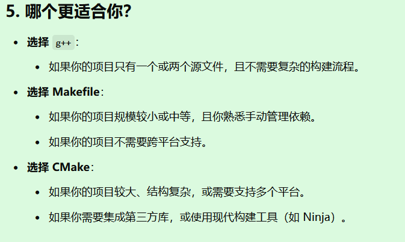

王道的网盘项目其实就是一个网络库部分编写过程+客户端+服务端，还比较粗糙

mprpc是网盘的高级版（用来muduo网络库），然后muduo网络库可以考虑自己手撕一个

下面介绍一下网络库

# 网络库

https://blog.51cto.com/u_15346415/4995273

高级语言(Java、Python等)的Sockets库并没有对Sockets API提供更高层的封装，直接用它编写网络程序很容易掉到陷阱里，因此我们需要一个好的网络库来降低开发难度。网络库的价值还在于能方便地处理并发连接

就是封装好socket/epoll等一些底层的系统调用，网络库提供提供API，避免自己去使用，封装成库，下载安装就可以直接用了，

网络库是指提供网络通信功能的编程工具或模块，开发者可以利用这些工具来实现网络编程相关的任务，比如数据传输、请求处理和服务器搭建等。**网络库抽象了复杂的底层通信协议和操作，使开发者可以更简单地处理网络通信，而无需深入理解协议的具体实现细节。**

### 网络库的功能

网络库通常包括以下功能：

1. **基础通信支持：**
   - 支持常见的网络协议（如 TCP/IP、UDP）。
   - 提供 socket 编程接口，便于开发者创建服务器或客户端。
2. **HTTP/HTTPS 请求处理：**
   - 支持发送和接收 HTTP 请求（如 GET、POST 等）。
   - 提供封装好的 API 用于处理 RESTful 服务。
3. **异步和并发处理：**
   - 提供异步 I/O 和多线程支持，以提高并发性能。
   - 在高并发网络环境中尤为重要，比如 Web 服务或实时通信应用。
4. **高级功能：**
   - 数据序列化和反序列化（如 JSON、XML）。
   - 支持安全通信协议（如 SSL/TLS）。
   - 负载均衡和连接池管理。

### 常见的网络库

以下是一些流行的网络库及其使用场景：

1. **C++**
   - Boost.Asio：支持同步和异步网络编程，功能强大，适合复杂应用。
   - libcurl：轻量级库，支持 HTTP、FTP 等协议，适用于数据抓取和传输。
2. **Java**
   - Netty：高性能网络框架，支持异步事件驱动的网络应用开发。
   - OkHttp：适用于 HTTP 请求的轻量级库，常用于客户端开发。
3. **Python**
   - requests：专注于简单易用的 HTTP 请求处理。
   - asyncio：Python 内置异步框架，用于构建高并发网络程序。
4. **其他语言**
   - Node.js：基于 JavaScript，内置网络模块，适合构建高并发 Web 服务。
   - Spring WebFlux（Java）：支持响应式编程的网络框架。

### 网络库的作用

- **简化开发**：通过封装复杂的底层通信细节，减少开发工作量。
- **提高效率**：提供优化的通信逻辑，增强性能和稳定性。
- **增强可移植性**：屏蔽不同平台间的差异，保证跨平台运行。

# Muduo网络库

https://blog.csdn.net/qq_41453285/article/details/105104845

https://so.csdn.net/so/search?q=muduo&t=blog&u=qq_41453285详解muduo

https://blog.csdn.net/QIANGWEIYUAN/article/details/89023980详解muduo

https://blog.csdn.net/m0_75186846/article/details/141872034使用muduo


**使用方法：先安装Cmake,安装boost库，再下载安装muduo网络库源码，编译**，

具体安装看这篇博客https://blog.csdn.net/QIANGWEIYUAN/article/details/89023980

muduo库的介绍就是：一个基于reactor反应堆模型的多线程C++网络库。

muduo网络库是C++语言开发的一个非常优秀的网络库，作者陈硕，muduo网络库在多线程环境下性能非常高，该系列文章会分享一些muduo库源码的知识，包括它的线程池源码，TcpServer源码，还有很多muduo库应用的示例代码等，学习一下作者优秀的C++多线程网络编程设计思想。
# 1.Muduo简介

**Muduo 网络库** 是一个基于 **C++** 的高性能网络库，主要用于构建高并发、高性能的网络服务器。它由 **陈硕**（Shuo Chen）开发，并在《Linux多线程服务端编程》一书中详细讲解，是学习 C++ 网络编程的经典库。

------

### **Muduo 网络库的特点**

1. **高性能设计**：
   - 基于多线程和事件驱动（Reactor 模型）的架构。
   - 使用 **EPOLL**（在 Linux 上的高效 I/O 多路复用机制）实现高效的网络 I/O。
2. **线程安全**：
   - 提供明确的线程模型，区分主线程和工作线程。
   - 使用 **线程池** 提高并发性能，减少线程切换的开销。
3. **易用性**：
   - 提供清晰的接口，简化网络编程中的复杂细节。
   - 对 C++11 提供了较好的支持（如智能指针、函数对象等）。
4. **模块化设计**：
   - 包含了常见的网络编程组件（如定时器、日志系统、Buffer、线程池等），方便开发者快速构建应用。
5. **跨平台**：
   - 虽然主要针对 Linux，但代码有较好的可移植性，稍加修改可以在其他类 Unix 平台上运行。

------

### **Muduo 的核心组件**

1. **Reactor 模型**：
   - Muduo 使用单线程 Reactor 和多线程 Reactor 模型，管理多个 I/O 事件的调度和分发。
   - 提供了 **EventLoop**（事件循环）和 **Channel**（事件处理单元）两个核心模块。
2. **线程池（ThreadPool）**：
   - 用于管理多个线程，提高多核 CPU 的利用率，适合处理高并发请求。
3. **Buffer**：
   - 设计了高效的读写缓冲区，减少频繁的内存分配和拷贝操作。
4. **TimerQueue**：
   - 实现了高效的定时器管理功能，用于定时任务。
5. **TCP 服务器/客户端**：
   - 提供了 **TcpServer** 和 **TcpClient** 类，封装了 TCP 通信的常见功能，支持高效的连接管理和数据传输。
6. **日志系统**：
   - 内置了高性能的异步日志系统，用于记录运行时信息。

------

### **Muduo 的线程模型**

Muduo 的线程模型分为两种模式：

1. **单线程模式**：
   - 只有一个线程处理所有 I/O 事件。
   - 适用于简单的服务器（如本地调试或低负载应用）。
2. **多线程模式**：
   - 主线程（Main Thread）负责接受连接。
   - 工作线程（Worker Thread）通过线程池处理 I/O 事件和计算任务。
   - 使用 **EventLoopThread** 和 **EventLoopThreadPool** 管理线程。

------

### **Muduo 的基本工作流程**

1. **创建服务器**：
   - 使用 `TcpServer` 类构建服务器，设置回调函数处理连接和数据。
2. **事件循环**：
   - 主线程运行一个 **EventLoop**，等待事件发生并将事件分发给对应的 **Channel**。
3. **线程池处理**：
   - 通过线程池分发任务，提高服务器的吞吐量。
4. **处理 I/O 事件**：
   - 根据事件类型（如读、写、连接关闭）调用用户定义的回调函数。

------

### **Muduo 的使用示例**

一个简单的 Echo 服务器示例：

```cpp
#include <muduo/net/TcpServer.h>
#include <muduo/net/EventLoop.h>
#include <muduo/base/Logging.h>

using namespace muduo;
using namespace muduo::net;

// 数据回显处理函数
void onMessage(const TcpConnectionPtr& conn, Buffer* buffer, Timestamp time) {
    string msg = buffer->retrieveAllAsString(); // 获取接收到的数据
    LOG_INFO << "Received: " << msg;
    conn->send(msg); // 回显数据
}

int main() {
    EventLoop loop;                      // 创建事件循环
    InetAddress listenAddr(8888);       // 监听地址和端口
    TcpServer server(&loop, listenAddr, "EchoServer"); // 创建服务器

    server.setMessageCallback(onMessage); // 设置消息处理回调
    server.start();                        // 启动服务器
    loop.loop();                           // 开始事件循环
    return 0;
}
```

------

### **Muduo 的优点**

1. **高并发性**：利用线程池和事件驱动模型，可处理大量并发连接。
2. **易扩展性**：提供丰富的模块，方便构建复杂的网络应用。
3. **学习价值高**：源码设计清晰，是学习 C++ 网络编程和高性能服务器开发的优秀资料。

------

### **适用场景**

1. 高并发 Web 服务器。
2. 实时通信系统（如聊天系统、游戏服务器）。
3. 数据采集系统。

# 2.Muduo怎么使用

使用 **Muduo 网络库** 需要经历几个关键步骤，包括环境准备、项目配置、核心组件的使用以及实际开发网络应用。以下是一个完整的指南，帮助你快速上手 Muduo。

------

## 1. 环境准备

### **1.1 安装依赖**

Muduo 依赖以下组件：

- **Linux 系统**（推荐 Ubuntu 或 CentOS）
- **C++ 编译器**（支持 C++11 标准，建议使用 GCC 或 Clang）
- **Boost 库**（主要用于非阻塞 I/O）

安装这些依赖：

```bash
sudo apt-get update
sudo apt-get install -y g++ cmake libboost-all-dev
```

### **1.2 下载和编译 Muduo**

1. 从 [Muduo 官方 GitHub 仓库](https://github.com/chenshuo/muduo) 克隆代码：

   ```bash
   git clone https://github.com/chenshuo/muduo.git
   cd muduo
   ```

2. 配置和编译：

   ```bash
   mkdir -p build/release
   cd build/release
   cmake -DCMAKE_BUILD_TYPE=Release ../..
   make -j$(nproc)
   sudo make install
   ```

   编译完成后，库会安装到系统默认路径。

3. 验证安装： 检查 Muduo 的头文件和库是否已经安装：

   ```bash
   ls /usr/local/include/muduo
   ls /usr/local/lib/libmuduo*
   ```

------

## 2. 配置项目

创建一个新的项目并配置 CMake 以便使用 Muduo。

### **2.1 创建项目目录**

假设你的项目目录为 `muduo_demo`：

```bash
mkdir muduo_demo
cd muduo_demo
```

### **2.2 编写 CMakeLists.txt**

使用 CMake 配置项目，确保链接 Muduo 库。以下是一个基本的 `CMakeLists.txt` 示例：

```cmake
cmake_minimum_required(VERSION 3.10)
project(muduo_demo)

set(CMAKE_CXX_STANDARD 11)
set(CMAKE_BUILD_TYPE Release)

# 指定 Muduo 库的路径（如果安装在默认路径，CMake 会自动找到）
find_library(MUDUO_BASE muduo_base REQUIRED)
find_library(MUDUO_NET muduo_net REQUIRED)
find_package(Threads REQUIRED)

# 添加可执行文件
add_executable(echo_server echo_server.cpp)

# 链接 Muduo 和系统线程库
target_link_libraries(echo_server ${MUDUO_BASE} ${MUDUO_NET} pthread)
```

### **2.3 编写代码文件**

创建一个简单的 `echo_server.cpp` 文件，示例如下：

```cpp
#include <muduo/net/TcpServer.h>
#include <muduo/net/EventLoop.h>
#include <muduo/base/Logging.h>

using namespace muduo;
using namespace muduo::net;

// 数据回显处理函数
void onMessage(const TcpConnectionPtr& conn, Buffer* buffer, Timestamp time) {
    string msg = buffer->retrieveAllAsString(); // 读取接收到的数据
    LOG_INFO << "Received: " << msg;
    conn->send(msg); // 将数据回显给客户端
}

int main() {
    EventLoop loop;                      // 创建事件循环
    InetAddress listenAddr(8888);       // 监听地址和端口
    TcpServer server(&loop, listenAddr, "EchoServer"); // 创建服务器

    server.setMessageCallback(onMessage); // 设置消息处理回调
    server.start();                        // 启动服务器
    loop.loop();                           // 开始事件循环
    return 0;
}
```

------

## 3. 编译和运行

### **3.1 编译项目**

1. 创建构建目录并运行 CMake：

   ```bash
   mkdir build
   cd build
   cmake ..
   make
   ```

2. 编译成功后，你会看到生成的可执行文件（如 `echo_server`）。

### **3.2 运行服务器**

在终端运行：

```bash
./echo_server
```

服务器会监听 `8888` 端口。

### **3.3 测试服务器**

使用 `telnet` 或其他工具测试：

```bash
telnet 127.0.0.1 8888
```

在终端输入任意字符，服务器会回显输入内容。

------

## 4. Muduo 常用组件的使用

### **4.1 TcpServer**

- **功能**：处理客户端连接和数据交互。

- 重要回调函数

  ：

  - `setMessageCallback`：处理数据读写。
  - `setConnectionCallback`：处理连接建立或断开事件。

### **4.2 TcpClient**

- **功能**：用于创建客户端与服务器通信。

- 示例

  ：

  ```cpp
  TcpClient client(&loop, serverAddr, "TcpClient");
  client.connect(); // 连接服务器
  ```

### **4.3 EventLoop**

- **功能**：事件循环的核心，负责管理 I/O 和定时器事件。

- 使用

  ：

  ```cpp
  EventLoop loop;
  loop.loop(); // 开始事件循环
  ```

### **4.4 Buffer**

- **功能**：管理数据的收发缓冲区，避免频繁的内存分配。

- 常用方法

  ：

  - `retrieveAllAsString()`：读取并清空缓冲区。
  - `append(data, len)`：向缓冲区添加数据。

------

## 5. 高级功能和扩展

### **5.1 多线程支持**

Muduo 内置了线程池，可以通过 **EventLoopThreadPool** 管理多个线程：

```cpp
EventLoopThreadPool threadPool(&loop, "ThreadPool");
threadPool.setThreadNum(4); // 设置线程数量
threadPool.start();
```

### **5.2 定时器**

Muduo 提供高效的定时器，使用 **runAt** 或 **runAfter**：

```cpp
loop.runAfter(5.0, [] { LOG_INFO << "5 seconds passed!"; });
```

### **5.3 日志**

Muduo 提供了异步日志模块，默认日志级别为 `INFO`，可以通过 `Logging` 控制日志输出。

------

## 6. 进一步学习

如果你想深入学习 Muduo，可以参考：

1. **官方 GitHub 仓库**：包含源码和使用文档。
2. **《Linux多线程服务端编程》**：Muduo 的作者亲自编写的书籍，详细讲解设计理念和实现细节。
3. **示例代码**：Muduo 源码中附带了大量示例程序，覆盖了从简单到复杂的场景。

# 3.实际安装

先安装Cmake，再boost库，再muduo


## 1.先安装Cmake

```bash
sudo apt-get install cmake
cmake --version
```

## 2.再boost库

```bash
sudo apt-get install libboost-dev libboost-test-dev
```


## 3.再muduo

muduo有三个非必须的依赖库（curl、c-ares DNS、Google Protobuf）。如果安装了这三个库，cmake会自动多编译一些示例。安装方法如下：

```bash
sudo apt-get install libcurl4-openssl-dev libc-ares-dev
sudo apt-get install protobuf-compiler libprotobuf-dev
```

安装muduo


- **第一步：**下载muduo源码包

```cobol
git clone https://github.com/chenshuo/muduo.git
```

- **第二步：**编译muduo，命令如下：

```bash
# 下载完成之后进入muduo根目录
cd muduo
# 编译muduo库和它自带的例子
./build.sh -j2
```

- **编译完成之后：**
  - 会在muduo源码根路径的上一级路径下生成一个build目录（下面全文我们以../build表示）
  - 生成的可执行文件位于：../build/release-cpp11/bin
  - 静态文件位于：../build/release-cpp11/lib
- **第三步：**安装muduo库，注意在muduo目录下执行

```bash
./build.sh install
```

- **默认情况下：**
  - muduo头文件安装在../build/release-install-cpp11/include目录下
  - 库文件安装在../build/release-install-cpp11/lib目录下
  - 以便muduo-protorpc和muduo-udns等库使用

第三步（测试）

    编译完成之后我们可以试着运行编译的例子（位于../build/release-cpp11/bin/目录下），查看能够运行成功
    此处我们以inspector_test为例：
        （下图1）运行../build/release-cpp11/bin/inspector_test
        （下图2）然后通过浏览器访问“192.168.0.101:12345”访问运行的服务器（其中192.168.0.101更换为你的Linux IP，ifconfig之后inet之后的就是ipv4地址，第一个不行，试第二个）
        （下图3）或者输入“192.168.0.101:12345/proc/status”来访问该服务器的状态
# 4.实际使用

https://blog.csdn.net/m0_75186846/article/details/141872034

https://blog.csdn.net/qq_41453285/article/details/105104845


# 4.如何生成可执行文件

将代码生成可执行程序需要经历多个步骤，从源代码到最终可执行程序，主要涉及**编译**和**链接**过程。以下是完整的过程及每一步的详细解析：

------

### **1. 代码生成可执行程序的整体流程**

1. **预处理**（Preprocessing）
2. **编译**（Compilation）
3. **汇编**（Assembly）
4. **链接**（Linking）

------

### **2. 每个阶段的详细解析**

#### **2.1 预处理（Preprocessing）**

预处理是将源代码中的预处理指令处理掉，生成一个纯净的代码文件。

- **输入**：源代码文件（如 `main.c`）。

- **输出**：预处理后的代码文件（通常是 `.i` 文件）。

- **任务**：

  1. 展开 **宏定义**（`#define`）。
  2. 处理 **头文件包含**（`#include`）。
  3. 处理 **条件编译指令**（`#ifdef`、`#endif` 等）。

- **示例**：

  ```c
  #include <stdio.h>
  #define PI 3.14
  int main() {
      printf("%f\n", PI);
      return 0;
  }
  ```

  预处理后：

  ```c
  int main() {
      printf("%f\n", 3.14);
      return 0;
  }
  ```

- **使用命令**：

  ```bash
  gcc -E main.c -o main.i
  ```

------

#### **2.2 编译（Compilation）**

编译是将预处理后的代码文件翻译为**汇编代码**的过程。

- **输入**：预处理后的代码文件（如 `main.i`）。

- **输出**：汇编代码文件（通常是 `.s` 文件）。

- **任务**：

  1. 词法分析：将代码分解为**词法单元**（如关键字、变量、运算符）。
  2. 语法分析：检查代码的语法结构是否符合语言规范。
  3. 语义分析：检查数据类型是否匹配，函数是否定义等。
  4. 中间代码生成：生成与机器无关的中间表示。
  5. 代码优化：简化循环、减少冗余运算。
  6. 汇编代码生成：翻译为对应平台的汇编代码。

- **示例**：

  ```c
  int main() {
      return 0;
  }
  ```

  编译后生成的汇编代码（`main.s`）可能类似：

  ```asm
  .section .text
  .globl main
  main:
      movl $0, %eax
      ret
  ```

- **使用命令**：

  ```bash
  gcc -S main.i -o main.s
  ```

------

#### **2.3 汇编（Assembly）**

汇编是将汇编代码转化为**机器码**，生成目标文件（`.o` 或 `.obj` 文件）。

- **输入**：汇编代码文件（如 `main.s`）。

- **输出**：目标文件（如 `main.o`）。

- **任务**：

  1. 翻译每条汇编指令为对应的机器指令（二进制形式）。
  2. 将数据和指令分配到目标文件的不同段（如 `.text`、`.data`、`.bss`）。

- **示例**： 汇编代码：

  ```asm
  main:
      movl $0, %eax
      ret
  ```

  转换为机器码（十六进制）：

  ```plaintext
  B8 00 00 00 00 C3
  ```

- **使用命令**：

  ```bash
  gcc -c main.s -o main.o
  ```

------

#### **2.4 链接（Linking）**

链接是将多个目标文件和库文件组合在一起，生成最终的可执行程序。

- **输入**：目标文件（如 `main.o`）和库文件（如 `libc.a` 或 `libc.so`）。

- **输出**：可执行文件（如 `a.out`）。

- **任务**：

  1. **符号解析**：找到所有函数和变量的定义（如 `printf` 在标准库中的实现）。
  2. **地址重定位**：将目标文件中的相对地址调整为最终程序中的绝对地址。
  3. **合并代码段和数据段**：将各个目标文件的 `.text`、`.data` 段合并到可执行文件中。

- **使用命令**：

  ```bash
  gcc main.o -o program
  ```

------

### **3. 从代码到可执行文件的完整流程示例**

#### **源代码（`main.c`）**

```c
#include <stdio.h>
int main() {
    printf("Hello, World!\n");
    return 0;
}
```

#### **完整编译过程**

1. **预处理**：

   ```bash
   gcc -E main.c -o main.i
   ```

   输出：`main.i`（预处理后的代码）。

2. **编译**：

   ```bash
   gcc -S main.i -o main.s
   ```

   输出：`main.s`（汇编代码）。

3. **汇编**：

   ```bash
   gcc -c main.s -o main.o
   ```

   输出：`main.o`（目标文件）。

4. **链接**：

   ```bash
   gcc main.o -o program
   ```

   输出：`program`（可执行文件）。

5. **运行程序**：

   ```bash
   ./program
   ```

   输出：

   ```plaintext
   Hello, World!
   ```

------

### **4. 编译和构建工具**

为了简化复杂项目的编译过程，可以使用构建工具（如 Makefile 或 CMake）：

- **Makefile**：定义如何调用 `gcc` 完成预处理、编译、汇编和链接。
- **CMake**：自动生成 Makefile 或其他构建系统文件，支持跨平台构建。

------

### **5. 关键点总结**

- **预处理**：处理宏、头文件和条件编译，生成纯净代码。
- **编译**：将源代码转化为汇编代码，并优化代码。
- **汇编**：将汇编代码翻译为机器码，生成目标文件。
- **链接**：将多个目标文件和库组合成一个可执行文件。

这些过程的工具可以通过 `gcc` 或其他编译器（如 Clang）完成。如果有更复杂的需求，可以使用 `Makefile` 或 `CMake` 来自动化这些步骤。

# 5.编译

**编译**是将**高级编程语言**（如 C++、Java 等）编写的代码，翻译成**机器能够执行的语言**（机器码或字节码）的过程。这个过程通常由一个**编译器（Compiler）**来完成。

编译的结果通常是一个**可执行文件**，例如：

- 在 Linux 上：`a.out`（默认输出）。
- 在 Windows 上：`program.exe`。

这些文件可以直接运行在操作系统上，而无需再次翻译。




## 1.一些区别

**编译**是将**高级编程语言**（如 C++、Java 等）编写的代码，翻译成**机器能够执行的语言**（机器码或字节码）的过程。这个过程通常由一个**编译器（Compiler）**来完成。

------

### **1. 为什么需要编译？**

计算机只能理解和执行二进制的机器语言（0 和 1）。但程序员通常用高级语言编写代码（如 C++、Python 等），因为高级语言更接近人类的自然语言，更易于阅读和维护。

因此，编译的主要目的是：

- **将人类可读的源代码**翻译为**机器可执行的代码**。
- **检测语法错误**，保证代码符合语言规范。
- **优化代码**，提高程序的运行效率。

------

### **2. 编译的工作流程**

编译通常包括以下几个步骤：

#### **2.1 预处理（Preprocessing）**

- 处理代码中的预处理指令（如 `#include` 和 `#define`）。
- 生成**纯净的源代码文件**。

示例（C++ 中）：

```cpp
#include <iostream>
#define PI 3.14
```

预处理后会替换宏定义和头文件的内容。

#### **2.2 词法分析（Lexical Analysis）**

- 将代码分解成**词法单元（Tokens）**，如关键字、变量名、运算符等。

- 例如，将代码：

  ```cpp
  int x = 5;
  ```

  分解为：

  - `int`（数据类型）
  - `x`（变量名）
  - `=`（赋值运算符）
  - `5`（常量）

#### **2.3 语法分析（Syntax Analysis）**

- 检查代码的语法结构是否正确。
- 例如，代码 `int x = ;` 会报错，因为缺少赋值的值。

#### **2.4 语义分析（Semantic Analysis）**

- 确保变量和函数的使用符合语义规则。
- 例如，检查变量是否定义过，数据类型是否匹配。

#### **2.5 中间代码生成（Intermediate Code Generation）**

- 将代码转换为更接近机器语言的中间形式（如三地址代码）。
- 便于后续优化。

#### **2.6 优化（Optimization）**

- 优化代码以提高效率，比如去除冗余代码、简化循环。

#### **2.7 目标代码生成（Code Generation）**

- 将中间代码翻译为目标机器的机器码。

#### **2.8 汇编与链接（Assembly & Linking）**

- **汇编**：将机器码转换为二进制指令（`.o` 文件）。
- **链接**：将多个目标文件和库文件合并为一个可执行程序。

------

### **3. 编译的最终产物**

编译的结果通常是一个**可执行文件**，例如：

- 在 Linux 上：`a.out`（默认输出）。
- 在 Windows 上：`program.exe`。

这些文件可以直接运行在操作系统上，而无需再次翻译。

------

### **4. 编译型语言 vs 解释型语言**

编程语言分为编译型和解释型，二者的主要区别在于代码的执行方式。

#### **编译型语言**

- 在运行前，代码需先通过编译器编译成机器码。

- 编译完成后，不需要源代码即可运行生成的程序。

- 优点

  ：

  - 运行速度快。
  - 程序经过优化，性能更高。

- 缺点

  ：

  - 编译过程耗时。
  - 调试错误较困难。

- **示例**：C、C++、Rust。

#### **解释型语言**

- 在运行时，代码由解释器逐行翻译并执行。

- 不需要生成可执行文件。

- 优点

  ：

  - 便于调试和开发。
  - 跨平台性能好（只需安装解释器）。

- 缺点

  ：

  - 执行速度较慢。

- **示例**：Python、JavaScript。

------

### **5. 编译器的作用**

**编译器**是实现编译过程的工具，以下是一些常见的编译器：

- **GCC**（GNU Compiler Collection）：支持 C、C++ 等语言。
- **Clang**：现代化的 C/C++ 编译器，基于 LLVM。
- **Javac**：用于 Java 的编译器，将 Java 代码编译为字节码。
- **MSVC**（Microsoft Visual C++）：用于 Windows 上的 C++ 开发。

### 

### **7. 编译的优点**

- **高效**：编译型程序直接运行在机器上，速度更快。
- **错误检查**：编译时可以提前检测语法和语义错误。
- **优化**：编译器可以对代码进行优化，提高程序性能。


## 2.Linux上的编译

在 Linux 上写代码时，是否需要手动使用 `g++` 编译代码，取决于你的开发环境和项目规模。以下是几种常见的开发场景和对应的建议：

------

### **1. 手动使用 `g++`（适合小项目或练习）**

对于简单的程序（如单个文件或少量文件），可以直接手动用 `g++` 编译。示例如下：

1. 编写代码：

   ```bash
   nano example.cpp
   ```

2. 使用 

   ```
   g++
   ```

    编译：

   ```bash
   g++ example.cpp -o example
   ```

3. 运行程序：

   ```bash
   ./example
   ```

**优点**：

- 简单直接，适合新手和小型项目。
- 没有额外依赖。

**缺点**：

- 如果文件较多，手动输入每个文件的路径会很繁琐。
- 无法自动管理复杂的依赖和编译流程。

------

### **2. 使用 Makefile（适合中小型项目）**

对于包含多个源文件的项目，可以使用 `Makefile` 自动化编译流程。`Makefile` 是 Linux 上的标准构建工具，可以节省重复输入命令的时间。

#### **步骤：**

1. 创建项目目录并编写代码：

   ```bash
   mkdir my_project
   cd my_project
   nano main.cpp
   nano helper.cpp
   ```

2. 创建一个 `Makefile`：

   ```makefile
   # Makefile
   CXX = g++
   CXXFLAGS = -std=c++11 -Wall -O2
   TARGET = my_program
   
   SRCS = main.cpp helper.cpp
   OBJS = $(SRCS:.cpp=.o)
   
   $(TARGET): $(OBJS)
       $(CXX) $(CXXFLAGS) -o $(TARGET) $(OBJS)
   
   clean:
       rm -f $(OBJS) $(TARGET)
   ```

3. 运行 `make`：

   ```bash
   make
   ```

4. 执行程序：

   ```bash
   ./my_program
   ```

**优点**：

- 自动化管理多个文件和依赖关系。
- 修改代码后，只重新编译受影响的部分，提升效率。

**缺点**：

- 初次设置 Makefile 需要一定时间。

------

### **3. 使用 CMake（适合中大型项目）**

对于更复杂的项目，推荐使用 **CMake**，这是一个跨平台构建工具，能生成各种构建系统（如 Makefile 或 Ninja），适合团队协作。

#### **步骤：**

1. 创建项目目录并编写代码：

   ```bash
   mkdir my_project
   cd my_project
   nano main.cpp
   nano helper.cpp
   ```

2. 创建一个 `CMakeLists.txt` 文件：

   ```cmake
   cmake_minimum_required(VERSION 3.10)
   project(MyProject)
   
   set(CMAKE_CXX_STANDARD 11)
   add_executable(my_program main.cpp helper.cpp)
   ```

3. 生成构建文件并编译：

   ```bash
   mkdir build
   cd build
   cmake ..
   make
   ```

4. 运行程序：

   ```bash
   ./my_program
   ```

**优点**：

- 适用于复杂项目和跨平台开发。
- 易于集成第三方库。

**缺点**：

- 学习曲线稍高。

------

### **4. 使用 IDE（适合个人开发和学习）**

如果你习惯图形化界面，可以使用 Linux 上的 IDE，它们通常集成了编译和调试功能，省去了手动输入 `g++` 命令的麻烦。

#### **常见 IDE**：

1. **VS Code**：
   - 使用轻量级编辑器并配合插件（如 C/C++ 插件）。
   - 配置 `tasks.json` 来自动调用 `g++`。
2. **CLion**：
   - JetBrains 提供的强大 IDE，支持 CMake 和 C++ 项目管理。
   - 集成了代码补全、调试器和版本控制。
3. **Code::Blocks**：
   - 经典 C++ IDE，轻量级且开源。
   - 支持自定义构建配置。
4. **Eclipse CDT**：
   - 强大的 C/C++ 开发环境，适合大型项目。

------

### **总结**

- **小项目或练习**：直接使用 `g++` 手动编译即可。
- **中小型项目**：推荐使用 Makefile 自动化编译。
- **中大型项目**：使用 CMake 构建更高效。
- **个人开发或团队协作**：使用 IDE 提高效率和开发体验。

选择工具和方法应根据项目复杂度和个人习惯决定。如果需要帮助配置具体工具或环境，随时提问！

# 6.链接

**链接**（Linking）是软件开发中将多个目标文件（object files）和库文件组合在一起，生成最终的可执行文件或共享库的过程。它是编译完成后构建流程的一个重要步骤。

------

## **1. 链接的作用**

编译器将源代码翻译成目标文件（通常是 `.o` 或 `.obj` 文件），这些目标文件中可能只包含函数和变量的定义或调用。**链接器（Linker）** 的任务是将这些目标文件以及需要的库文件结合起来，解决函数和变量的引用问题，生成最终可以运行的可执行文件。

------

## **2. 链接的类型**

### **2.1 静态链接（Static Linking）**

- **定义**：将所有目标文件和库文件打包到一个单独的可执行文件中，运行时不需要依赖外部库。

- 特点

  ：

  - 程序独立运行，无需额外的库支持。
  - 文件体积较大，因为所有的库代码都嵌入到了可执行文件中。
  - 修改库后，需要重新链接程序。

- 示例

  ： 静态链接时，库会嵌入到生成的可执行文件中：

  ```bash
  gcc main.o -o program -static
  ```

### **2.2 动态链接（Dynamic Linking）**

- **定义**：将库文件与程序分离，运行时加载库文件。程序只包含对动态库的引用。

- 特点

  ：

  - 可执行文件体积较小，因为库文件并未嵌入。
  - 运行时需要外部库支持。
  - 修改库后，无需重新链接程序。

- 示例

  ： 动态链接时，程序运行时会加载动态库：

  ```bash
  gcc main.o -o program -L/path/to/libs -lmylib
  ```

------

## **3. 链接的工作过程**

链接器的主要任务是：

1. **符号解析（Symbol Resolution）**：
   - 确定函数或变量的实际地址。
   - 例如，`main.o` 调用了一个函数 `add`，链接器会查找 `add` 的实现位置（可能在 `math.o` 中）。
2. **重定位（Relocation）**：
   - 将目标文件中的地址调整为可执行文件中的实际地址。
   - 目标文件中的地址通常是相对地址（如偏移量），链接器会将其调整为程序的绝对地址。
3. **生成可执行文件**：
   - 将多个目标文件及库整合为一个完整的可执行文件。

------

## **4. 链接的输入和输出**

### **输入**：

- **目标文件**：由编译器生成的中间文件（如 `main.o`）。

- 库文件

  ：

  - 静态库：`.a`（Linux）或 `.lib`（Windows）。
  - 动态库：`.so`（Linux）或 `.dll`（Windows）。

### **输出**：

- **可执行文件**：如 `a.out` 或 `program`。
- **共享库**：如 `.so` 或 `.dll`。

------

## **5. 链接的工具**

在 Linux 中，链接器的工具通常是 `ld`，但我们通常通过编译器（如 `gcc` 或 `g++`）间接调用它。

### **示例 1：链接多个目标文件**

假设有两个源文件 `main.c` 和 `add.c`，它们分别被编译成目标文件 `main.o` 和 `add.o`：

```bash
gcc -c main.c -o main.o
gcc -c add.c -o add.o
gcc main.o add.o -o program
```

生成的 `program` 文件就是一个可执行文件。

### **示例 2：链接外部库**

如果需要使用一个名为 `mylib` 的静态库（`libmylib.a`），可以通过以下命令进行链接：

```bash
gcc main.o -L/path/to/libs -lmylib -o program
```

### **示例 3：动态链接**

如果使用动态库（`libmylib.so`）：

```bash
gcc main.o -L/path/to/libs -lmylib -o program
```

------

## **6. 常见的链接问题**

### **6.1 未定义的引用**

错误示例：

```plaintext
undefined reference to 'function_name'
```

**原因**：在链接阶段，函数的实现未找到。 **解决方法**：

- 检查是否遗漏了相关的目标文件或库。
- 确保库文件路径正确，并正确指定链接选项（如 `-L` 和 `-l`）。

### **6.2 库路径问题**

错误示例：

```plaintext
libmylib.so: No such file or directory
```

**原因**：链接动态库时，系统未能找到库文件。 **解决方法**：

- 使用 `-L` 指定库文件路径。

- 将库路径添加到环境变量 

  ```
  LD_LIBRARY_PATH
  ```

   中：

  ```bash
  export LD_LIBRARY_PATH=/path/to/libs:$LD_LIBRARY_PATH
  ```

------

## **7. 链接和编译的关系**

- **编译**是将单个源文件翻译为目标文件的过程。
- **链接**是将多个目标文件和库文件组合成最终可执行文件的过程。

二者可以分开进行，也可以合并：

1. 分开编译和链接

   ：

   ```bash
   gcc -c main.c -o main.o
   gcc -c add.c -o add.o
   gcc main.o add.o -o program
   ```

2. 一次性完成编译和链接

   ：

   ```bash
   gcc main.c add.c -o program
   ```

------

## **8. 总结**

- **链接**是生成可执行文件的最后一步，解决符号引用问题并整合代码和库。
- 根据方式不同，链接可以分为**静态链接**和**动态链接**。
- 链接器（Linker）会处理符号解析、地址重定位并生成最终的程序。
- 在构建大型项目时，链接是不可或缺的一部分，通过工具如 `gcc` 或 `ld` 可以完成链接过程。

如果你有具体问题或示例代码需要分析，可以随时提问！

# 7.文本编辑器

nano/vim/VScode

# 8.脚本和宏

**脚本** 和 **宏** 都是用于**自动化任务**的工具，但它们的工作方式和适用场景有所不同。以下是它们的定义、区别和使用场景：

------

## **1. 什么是脚本（Script）**

### **定义**

脚本是由**一系列命令组成的程序文件**，通常使用特定的脚本语言（如 Shell、Python、JavaScript 等）编写，用于自动化执行重复的或复杂的任务。脚本的执行通常是解释执行（不需要编译）。

### **特点**

1. **可编程**：脚本通常包含逻辑控制语句（如循环、条件判断）。
2. **通用性**：可以编写复杂的操作，完成多步骤任务。
3. **跨平台性**：许多脚本语言（如 Python、Bash）可以在不同系统上运行。
4. **灵活性**：适用于从简单到复杂的任务。

### **示例**

#### **Linux Shell 脚本**

将一组命令写入文件中：

```bash
#!/bin/bash
echo "开始备份文件..."
cp -r /home/user/docs /backup
echo "备份完成！"
```

执行脚本：

```bash
bash backup.sh
```

#### **Python 脚本**

```python
# 自动化文件重命名
import os
for file in os.listdir("documents"):
    os.rename(file, file.lower())
```

### **应用场景**

- 服务器运维任务（如备份、日志清理）。
- 数据处理（如批量重命名文件、数据分析）。
- 自动化测试（通过 Selenium、Pytest 等工具）。

------

## **2. 什么是宏（Macro）**

### **定义**

宏是**一组预定义的动作或指令的快捷方式**，通常用于自动化简单的、固定的任务。宏通过**录制用户的操作**，然后在需要时**重放**这些操作，帮助用户提高效率。

### **特点**

1. **无需编程**：大多数宏通过录制用户操作生成，无需手动编写代码。
2. **简单直接**：通常用于简单、重复性强的任务。
3. **与特定应用绑定**：宏通常内嵌在特定的应用程序中，如办公软件、终端工具。

### **示例**

#### **Office 软件中的宏**

在 Excel 中录制一个宏，用于将选中的单元格背景设置为黄色：

1. 在 Excel 中点击 `开发工具 -> 录制宏`。
2. 执行将单元格背景填充为黄色的操作。
3. 停止录制，宏会保存为 VBA（Visual Basic for Applications）代码。

使用宏时，只需运行录制的宏，就能快速完成操作。

#### **Xshell 中的宏**

在 Xshell 中录制宏，用于登录服务器并执行命令：

1. 打开 `工具 -> 宏 -> 开始录制宏`。
2. 输入 SSH 登录命令和操作（如运行几个命令）。
3. 保存宏并随时运行。

------

## **3. 脚本和宏的区别**

| **属性**     | **脚本**                                       | **宏**                                     |
| ------------ | ---------------------------------------------- | ------------------------------------------ |
| **灵活性**   | 灵活且功能强大，可编写复杂逻辑。               | 主要用于简单、重复性的任务。               |
| **编写方式** | 需要手动编写代码，使用脚本语言。               | 多数通过录制用户操作生成，无需编写代码。   |
| **适用场景** | 适合多步骤自动化任务，具有逻辑判断和条件控制。 | 适合特定应用程序内的固定任务操作。         |
| **跨平台性** | 多数脚本语言跨平台（如 Python、Shell）。       | 通常与特定软件绑定（如 Excel、Xshell）。   |
| **复杂度**   | 可实现复杂任务（如爬虫、数据处理）。           | 适用于重复固定的简单任务（如填表、点击）。 |

------

## **4. 脚本和宏的结合**

在一些工具中，可以结合使用脚本和宏：

- Xshell

  ：

  - 宏：录制 SSH 登录和简单的命令操作。
  - 脚本：编写 Xshell 脚本（`.xsh` 文件），实现复杂自动化任务。

- 办公软件（如 Excel）

  ：

  - 宏：录制重复性的操作（如格式化表格）。
  - 脚本：使用 VBA 编写更复杂的自动化任务。

------

## **5. 应用场景对比**

### **脚本适合的场景**

- **服务器运维**：如定时备份、日志清理、监控系统状态。
- **数据处理**：批量文件重命名、格式转换、大规模数据分析。
- **开发自动化**：自动化构建、部署、测试。

### **宏适合的场景**

- **办公自动化**：在 Word、Excel 中快速完成固定格式的文档编辑。
- **软件操作**：在 Xshell 中录制登录和固定操作。
- **游戏操作**：录制固定按键组合，提高效率。

------

## **总结**

- **脚本** 更适合复杂的自动化任务，功能强大但需要编写代码。
- **宏** 更适合简单、固定的操作，易用但功能有限。
- 它们的目的都是为了提高效率，选择使用哪个取决于任务的复杂程度和灵活性需求。